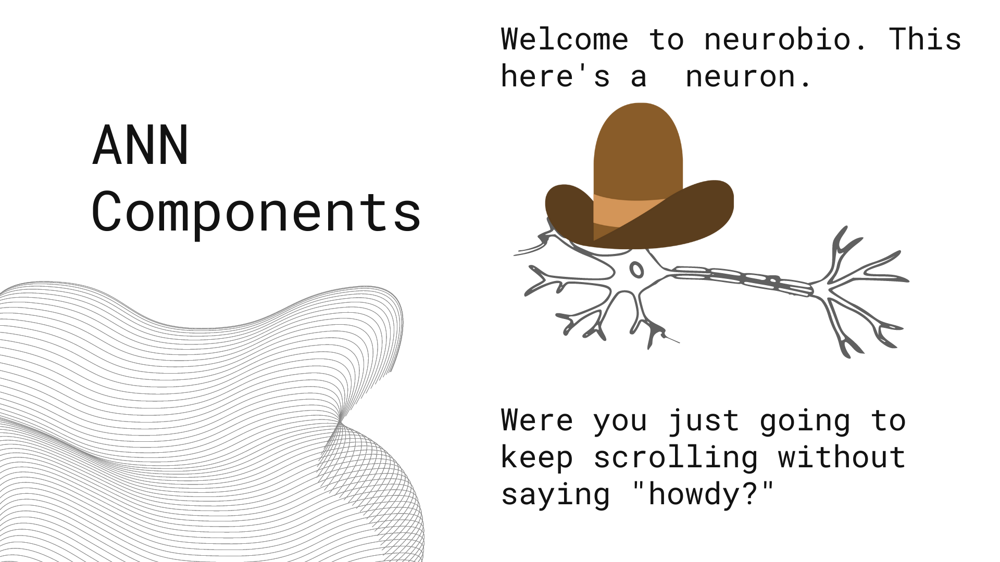
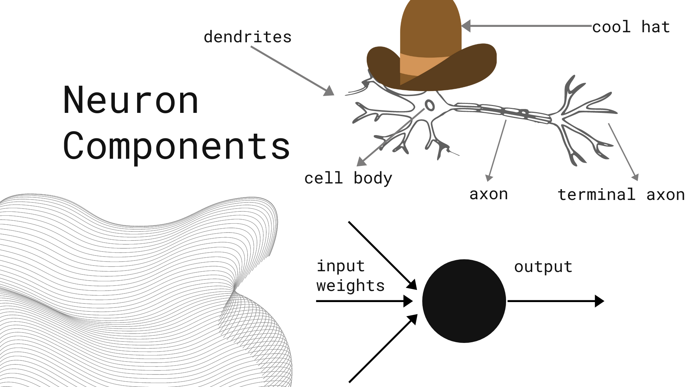
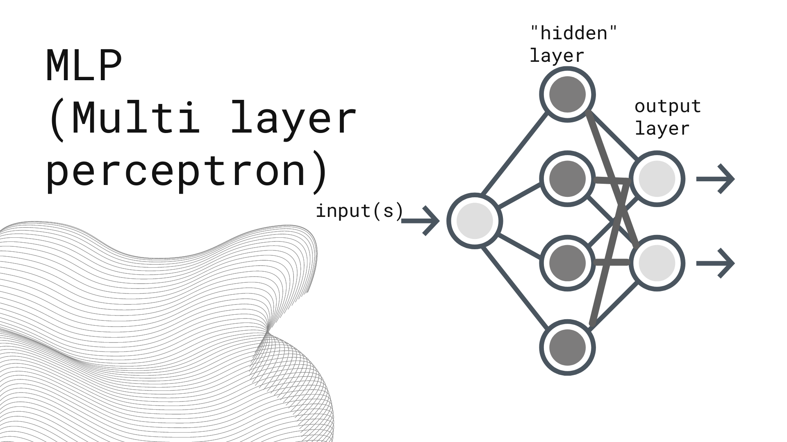
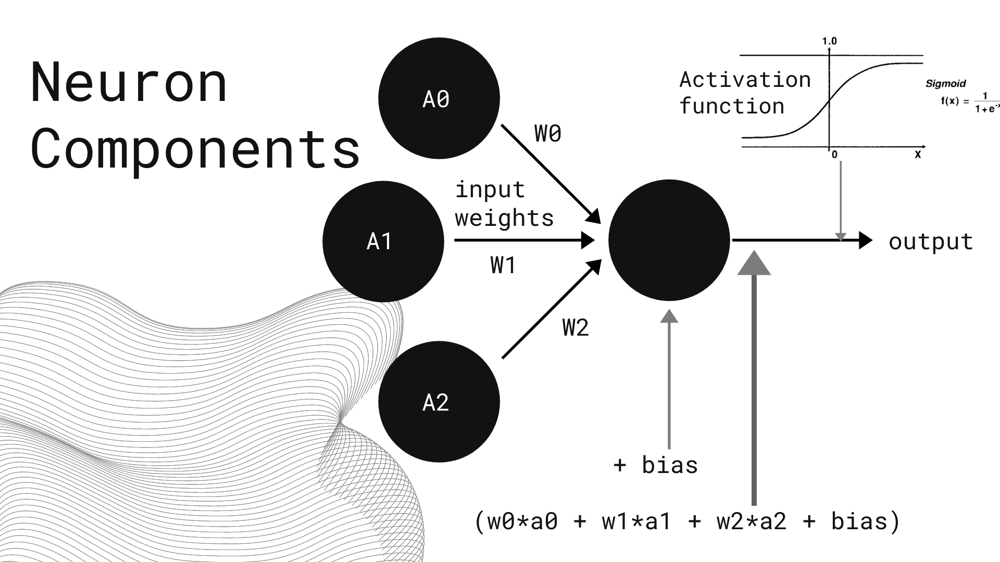
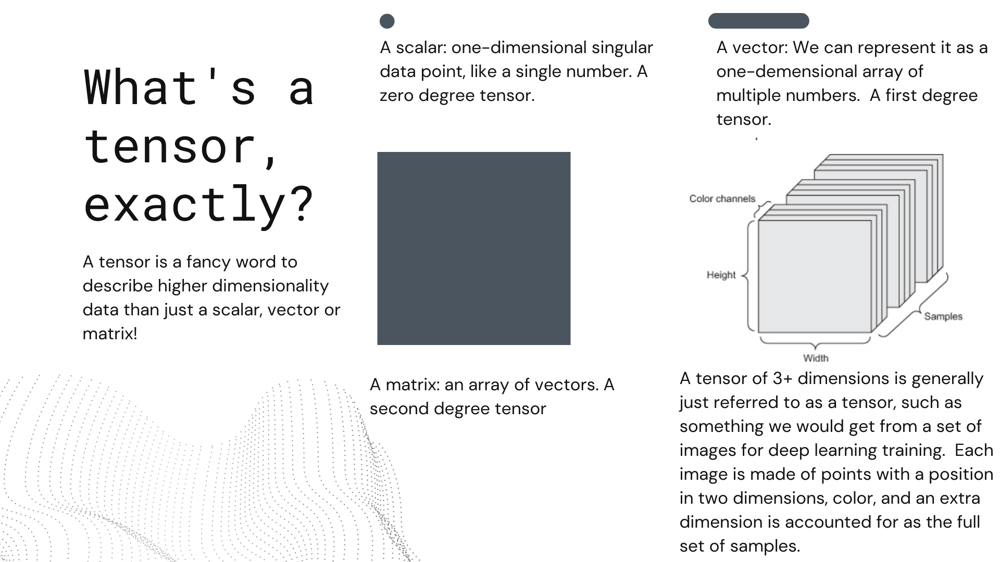

# Introduction to Deep Learning
## What is Deep Learning, how is it different from classic machine learning, and how do we leverage it?

### Agenda:
### Dictionary:
What do we talk about what we talk about Deep Learning?
What do all these terms mean?
How does his difffer from what we have done up until now?
### Life and Role of a Neuron:
An examination of the building blocks of deep learning
What makes an Artificial Neural Network tick? How does it train?
### Application
We’ll examine what programming one of these looks like, investigating the concept of building a simple neural network using the Keras front-end API for Tensorflow

## Dictionary
Artificial Intelligence:
Artificial Intelligence is the general act of training computers to make decisions. Its our broadest term.
Machine Learning:
Machine Learning is one tactic we utilize to realize AI. It involves taking algorithms (like the ones we have examined) and training them into models.
Deep Learning:
Deep Learning is a tactic that lives within Machine Learning, that is to say that it is a speciic application of Machine Learning. Deep Learning is Machine learning that is contingent on a specific type of algorithm type: the Artificial Neural Network. From this point, we can drill down further, as there are many different structures that are all part of the artificial neural network (ANN) family of models!

> "But wait, I thought Artificial Intelligence was a subset of Machine Learning?”

\- Surprise! People don't use these terms consistently and you might hear AI used sononomously with Deep Learning, Machine Learning, Data Science, or none of the Above! **Its your job to keep your language consistent but ensure that you are on the same page as your conversational partner if you hear "artificial intelligence."**

---

> "What about Computer Vision? I've heard about that in relation to this field."

\- Computer vision comes into play a lot in this field, in that it plays into the greater AI umbrella but its not the same concept as Deep Learning. When we reference Computer Vision, we are talking about the ability of computational methods to perceive visual information. This is often intuitively accomplishable with the structure of an Artificial Neural network, which we will intuit as se move foward and talk about these methodologies.

## Why Deep Learning?

### Dimensionality
We have already seen how sparsity can be an issue when it comes to dimensionality in our NLP block. Especially wide data frames can dramatically increase the space in which a line must regress, which makes decisions particularly hard to compute accurately, as we inevitably wind up with +1 dimension of space separating our data points for each feature we add into our mix. Deep learning avoids some of the consequences of this by tackling the structure itself differently.
### Parallelization
Deep learning involves a lot of calculus and linear algebra acting (typically) in high dimensional space. One of the advantages of the types of computation that we are doing with neural networks is that we can leverage a GPU (or better yet, multiple GPUs) to do our work faster than a CPU could do for the same set of tasks. Even better than that, using a series of someone else's GPUs!
### Automation
When we work with traditional machine learning, we have observed how painstaking it can be to curate which features are being utilized for our models. A large aspect of this is automated in the training of a deep neural network through the act of backpropagation, which continuously updates the weights of individual features based on their importance to the outcome of the model and loss.
> Does this mean its always better?
>
>**No!!**
>
>Deep learning is absolutely fantastic for many specific applications, but do not presume its a magic bullet that will always solve a problem or improve upon previous models.
### Advantages:
NNs work fantastic on multimedia and data that by its initial nature is nontabular, and/or large, that is to say, something that isn't packaged into a SQL database or a csv.
- Images / Video
- Sound
- NLP
- Reinforcement learning

### Disadvantages:
Artificial Neural Networks can fail you in several areas:
- When you have tabular data that you as a data practitioner can make interpretations about
-When you have a small data set
- When you want a model with a high level of interpretability
- When you want a light weight solution
-When you want to more specifically avoid bias and junk input
> Remember: **Build from simple to complex!!**

## Applications:
You see them all around you!
Deepfake videos
automated driving
nlp story generators
predictive text
camera-based translation apps
image generation
image classification
And like a bazillion other things
## Life and Role of a Neuron: What Makes it tick? What makes *us* tick?

---
OK, but how does that relate to what we are doing here?
---

### ANN Components:

### Neuron Components:

### What is a Tensor, exactly?

### Gradient Descent:
The name of the game, as with any model, is to minimize loss. This is where we use a bunch of calculus! Yay! (Computer do calculus Be Not afraid)
If you've taken Calculus, recall the process of finding local minima in a function:
In order to minimize loss, imagine closing your eyes and taking steps around hilly terrain. taking a step in some direction will give you some idea of getting lower or higher. You could repeat this process indefinitely to eventually reach a low point.
When we talk about stochastic gradient descent, we will see a bit more randomness in our progress down the hill as a result of taking mini-batches of our data to speed up computational burden.
### Backpropogation
As we mentioned before, we have input values, each will be summed following multiplication with its individual weight and additionally a bias, and then compressed via an activation function like the sigmoid function to put it on a scale of 0 to 1 for each output node (mid-layer or final output).

This will occur for each layer, and result in output that will be some value that may or may not be what we want. We will calculate a loss metric just like we would with any model.

From this point, we use an optimizer that will allow us to assess how we will want to nudge weights and biases appropriately. Keep in mind the nodes have different values (like the inputs that go into the model at the start, but for every layer. Imagine a row of cells with values in a dataframe) and the weights will subsequently impact differently 

Using the chain rule and some multivariate calculus, we get which direction we want to push each weight and bias going back through to the first layer. We do this and sum for each mini batch, eventually reaching a local minimum. We will do this until we reach the full sum of samples in our training set, what we call an epoch. Then we do it again! a bunch of times!
## Beyond the multilayer perceptron:

There are many other structures in the family of Artificial Neural Networks, including:
- Generative Adversarial Networks
- Recurrant Neural Networks
- Long Short Term Memory (LSTM)
- Autoencoders
- And many others!

This is just the tip of the iceberg, go forward and explore!