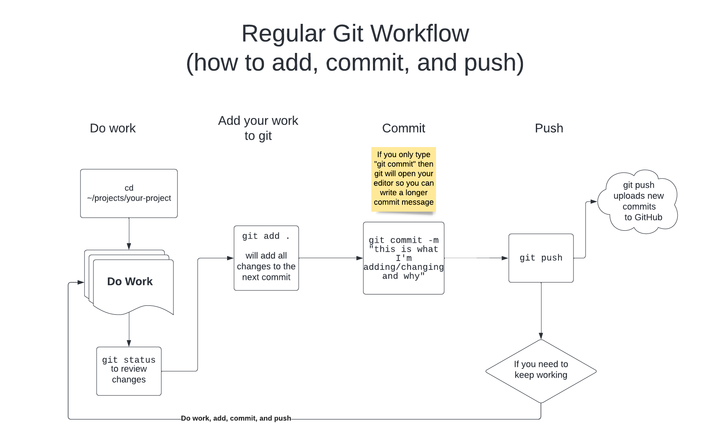

# The "Local First" Git Repository Setup Approach

## Diagram of the Process Described Below


## Initializing a Repository

```
git init
```

`git init` is the command we will use any time we want to create, or
*initialize*, a new repository. This command will tell git that we wish to track
files in this directory, as well as any files in any subdirectories as well. You
should run this command from the top level directory of your project.

Note that this command should only be run once per project you are working on
with git.

## Adding files

When we add files to our repository, we are _staging_ them.  Staging means they
are ready to be added to the repository, and will be available to _commit_.
When we commit, we making an official record of the changes (additions or
deletions) resulting from the _commit_.

Adding files is how we take our files from _untracked_ to _tracked_.

### Using `git status`

Before we add any files, let's take a look at the current status, by running
`git status` inside our repo.

    On branch master
    
    Initial commit
    
    Untracked files: (use "git add <file>..." to include in what will be
    committed)
    
        Codeup/
    
    nothing added to commit but untracked files present (use "git add" to track)

Notice that git says we have an *untracked* file. If you initialized a
repository where there were files already in the directory, you would see this
message. You would also see this message when you create new files in an
existing project. Because git has no history of those files they are in an
unknown state, aka "untracked".

!!!note "Helpful Hint"
    You should run `git status` very frequently, as it will make you aware of
    the state of your repository. If you are new to git, consider running `git
    status` between every other git command that you execute.

### Using `git add`

To move a file from *untracked* to *tracked* we use the `gid add` command.
Because we could have any number of file untracked in our repository, we must
tell `git add` which file we want to track. For example, if we had a file called
`Codeup/my_new_file.sql` we would do:

```
git add Codeup/my_new_file.sql
```

Doing this would change the output of our `git status`:

    On branch master
    
    Initial commit
    
    Changes to be committed: (use "git rm --cached <file>..." to unstage)
    
        new file:   Codeup/my_new_file.sql
    
    Untracked files: (use "git add <file>..." to include in what will be
    committed)
    
        Codeup/index.sql
        Codeup/hello_world.sql
        ...

Notice here that git now shows other files in the `Codeup` directory as
untracked. As soon as one file from an untracked directory is added, git will
designated all other files in that directory as untracked as well.

This tells us that our file is now staged, and is ready to be committed. We can
run `git add` additional times for any other files we would like to stage for
the next step: committing.

## Committing Changes

By committing code to a git repository, changes are recorded with a message,
timestamp, and unique identifier.

Code committed to a repository can then be shared, altered, and all future
changes will be logged in the history. We can revert to previous states in the
code, see who wrote which lines (and when), and many other features. By
committing our code, we are making it officially part of a project.

### Committing

```
git commit
```

OR

```
git commit -m 'Detailed commit message goes here'
```

To commit previously added files, we can simply run `git commit`.

To record our changes in git's history, we can run `git commit`. This will take
all the files we have staged previously and record their content in git's
history. When we run `git commit`, git will prompt us for a *commit message*,
that is, a brief description of the changes we made.

If we run just `git commit` by itself, git will open our default editor, usually
vim unless otherwise specified, for us to write our commit message in. We can
also specify a commit message on the command line by passing the `-m` flag to
git, followed by a commit message.

!!!warning "Write Good Commit Messages"
    In general, we will prefer **not** to use the `-m` option, as we prefer to
    write detailed thoughtful commit messages.

!!!note "Helpful Hint"
    If you run `git commit` and get "stuck" in a terminal-based editor, you most
    likely opened `vim`. To exit vim (without saving):

    1. Press the escape key a couple times
    1. Press colon, that is, `:` (this enters vim's "command mode")
    1. Exit the file with or without saving changes
        - To quit without saving: type `q!` then press enter.
        - To save your changes: type `wq` then press enter.

## Pushing and Pulling

Pushing refers to transferring changes from a local repository to a remote
repository.  This is much like uploading a file, the difference being that git
only uploads, or _pushes_, the changes. Pulling is the opposite of pushing, it
is the act of retrieving updates of changes from a remote repository.

### Remotes

Git allows us to have different *remotes* for our repositories. A remote is
essentially a copy of our repository in a different location. For this course we
will use GitHub as our remote, but a remote could be on a company server,
another laptop, or a different git hosting service, like BitBucket or Gitlab.

While a remote can have any arbitrary name, a very common convention is to use
the name `origin`. There are two main operations we will perform in the process
of working with remotes, *pushing* and *pulling*.

### Setting Up a Remote Repository

Creating a new repository on GitHub can be accomplished several ways, one of
which is going to [`https://github.com/new`](https://github.com/new). Here you
can enter the name of your repository and an optional description.

!!! warning "Creating A Repository"
    Make sure the checkbox that says "Initialize this repository with a README"
    is **not checked**, and that the dropdowns for "Add .gitignore" and "Add a
    license" both say "None". This should be the default, so don't make any
    changes to these options.[^1]

After creating the repository, Github will take you to a page that will show
instructions for setting up a repo. First, make sure your repo on GitHub is
configured to use *SSH*, **not** *HTTPS*. We have already configured your
computers to push using SSH very easily.

Next, find the line that refers to adding the remote to git. It should look like
this:

```
git remote add origin git@github.com:YourUsername/your-repo-name.git
```

This line tells git to add a remote repository named `origin`, and point it to a
GitHub repository.

Now that we have a remote setup, we can *push to*, and *pull from* that remote.

### Using `git push` and `git pull`

Pushing and pulling are very simple, and git makes it easy for us to update and
retrieve code from our remote repository.

Push our changes to a remote

```
git push origin master
```

To pull the latest changes

```
git pull origin master
```

## Ignoring Files

Sometimes there are files or folders we do not want to be tracked by git. For
example, if we were building an application that had multiple *dependencies*
managed by another piece of software, tracking those files with git would be
redundant and could cause conflicts. We can tell git to ignore certain files by
creating a `.gitignore` file in our repository.

### Creating the `.gitignore` File

Git looks for a file named `.gitignore` at the base of our repository for
instructions on what files to ignore.

The `.gitignore` file is a list of files and paths we want git to not pay
attention to. For example, if we had a file called `ipython.log` we wanted
hidden from git, we could put it in our `.gitignore` file like so:

```
ipython.log
```

We can also put longer paths in our `.gitignore` file:

```
notebooks/my_data.csv
```

Finally, `.gitignore` can contain wildcards (`*`) to find files or folders that
match a certain pattern. For example, if we wanted git to ignore everything in a
directory named `data`, and ignore any file with the `.tsv` extension, we could
add both with wildcards:

```
data/*
*.tsv
```

## Example Workflow

Altogether, a sample workflow for using git might look like this:

!!!note "Helpful Hint"
    Remember to run `git status` frequently, possibly even between every step
    below.

### Initial Repository Setup

1. Create a new project and initialize a repository

   ```
   mkdir my-new-project
   cd my-new-project
   git init
   ```

1. Create a repository on Github and add the remote to your project

   ```
   git remote add origin REMOTE_URL
   ```

   Where `REMOTE_URL` is the url obtained from Github after creating a repo.

1. Create a `README.md` file with a short description of the project, and add
   and commit it

    After creating the readme file:

    ```
   git add README.md
   git commit -m 'Initial Commit'
    ```

1. Push your changes

   ```
   git push origin master
   ```

   After pushing, visit Github and verify that you can see the `README.md` file
   that you created.

## Daily Workflow

1. Edit or Create files
1. Add and commit the files you changed or created
1. Push your changes to Github


## Diagram of Daily Workflow

