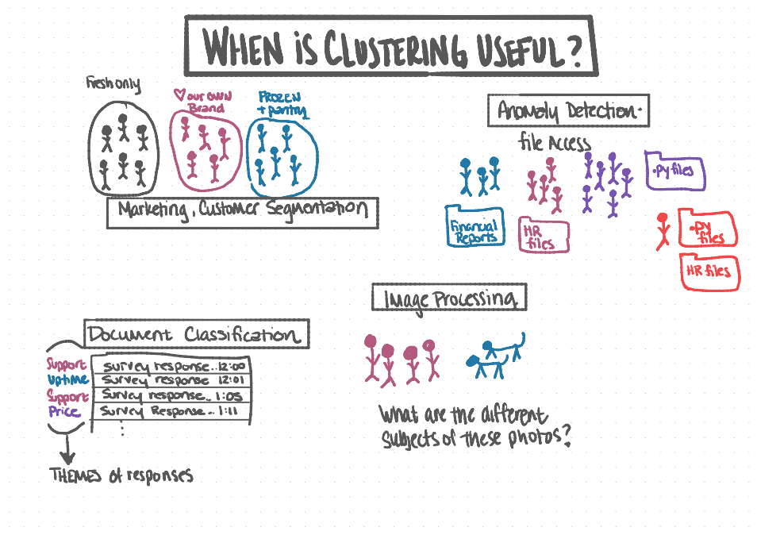
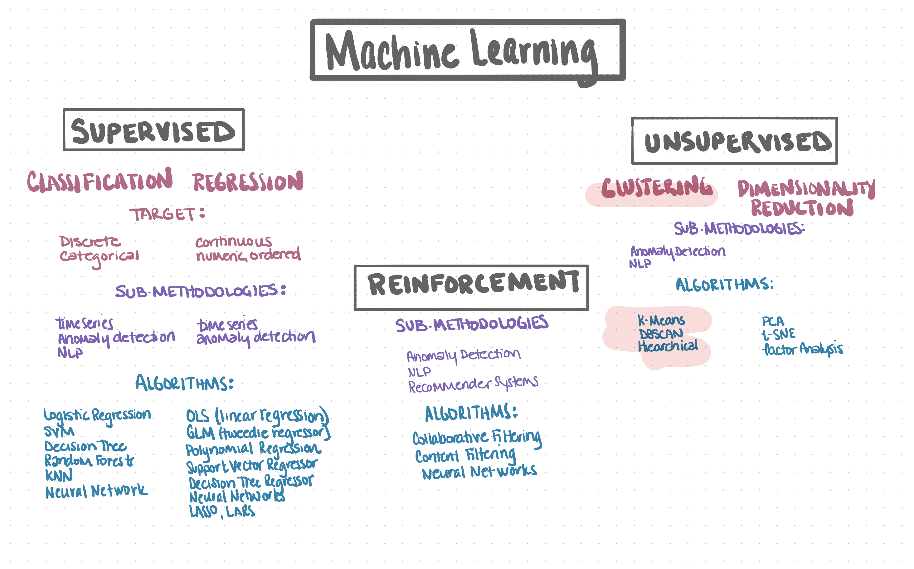
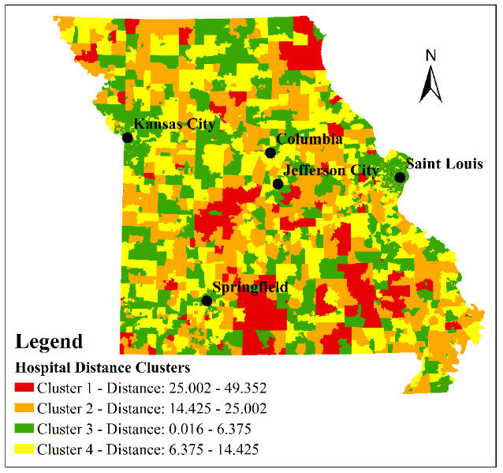
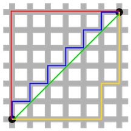
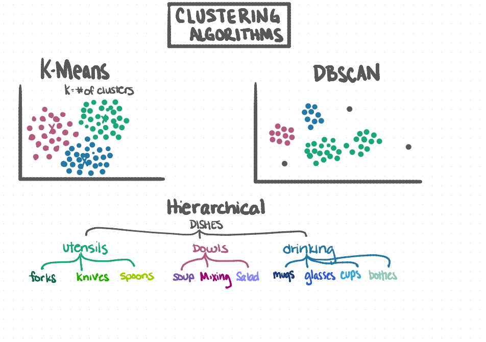
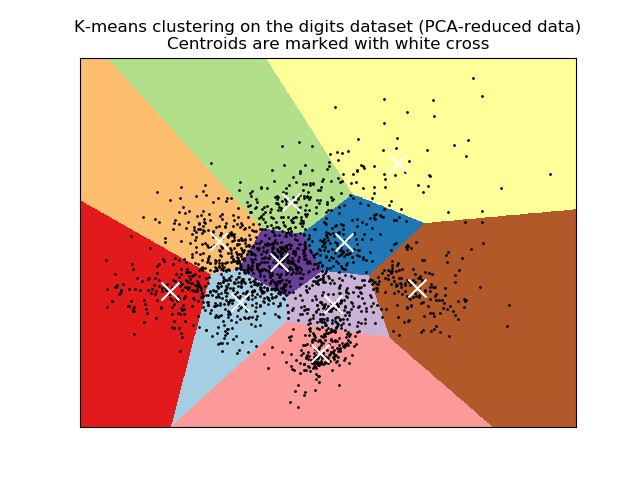
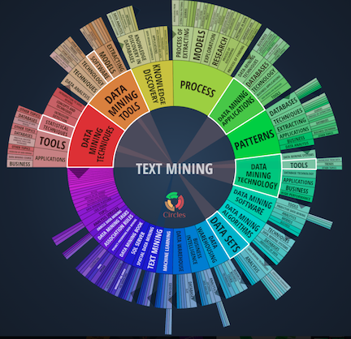

# Clustering

## Learning Goals

1. Be able to discuss and discover use cases for clustering across multiple industries. 
    
1. Be able to recognize common clustering algorithms.

1. General understanding of how the k-means clustering algorithm works.

1. Ability to implement k-means clustering in python.

1. Handle outliers using IQR. 

1. More practice scaling data. 

1. Strategies for missing values. 

1. Plotting clusters.  

1. Ability to make use of discovered clusters later down the data science pipeline.  

## About Clustering

Clustering is...

- **Unsupervised** machine learning methodology 

- Used to group and identify similar observations when we do not have labels that identify the groups. 

- Often a preprocessing or an exploratory step in the data science pipeline. 

Suppose you have a data set with observations, features, but no labels or target
variable. You want to predict which group of similar observations a new
observation will fall in. Without the labels, you cannot use a supervised
algorithm, such as a random forest or KNN. We can address this challenge by
finding groups of data in our dataset which are similar to one another. These
groups are called clusters.

Clustering can also be used for data exploration, or to generate a new feature
that can then be fed into a supervised model.

Formally, clustering is an unsupervised process of grouping similar observations
or objects together. In this process similarities are based on comparing a vector of
information for each observation or object, often using various mathematical
distance functions.

Clustering methodologies include:

- Partitioned based clustering (K-Means)

- Hierarchical clustering

- Density-based clustering (Density-Based Spatial Clustering of Applications with Noise (DBSCAN))

Every methodology follows a different set of rules for defining the ‘similarity’
among data points. While there are more than 100 known clustering algorithms,
few of the algorithms are popularly used, and we will be focusing on K-means in
the coming lesson.

## Clustering Use Cases

- Text: Document classification, summarization, topic modeling, recommendations

- Geographic: Crime zones, housing prices

- Marketing: Customer segmentation, market research

- Anomaly Detection: Account takeover, security risk, fraud

- Image Processing: Radiology, security

## Vocabulary

**Euclidean Distance**

The shortest distance between two points in n-dimensional space, a.k.a. *L2 distance*.

$\sqrt{\sum_{i=1}^n(q_{i}-p_{i})^2}$

**Manhattan Distance**

The distance between two points is the sum of the absolute differences of their Cartesian coordinates. Also known as:  taxicab metric, rectilinear distance, $L_1$ distance, $L^1$ distance or $l_{1}$ norm, snake distance, city block distance, or Manhattan length.

**Cosine Similarity**

Cosine Similarity measures the cosine of the angle between two vectors to define similarity between two vectors. It is a measure of orientation and not magnitude: two vectors with the same orientation, i.e. parallel, have a cosine similarity of 1 indicating they are  maximally "similar". Two vectors oriented at 90° relative to each other, i.e. perpendicular or orthogonal, have a similarity of 0 and are considered maximally "dissimilar". If two vectors diametrically opposed ($180^{\circ}$) have a similarity of -1. The cosine similarity is particularly used where the outcome is neatly bounded in $[0,1]$.

**Sparse vs. Dense Matrix**

A sparse matrix is a matrix in which most of the elements are zero. By contrast, if most of the elements are nonzero, then the matrix is considered dense.

The number of zero-valued elements divided by the total number of elements (e.g., m × n for an m × n matrix) is called the **sparsity** of the matrix (which is equal to 1 minus the density of the matrix). Using those definitions, a matrix will be sparse when its sparsity is greater than 0.5.

**Manhattan (Taxicab) vs Euclidean Distance**

In taxicab geometry, the red, yellow, and blue paths all have the same shortest path length of 12. In  Euclidean geometry, the green line has length $6\sqrt{2}\approx8.49$ and is the unique shortest path.

## Data Types

**Input**: Continuous data, or ordered discrete data at a minimum.

**Output**: Integer representing a cluster id. The number itself doesn't mean anything except that those who share the same number are most similar. In addition, the number doesn't compare to any of the other cluster id's beyond the fact that they are different.

## Common Clustering Agorithms

### K-Means

- Most popular "clustering" algorithm.

- Stores K centroids that it uses to define clusters.

- A point is considered to be in a particular cluster if it is closer to that cluster's centroid than any other centroid.

- K-Means finds the best centroids by alternating between (1) assigning data points to clusters based on the current centroids, and (2) choosing centroids (points which are the center of a cluster) based on the current assignment of data points to clusters.

- Python implementation: [`sklearn.cluster.KMeans`](https://scikit-learn.org/stable/modules/generated/sklearn.cluster.KMeans.html)

**Key Hyperparameters**

- Number of Clusters (`k`): The number of clusters to form, which is equal to the number of centroids to generate.

- `random_state`: Specific to sklearn, this is for 'setting the seed' for reproducibility. When you use any integer as a value here and then re-run with the same value, the algorithm will kick off with the same seed as before, thus the same observations & centroids.

**Pros of K-Means**

- Performance scales well with the amount of data, i.e. the algorithm is linear in the number of objects $O(n)$.

- Creates tighter, more refined clusters.

- Centroids can be recomputed driving an observation or object to another cluster.

**Cons of K-Means**

- Naive use of the mean value for the cluster center.

- Fails when the clusters are not circular.

- Which observations the clustering starts with, i.e. initial seeds, can dramatically affect the results.

- The order of the data can affect the results.

### Hierarchical Clustering

- **Bottom-up Clustering**: Each observation is its own cluster (bottom) and clusters are merged as they move "up" the hierarchy, a.k.a. hierarchical agglomerative clustering. [sklearn.cluster.AgglomerativeClustering](https://scikit-learn.org/stable/modules/generated/sklearn.cluster.AgglomerativeClustering.html)

- **Top-down Clustering**: All observations start in a single cluster (top) and is split apart recursively as it moves "down" the hierarchy, a.k.a. hierarchical divisive clustering.

- Good fits for hierarchical clustering: Customers' preferred support channels, classifying biological species, like the animal species, shopping cart analysis. 

**Key Hyperparameters**

**Linkage**: Determines which distance to use between sets of observations. 

- ward: Looks for clusters that are very cohesive inside and extremely differentiated from other groups. It tends to find clusters of similar size. Only uses Euclidean distance metric.

- average: Uses the clusters centroids or the average of the distances of each observation of the two sets. Clusters can be of different sizes and shapes.

- complete or maximum linkage: Uses the maximum distances between all observations of the two sets, or the most dissimilar observations. This leads to more dense clusters.

- single: Uses the minimum of the distances between all observations of the two sets.

**Affinity**: How distance is defined in the algorithm, i.e. which distance calculation is used. 

- Euclidean Distance (euclidean or L2 options): Shortest distance between two points, the shortest route, as if you were flying a plane from one point to the next.

- Manhattan Distance (manhattan or L1 options): Requires movements that are parallel to the x or y axis at any given time, as if you were driving in a car in manhattan along the grid-like streets.

- Cosine Similarity (cosine option): Puts emphasis on the 'shape' of the variables rather than their values, so it will associate observations that have similar min and max variables, e.g. Cosine Similarity is a good option when you have high dimensionality, i.e. many variables. This is often used in measuring similarity of text.

**Pros of Hierarchical Clustering**

- Deciding the number of clusters is intuitive by looking at the dendrogram that is created.

- Relatively easy to implement.

**Cons of Hierarchical Clustering**

- Performance does not scale well with amount of data, i.e. the algorithm is quadratic in the number of objects $O(n^2)$; therefore, the ability to perform on large datasets is challenging, if not impossible.

- Less adaptable, i.e. once an instance is assigned to a cluster it cannot be moved around.

- Highly sensitive to outliers.

- The order of the data as well as the observations which the clustering starts with, i.e. initial seeds, can dramatically affect the results. 

### DBSCAN

DBSCAN: Density-Based Spatial Clustering of Applications with Noise

- Clusters together objects based on the density of the space around them.

- Those with many neighbors will be clustered together, while objects sitting in a low density space will not be placed in a cluster.

- [sklearn.cluster.DBSCAN](https://scikit-learn.org/stable/modules/generated/sklearn.cluster.DBSCAN)

**Key Hyperparameters**

If $p$ is the point derived from the vector of an object (i.e. the vector of an observation), the minimum number of points **(minPts)** must be within a radius of **$\epsilon$** from $p$. These parameters must be specified by the user.

**Epsilon** $\epsilon$ (`eps`): Can be estimated using a k-distance graph, looking for the elbow in the graph.

**Minimum Points** minPts (`min_samples`): Can be estimated by the number of dimensions,*D*, in the dataset. 

- *minPts* $\geq$ *D + 1* $\bigwedge$ *minPts* $\geq$ *3*

- *minPts* = 2 $\times$ *D* is generally a good estimate.
    
- For larger datasets or those with more outliers, however, a value greater than that may be needed.

**Distance Metrics** `metric`: [sklearn.metrics.pairwise_distances](https://scikit-learn.org/stable/modules/generated/sklearn.metrics.pairwise_distances)

- Euclidean Distance (euclidean or L2 options): Shortest distance between two points, the shortest route, as if you were flying a plane from one point to the next.

- Manhattan Distance (manhattan, L1, or cityblock options): Requires movements that are parallel to the x or y axis at any given time, as if you were driving in a car in Manhattan along the grid-like streets.

- Cosine Similarity (cosine option): Puts emphasis on the 'shape' of the variables rather than their values, so it will associate observations that have similar min and max variables, e.g. Cosine Similarity is a good option when you have high dimensionality, i.e. many variables. This is often used in measuring similarity of text.

**Pros of DBSCAN**

- Doesn't require pre-set number of clusters.

- Identifies outliers as noise.

- Able to find arbitrarily sized and arbitrarily shaped clusters.

- Requires only 2 parameters.

- Is not largely affected by the order of the data.

**Cons of DBSCAN**

- Performance does not scale well with amount of data; however, performance can improve with indexing. The worst case scenario is $O(n^2)$.

- Doesn't do as well with clusters of varying density.

- Not great with very high-dimensional data because the distance threshold, epsilon, becomes challenging to estimate.

- When an object sits on the border of more than one cluster, the cluster is determined by the order of the data.

## Further Reading

- [Wikipedia: Cosine Similarity](https://en.wikipedia.org/wiki/Cosine_similarity)
- [Wikipedia: Sparse Matrix](https://en.wikipedia.org/wiki/Sparse_matrix)
- [Wikipedia: Taxicab Geometry](https://en.wikipedia.org/wiki/Taxicab_geometry)
- [A short kmeans example](http://stanford.edu/~cpiech/cs221/handouts/kmeans.html)
- [Kmeans Visualization](http://web.stanford.edu/class/ee103/visualizations/kmeans/kmeans.html)
- [Interactive k-means demo](https://www.naftaliharris.com/blog/visualizing-k-means-clustering/)
- [DBSCAN Interactive Demo](https://www.naftaliharris.com/blog/visualizing-dbscan-clustering/)
