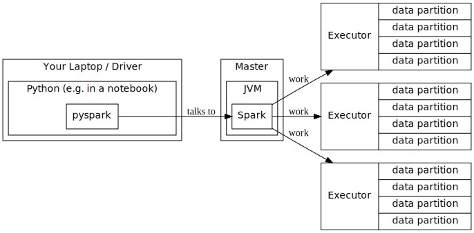
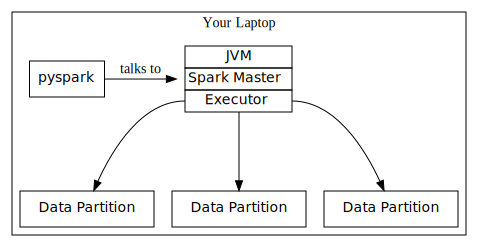

# Distributed ML Overview

In this module, we will learn about [Apache Spark](https://spark.apache.org/), a tool for handling big, distributed, or streaming data.

1. **Overview**: In the overview we will present a rough outline of how spark works, and look at the components from a high-level view. 
1. **Environment Setup**: In this lesson we will set up your environment so that you can run spark.
1. **Spark API**: In this lesson we will cover how to work with spark through python, and look at how to manipulate spark dataframes.
1. **Data Wrangling**: In this lesson we will cover reading and writing data with spark, and use our spark API knowledge to acquire and prepare a dataset.

## Apache Spark Architecture

Spark is written in a language called scala, which runs on the Java Virtual Machine (JVM). Initially, you had to write scala code to interact with spark. Now there are many different *client libraries* to interact with spark. This means you can harness spark's power using python, R, or a number of other languages.

We will be using **pyspark**, the python interface to spark. Pyspark lets us write python code that manipulates spark dataframes (which are similar to pandas dataframes), and the pyspark library will translate our python code into spark code that will run on the JVM.

Because pyspark is interfacing with spark, which is running on the JVM, we will sometimes see error messages and stack traces from Java when working with pyspark code.

### The Driver and Executors

Broadly speaking, a Spark application is broken into several areas:

1. The **Driver**: a single JVM (Java Virtual Machine) process that is responsible for analyzing your Spark program, optimizing your DataFrame queries, and determining how your Spark jobs should be parallelized.
1. The **Cluster Manager**: Gathers resources and schedules jobs on the cluster.
1. The **Executors**: which actually perform the distributed work.

Each Spark program has a single Driver, a Cluster Manager, and one or more Executors. The Driver is usually your laptop, which will be running `pyspark` and will be connected to a cluster.

The **Driver** (on the laptop):

- Runs `pyspark`
- Analyzes and optimizes spark queries

The **Master**, or **Cluster Manager**:

- Allocates Resources
- Creates Executors

The **Executors** on each node:

- Read the data from various source(s)
- Do the actual work

### Local Mode

Spark also can run on a single machine through what it calls *local mode*. In local mode, there are no Executor processes. Instead, the Driver also acts as (a single) Executor.

For this module, we will exclusively be running spark in local mode. We won't be getting into the finer points of operating or managing a spark cluster, rather, we will get familiar with the Spark API and writing pyspark code.

### Doing Work in Parallel

Spark parallelizes the work that it does, to the extent that it can. What this means is that multiple things are done at the same time, as opposed to doing one thing after another.

There are two levels to how work is parallelized in spark:

- All of the executors work together at the same time.
- Within each executor, the data is divided into **partitions** that can be processed at the same time. Generally speaking, the number of partitions is equal to the number of available CPU cores on the executor.

### Transformations and Actions

Spark dataframe manipulation can be broken down into two categories:

- **transformations**: A function that selects a subset of the data, transforms each value, changes the order of the records, or performs some sort of aggregation.
- **actions**: transformations that actually do something; something that necessitate that the specified transformations are applied. For example, counting the number of rows, or viewing the first 10 records.

Spark is often referred to as **lazy**. What this means is that we can specify many different transformations, but none of the transformations will be applied until we specify an action.

### Shuffling

A **shuffle** occurs when a transformation requires looking at data that is in another partition, or another executor. 

A few examples:

- Performing arithmetic on each number in a column does *not* require a shuffle as each number can be processed independently of the others.
- Sorting the dataframe by the numbers in a single column *does* require shuffling, as the overall order is determined by all of the data within all of the partitions.
- Selecting a subset of the data, for example, selecting only the rows where a condition matches, does *not* require a shuffle, as each row can be processed independently.
- Calculating the overall average for a numeric column *does* require shuffling, as the overall average depends on data from all the partitions.

Shuffles get increasingly more expensive as the size of the data grows, and when a shuffle is performed is one of the largest considerations in optimizing spark code for performance.
