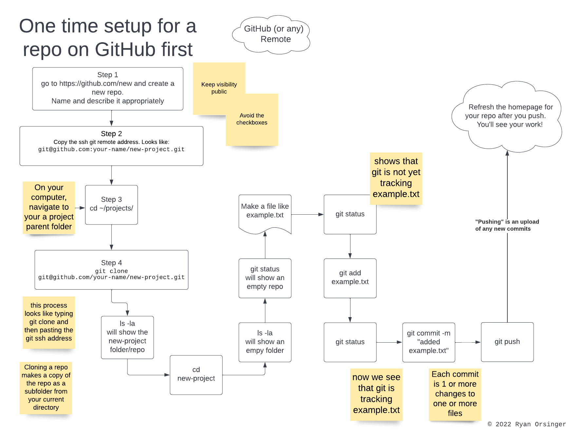
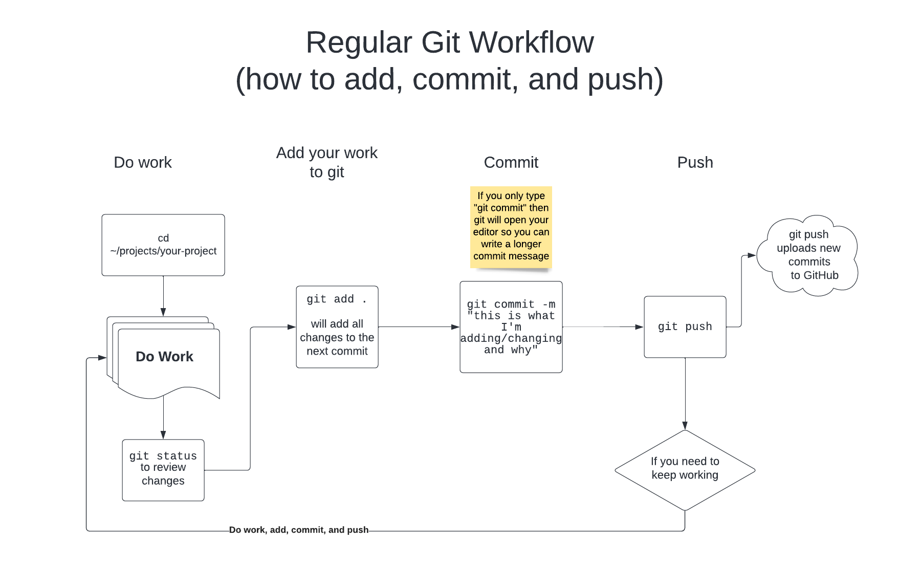
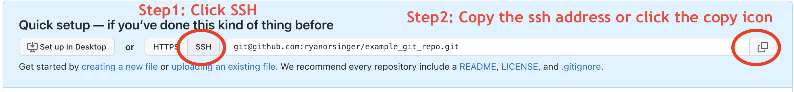
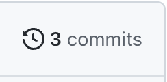
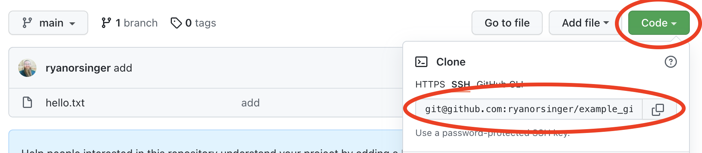

# Version Control with Git

## What is Version Control?

Version Control means to track, monitor, and manage changes. Version control systems allow us to track changes in files. One version control system is the "Version History" on a Google Doc or the "Track Changes" feature on Microsoft Office documents. Another type of version control is manually naming files with numbers or context like `resume.pdf`, `resume2.pdf`, and `resume_final.pdf`. While these are both adequate types of version control, code and its documentation benefit from a more robust tool.


## What is Git? 

Git is a formalized way to keep track of changes, and allows its users to view changes over time. [Git](https://git-scm.com/) is the most popular version control system for source code and software projects. 

Git can be thought of as a permanent record with a time machine and parallel universes. 

| Git is a permanent record for source code | with a time machine                                          | and parallel universes                        |
| ----------------------------------------- | ------------------------------------------------------------ | --------------------------------------------- |
|  |  |  |


> "Git is a free and open source distributed version control system designed to handle everything from small to very large projects with speed and efficiency." - [Git documentation](https://git-scm.com/)


## Why do we care about Git? 

Software developers, data scientists, and infrastructure teams use version control to keep track of changes and different features in software, analysis, environments, or documentation. Just having a backup is not enough. Version control allows people to have carefully maintained histories among one or multiple versions. 

Think of all the different versions of operating systems like `version 10.18.1 ` of the Mac OS, `Version 2 of Windows 11 Pro`, or any number of Linux distributions. Recognize that each version of a piece of software is made up of its own set of facts, its source code. 

Each different version of source code or documentation is a different body of facts. Git tracks facts and allows us to name and explain those sets of facts. 

[GitHub](https://github.com/) (and sites like GitLab or BitBucket) is a web application that makes it visually easy to review code, compare different versions, and collaborate.


## Key Vocabulary and Concepts

- **local**: means your computer, your laptop or desktop.
- **remote**: means another computer, a server, or service (like GitHub) where you backup your code and push changes.
- **repository**: a directory managed by git.
- **add**: to tell git which files we wish to look at for the next commit. Adding files is like putting documents in an envelope.
- **commit**: to create a "save point", to formally take a snapshot of a repository. Commiting means sealing the envelope with your own wax seal and a timestamp. Think of commits like hard save points.
- **push**: to copy the state of a local repository elsewhere, most commonly, to
  send your work with github. Pushing means uploading.
- **clone**: to copy an entire repository's content along with the fact that the folder is a repository.


## Initial Repository Setup

### GitHub-first approach

1. Create a new repository on your GitHub account
    
2. Copy the SSH link to your clipboard

3. Navigate to a folder to hold your new repository 
    
4. Clone the repository that was created on github.com 

5. Verify that the repo was cloned down



### Local-device-first approach

Initialize the repo on your local device first and then connect to the remote repo. That process is documented in the [curriculum appendix](https://ds.codeup.com/appendix/git-local-setup). 


## Regular Workflow with Git

Once a repository created on both your computer and GitHub, it's time to start doing work.

Here's the short version for your regular, daily Git workflow:

1. Do work (add files, edit files, delete files, rename files, etc) in a repository.

2. Add your work with `git add filename.py` (one file at a time)
    1. `git add .` (will add all files in the folder) 

3. Commit your work with message  `git commit -m "adding this file"`

4. Push your work with `git push` (this uploads all new commits to GitHub) 





> If your code ain't in GitHub then it doesn't exist. Always add, commit, and push your work, every day.  

Later in the course, when we work in teams, the workflow will change a bit and that is documented in the appendix as [Git for teamwork](https://ds.codeup.com/appendix/git-teamwork/)


## Configuring GitHub

There are many different options to change [git's behavior](https://git-scm.com/docs/git-config#_variables).

We will be setting up a couple of things: our name and email, and a global gitignore file.

All of our configuration can be changed through the `config` git subcommand, as well as by editing the `~/.gitconfig` file.

### Email and Name

We need to tell git who we are. This configuration will default to whatever git
can find out about you based on your Mac's configuration, but this will explicitly tell it.

```
git config --global user.name "Your Name"
git config --global user.email you@example.com
```

### Global `gitignore` File

We can also setup a *global `.gitignore` file*. This file will tell git to
ignore certain files system wide, in addition to any files found in a project
specific `.gitignore`.

For example, since we are using MacOS, we will tell git to never
track `.DS_Store` files. These files are autogenerated by Finder whenever a
directory is opened, and won't pertain to any of our projects.

The command below will create a file named `.gitignore_global` with a line in it
that specifies `.DS_Store` files to be ignored

```
echo '.DS_Store' >> ~/.gitignore_global
```

Now we can tell git that we should use this file to globally ignore files.

```
git config --global core.excludesfile ~/.gitignore_global
```

## Further Resources

- [Official Git Website](https://git-scm.com/)
- [Github's Resource List for Learning git](https://try.github.io/)
- [Tim Pope on Commit Messages](http://tbaggery.com/2008/04/19/a-note-about-git-commit-messages.html)
- [Create a Local Git Repository and Push to GitHub](https://www.youtube.com/watch?v=L7vzPm3_Im8)
- [Intro to Using Gitignore to Have Git Ignore Sensitive Files](https://www.youtube.com/watch?v=orp03xihHso)


## Exercises 


### Initial Repository Setup

1. Go to https://github.com/new and create a new repository on your GitHub account. 
    - Select yourself as owner
    - Name it "example_git_repo"
    - Keep your repro public
    - Ignore all the checkboxes
    
1. Once the repository is set up, copy the SSH link to your clipboard.

    

1. Create a folder to hold all your codeup work and switch to it
    - Open up your terminal
    - Run `mkdir ~/codeup-data-science` to make a new directory to hold all your codeup work
    - Run `cd ~/codeup-data-science` to navigate to the new directory
    
1. Clone the repository that was created on github.com into your `~/codeup-data-science/` folder
    - Type `git clone  ` followed by a space character
    - Paste the SSH git address of your repository (`command V`)
    - Hit enter

    


1. Verify that the repo was cloned down
    - Run `ls` 
        - You should see the new a subfolder
    - Move into your new repo with `cd example_git_repo`
    - Run `ls -la` in your new repo
        - You should see a `.git` folder (which is for git's internals) and nothing else
    - Run `git status`
        - you'll see that you are on a default branch and have no commits yet
    
1. Confirm that this new repository points to GitHub appropriately
    - Type `git remote -v`
    - The output of this command will show that the remote, called `origin` points to GitHub.
    
Congratulations! You now have a repository in GitHub that is cloned down to your laptop. 


### Configuration setup

**COMPLETE ABSOLUTELY EVERY ONE OF THESE EXERCISES OR IT WILL HARM YOU LATER**

1. Setup your global Git configuration.
    - Run `git config --global pull.rebase false` to set a helpful default.
    - Run `git config --global user.name "Your Name"` with your full name in the quotation marks.
    - Run `git config --global user.email you@example.com` with your email address associated with GitHub.

    !!! danger "Set your git config to use the email address associated with your GitHub account"
        Make sure that the email address and name you provide on the command
        line matches exactly what you provided to GitHub, otherwise you won't
        get credit for your commits. This is the email address of your GitHub account.

1. Run the following commands to ensure that your user information is correct. 
    - Run `git config --global user.name`  to verify your first and last name.
    - Run `git config --global user.email` to verify your email address.

1. Set up your default branch name 
    - Run `git config --global init.defaultBranch main`.
    - Like many command line commands, successfully running this command produces no output. 

1. Double check that your `~/codeup-data-science` directory exists in the appropriate place.
    - Open up Finder
    - `Command + Shift + H` keyboard shortcut will navigate you to your home directory. 
    - Your home directory should list `Desktop`, `Downloads`, other folders, as well as `codeup-data-science`.
    - Click and drag your `codeup-data-science` folder to the left-hand menu of Finder to add this folder as a Finder favorite.


### Create `Hello_World` repository

1. Using the directions above, create a repository on GitHub called Hello_World.

    - `cd ~/codeup-data-science` and then clone your repo here.
    - `cd ~/codeup-data-science/Hello_World`

1. Orient yourself with your new repository and its parent folder

    - Type `git status`. What do you see? Does this make sense?
    - Type `ls -l`. What do you see? Does this make sense? Why/why not?
    - Type `ls -la`.  What do you see? Does this make sense? Why/why not?
    - Type `cd ..` to navigate to the parent folder
        - From the parent folder, type `pwd`. What is your current working directory?
        - Run `ls -la`. What do you see?
        - Run `git status`. What output do you see? Does this make sense or not?
    - Return to `~/codeup-data-science/Hello_World` (remember the `cd` command). Type `pwd` to confirm.

1. Do work on your local repository

    - Create a file named `hello.txt` inside of your `~/codeup-data-science/Hello_World` repo.
        - Use a code editor or the Mac application `TextEdit`.
    - The `hello.txt` file should have text  that says "Hello, World!" on the first line. Save the file.
    - Now type `git status` from your terminal. What do you see?
    - Type `ls -la`. What do you see here?

1. Add files

    - Run `git add hello.txt` to stage your file.
    - Run `git status`.
    - Read the output carefully and think about what changed.

1. Commit files

    - Run `git commit -m "added hello.txt"` to take a snapshot of you have staged
    - Run `git status` to see what changed.

1. Push files

    - Run `git push`
        - Pay attention to the output messages
    - Go back to your `Hello_World` repository on GitHub.com and refresh the page for your repository

Congratulations! You've made a repository, done work, added, committed, and pushed to GitHub!

  

### Add to files in your `Hello_World` Repository

1. From your `Hello_World` repository on your laptop, open `hello.txt` with VS Code or the Mac application `TextEdit`.

1. On the second line, add a new line of text that says "Now I'm adding a second line of content" and save.

1. From the terminal type `git status`. What do you see? What changed?

1. Now that you've added new content, run `git diff`. 

    - We can run `git diff hello.txt` or for other specific filenames
    - We can also run `git diff` to see all differences in any changed files.

1. Back in your editor, add a 3rd line of text to `hello.txt` that says "Adding a 3rd line of text"

1. Return to your terminal and type `git diff`, reviewing the feedback.

1. Add, commit, and push your work

    - Add your new work with `git add hello.txt`
    - Commit with `git commit -m "added 2 example lines of text"`
    - Now push to GitHub with `git push`

1. Review the changes on your `Hello_World` repo page on GitHub.


### Remove content from files in `Hello_World`

1. Using VS Code or the `TextEdit` Mac application, open up your `hello.txt` file in your local `Hello_World` repo.

1. Delete the 3rd line of text from `hello.txt` and save.

1. From your terminal, type `git diff`. 

    - What do you notice? 
    - How does this compare to the `git diff` you ran earlier when adding content?

1. Run `git add hello.txt` to add these changes.

1. Now type `git commit -m "Removed 3rd line of text"` to commit.

1. Push your work with `git push`

1. From your terminal type `git log` and review the results. This is log is your history of git commits. 

    - Notice how each commit lists the author, timestamp, and date. 
    - Notice how each commit has a unique alphanumeric identifier. This is the unique identifier for each separate commit.

1. In your browser, refresh your `Hello_World` repository page. 

    - Click the icon that shows the number of commits in this repository
     

1. Compare the results of your terminal's `git log` with what GitHub shows.


### Setup or restore a repository from GitHub

Let's setup an existing repository from GitHub on a local device

1. Verify your `Hello_World` repository exists on GitHub with the `hello.txt` file and 3 commits.

1. Open up Finder on your Mac and navigate to `~/codeup-data-science` folder.

1. Delete your local `Hello_World` repo.

1. In your terminal, run `cd ~/codeup-data-science` and run `ls -la`. Your local repo should no longer be there.

1. Let's simulate restoring your work from GitHub.
    - Inside of GitHub, click Code and then copy the SSH git clone address to your clipboard.
    
    - From `~/codeup-data-science`, type `git clone`, space, and then paste the ssh clone address.
    - Now type `ls -la`. Do you see a new local copy of the repo?
    - `cd  Hello_World`
    - `ls -la` should show that all of your work is now restored from GitHub

This exercise highlights the importance of committing and pushing your code regularly. If you have a steady habit of both committing and pushing your work to GitHub, restoring your work is direct. Imagine if this was more important work and if you had neglected to commit or push!


### Gitignore Exercise

1. Stay in the `Hello_World` repo on your local device

1. Use VS Code to make new file called .gitignore 
    - Run `code .gitignore`
    - Leave it empty for now
    - Save this file
    
1. Use VS Code to make new file called secrets.txt
    - Run `code secrets.txt`
    - Add a pretend username and pretend password
    - Save this file

1. Run `git status`
    - What untracked files do you see? 

1. Add secrets.txt to .gitignore
    - Run `code .gitignore`
    - Type `secrets.txt` 
    - The only line of text inside of .gitignore is `secrets.txt`
    - Save this file
    
1. Run `git status`
    - What untracked files do you see? 

1. Add, commit, and push your work in the terminal
    - Run `git add .gitignore`
    - Run `git status`
        - What do you see? 
    - Run `git commit -m "add secrets.txt to gitignore"`
    - Run `git status`
        - What do you see?
    - Run `git push`
    - Run `git status`
        - What do you see
    - Run `git add secrets.txt`
        - What do you see?

1. Check your new repository on GitHub.com 
    - Does secrets.txt show up? 
    - The only file should be the `.gitignore` file. 


### Global Gitignore 

1. Create a global gitignore file
    - Run `code ~/.gitignore_global` 
    - Add the following lines:
```
env.py
.DS_Store
.ipynb_checkpoints/
__pycache__
.vscode/
```

1. Set .gitignore_global to ignore all files
    - Run `git config --global core.excludesfile ~/.gitignore_global` 
    
    
1. Confirm global gitignore setup
    - Go to Hello_World repository
        - Run `cd ~/codeup-data-science/Hello_World`
    - Create and open an env.py file
        - Run `code env.py`
    - Add the following lines
        ```
        host = "123.456.123.456"
        user = "example_username"
        password = "example_password"
        ```
    - Save and exit VS Code
    - Run `git status`
    - Do you see that git is tracking your `env.py` file?
    - If it's showing in `git status`, why is that the case? Double check any spelling in the filename and your global gitignore.
    

### Make a Profile README repo

1. Follow the directions on [Managing your profile README](https://docs.github.com/en/account-and-profile/setting-up-and-managing-your-github-profile/customizing-your-profile/managing-your-profile-readme) to make a profile readme on GitHub.

1. Use [Basic writing and formatting syntax](https://docs.github.com/en/get-started/writing-on-github/getting-started-with-writing-and-formatting-on-github/basic-writing-and-formatting-syntax) as reference for learning + using markdown that will add structure, organization, and content to your profile readme.

1. Take a few minutes to spice up your profile explaining why you're interested in data science and what you will be studying at Codeup.

1. Whenever you have spare moments, add more to your GitHub profile readme

1. If you need inspiration, check out https://zzetao.github.io/awesome-github-profile/

1. You can make and share amazing content with markdown, links, and images!
   