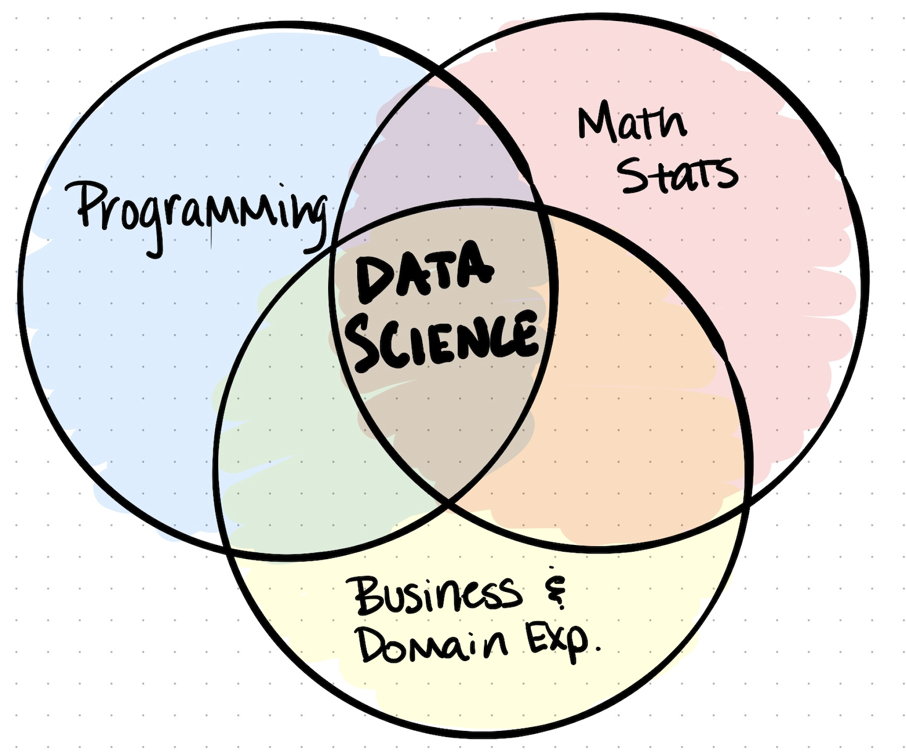
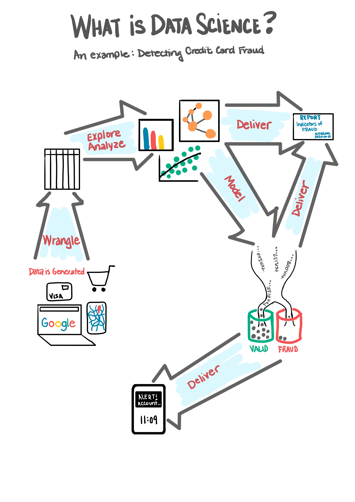
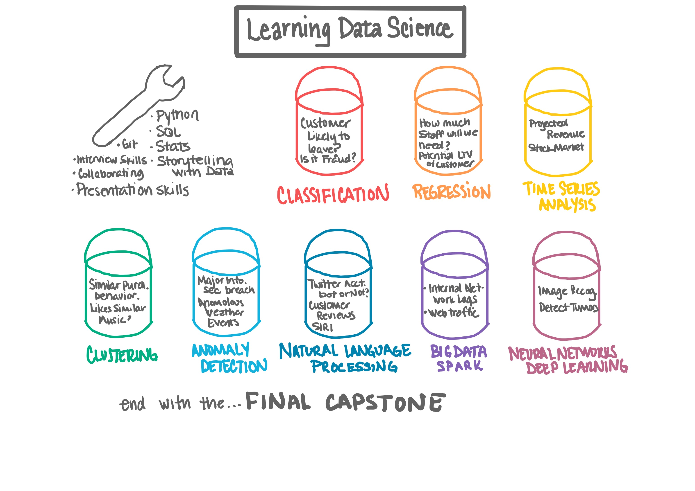
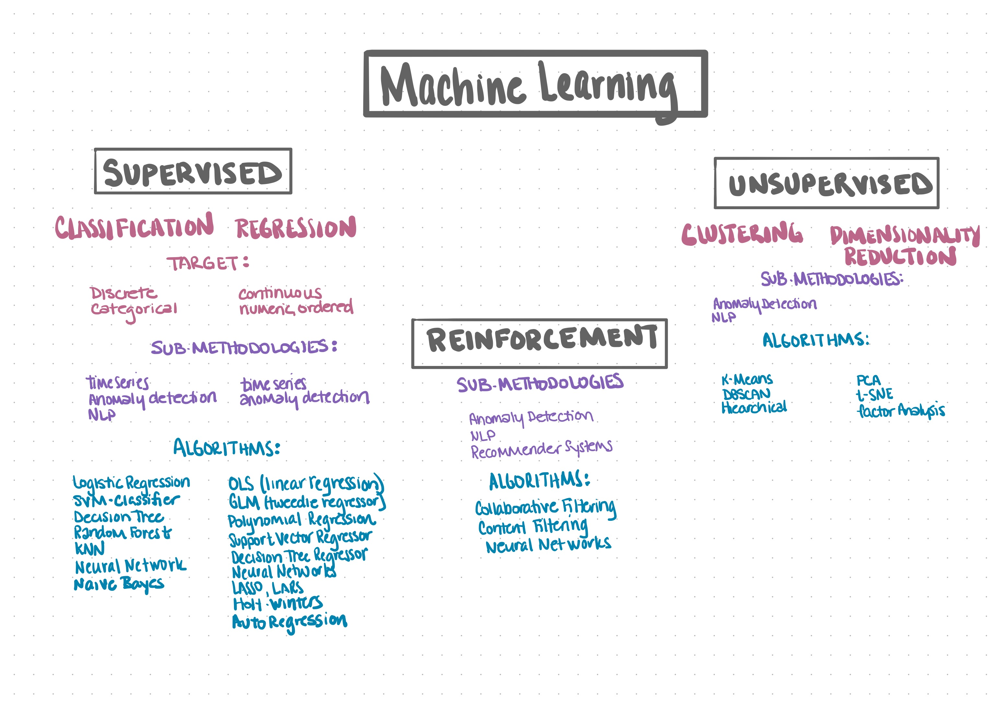
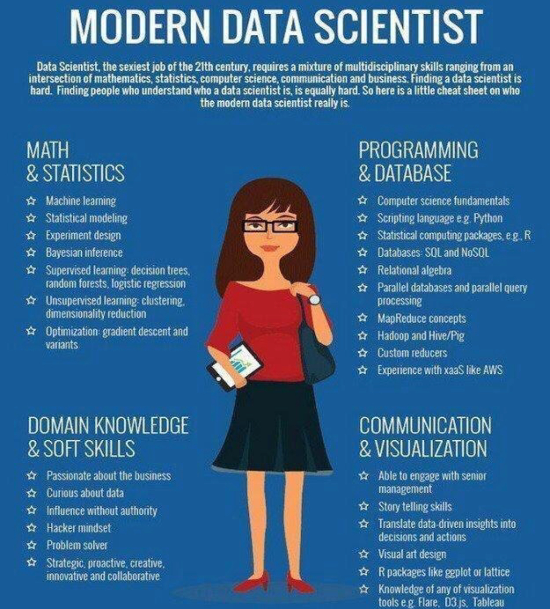
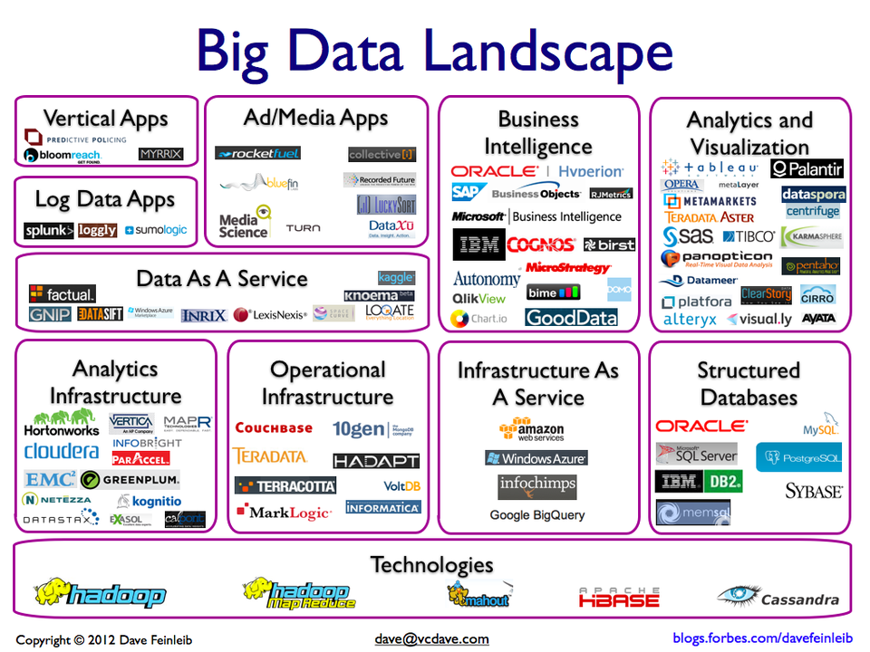
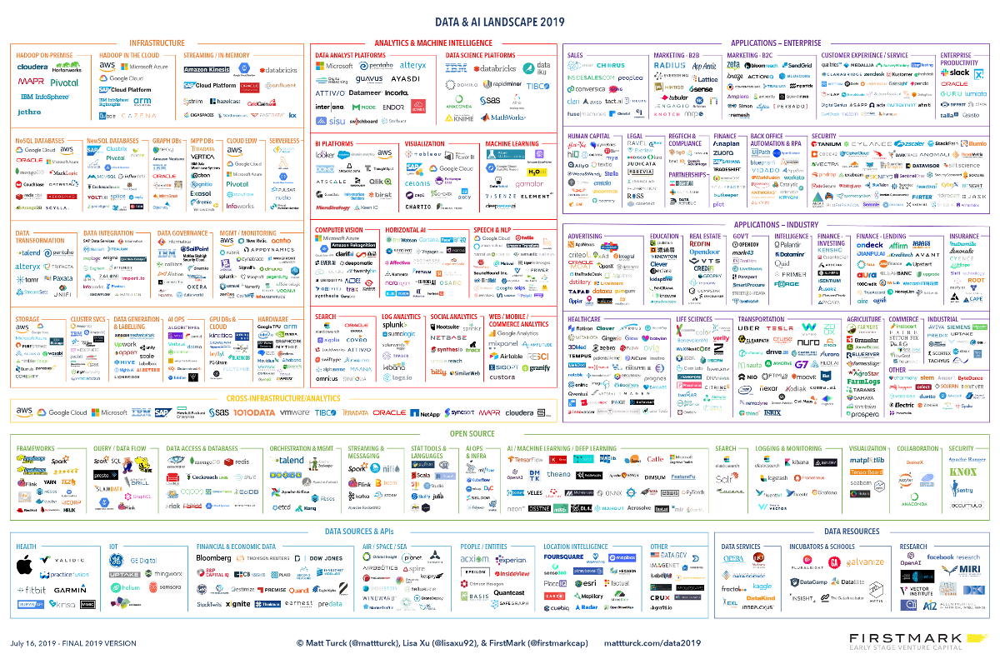
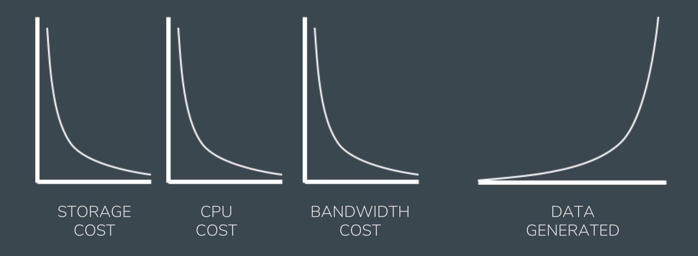
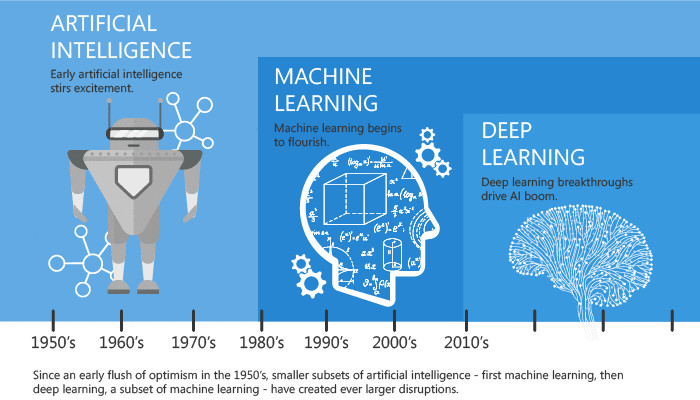

# Welcome to Data Science

## What is this thing we call Data Science? 

**Data Science, as understood through the skills used**

**Data Science, as understood through its process**

Video:  
[Data Science in 5 Minutes](https://www.youtube.com/watch?v=X3paOmcrTjQ)

**Data Science, as understood through linguistics**

- **Data:** Digital representation of information.
- **Science:** An applied and interdisciplinary science, applying scientific knowledge from formal sciences (math, logic) with social or natural sciences (sociology, computer science, biology, e.g.).

**Data science** is a formal, applied, and interdisciplinary science that works with and analyzes large amounts of data to provide meaningful information that can be used to make decisions and solve problems. Data science includes work in computation, statistics, analytics, data mining, and programming.

The purpose of data science is to provide actionable intelligence in the form of testable explanation, predictions, interactive intelligence, and intelligent machines.

**Data Science, as understood through what it is not**

Data Science is often equated with the topics below, but is not equal to any one of them.

*DS != Statistics*

- Statistics forces us to make assumptions about the nature of the relationship between variables, distribution of data, hypotheses, etc.
- Statistics is used in data science, but it is only a small part of it.
- Machine learning turns this process around. Given a large trove of data, the computer taunts us by saying "If only you knew what question to ask me, I would give you some very interesting answers based on the data!"[^1]

[^1]: Dhar, Vasant, Data Science and Prediction, New York University Stern School of Business, 2012

*DS != Business Analysis*

- Business analysis rarely involves unstructured data, data science often involves unstructured data.
- Business analysts usually work within relational databases and/or spreadsheets. Data scientists will often use relational databases as data sources, but will move data out of there quickly to more easily work with the data.
- Business analysts generally work with a size of data that can be worked with on a laptop, or within a RDMBS. Data scientists will often have to work with larger data sets.
- Business analytics projects are likely to be developing dashboards with KPIs, ad-hoc analysis and reporting, or schedule reports. Data science projects will include the above projects often, as well, but will also expand to more complicated analysis, NLP, predicted modeling, etc.
- Business analysis is light on the ‘decision science’ and heavy on the KPI reporting. Data science is all about decision science.
- Often a data or business analyst role will upskill into a data science role.

*DS != DS*

- Do not assume a common understanding among every hiring manager, recruiter, and applicant.
- There is not a single standard or understanding on how to effectively teach data science.

*DS != Python*

- Learning R, Python, or other tools is not what makes someone a data scientist.
- Just as knowing how to use autoCAD does not make me an architect… those are tools that enable someone to do much of the work required in data science.

**Data Science, as understood through its products**

- Product Recommendations
    - Products you may purchase based on the purchases watched of others with similar purchasing habits -or- Music you may like based on the music liked by others with similar music tastes.
    - Products you may purchase based on your previous purchases -or- music you may like based on your previous listening habits or music "liked".
    - Products you may purchase based on products that are often purchased together by customers.
    - People you may be likely to connect with based on a highly connected social network.
- Target Marketing: banner ads or social media ads, e.g.
- Virtual Assistances: Alexa, Hey Google, Siri.
- Logistics: [UPS data scientists discovered that if drivers took only right turns, it would decrease fuel consumption, increase safety, and reduce wasted time.][ups] This shaved 20.4 million miles off routes in one year!
- Business Operations: Predicting churn.
- Product Management: Predicting lifecycle of a product to know when it may need maintenance or replacement, e.g.
- Insurance: Likelihood of disease, auto accident, flooding for insurance premiums.
- Meteorology: Path a hurricane may take.
- Security and Defense: Terrorism, cyber attacks.
- Sales: Likelihood of engagement.

Video:
[Data Science for Social Good](https://www.youtube.com/watch?v=8RX1BCjJlqo)

[ups]: https://money.cnn.com/video/news/2010/12/13/n_cs_ups_no_left_turn.fortune/

**Finally, Data Science, as understood through its methodologies**

You will find in the image below how your learning of data science will be structured at Codeup, which starts with basic skills, walks through the primary machine learning methodologies, and ending with application of it all in a capstone. 

## Five Questions Machine Learning Methods Can Answer:
- How many or how much of something? (Regression)
- Is this observation A, B, or C? (Classification)
- What groupings exist in the data? (Clustering)
- Is this thing weird? (Anomaly Detection)
- What do we expect to happen next? (Time Series)

## Key Concepts in Data Science

## Types of Machine Learning Methods
- Regression is a supervised machine learning approach to predicting a continuous target variable.
- Classification is a supervised machine learning approach to predict a categorical target variable.
- Clustering is used to identify groupings of similar observations.
- Time Series Analysis is about finding patterns in temporal data and making predictions; forecasting. Each observation/row for time series represents a day or another measure of time.
- Anomaly Detection is not a single model, but a broad approach to identifying anomalous data points that involves domain knowledge, statistics, and other ML algorithms. 
- Natural Language Processing (NLP) is not a single model, but a broad approach to working with plain text that involves other ML algorithms.

## Examples of Machine Learning Methods
- Regression: Predicting sales using features like price, number of repeat customers, number of returns, and amount website visitors.
- Classification: Predicting if a customer will leave (called churn) based on features like their monthly bill, how long they've been a customer, and what services they use.
- Clustering: Grouping customers based on their similarities in purchases, spending habits, and preferences.
- Time Series Analysis: Predicting temperature using temporal data like the temperatures on the same date across the last 10 years or temperatures from the last 30 days.
- Anomaly Detection: Identifying fraudulent transactions and detecting cyber crime.
- Natural Language Processing: Identifying topics and sentiment in survey results.

**Artifical Intelligence vs. Machine Learning vs. Deep Learning**

- Algorithms

    - The foundation of AI, ML, and DL.
    - Simply, recipes for computers.
    - A series of repeatable steps, usually expressed mathematically, to accomplish specific data science tasks or solve a problem.
    - Data scientists need to understand certain algorithms in so far as to be able to identify how appropriate an algorithm is for a particular problem as well as to be able to effectively tune the model.
    - Examples: Linear and logistic regression, Naive Bayes, and KNN (K-Nearest Neighbors).

- Machine Learning (ML)

    - Helps computers predict outcomes without explicit human input.
    - Process of 'learning' the underlying patterns in a set of observations that is represented through data.
    - Patterns are extracted using algorithms and can then be represented in a mathematical model.
    - The model is then used to predict outcomes of new observations.
    - "Capable of generalizing information from large data sets as well as detecting and extrapolating patterns to apply information to new solutions and actions."[^4]

- Artificial Intelligence (AI)

    - Began in the 1950s as the programming of computers to perform simple human tasks.
    - Early AI was based on rules systems provided by people. For example, in a Blackjack game, the computer follows a specific set of rules to play as a dealer or another player. There's no learning or getting better at the game over time, only following the rules.
    - AI programs do not always enable the machine to learn or make adjustments based on new information.
    - AI does imply that the program can do difficult tasks or generate repetitive solutions based off its code.
    - Classic AI (aka Simple AI, Narrow AI or General AI): Tuned for a specific question, unable to learn, limited to highly-specific solutions to individual problems. Example: facial recognition on iphone.
    - Artificial Neural Networks uses a network of interconnected "neurons" which communicate with each other and can be adjusted based on their inputs and outputs.

- The intersection of ML and AI

    - Once a machine learning program collects information and supplies outputs, AI can be used to create a new algorithm so that a machine learning program can update its algorithm, e.g. its parameters, accordingly.
    - Deep Learning (DL) is a subset of ML and AI that uses neural network algorithms, or Artificial Neural Networks (ANN), with 3 or more hidden layers to solve problems such as speech recognition, translation, and image recognition. In ANNs, recognizing the patterns falls in the simple-for-humans-hard-for-machines task category of artificial intelligence, and the generalizability of the model, i.e. the ability to apply to new observations, falls in the machine learning category.

[^4]: [Data Mining vs Artificial Intelligence vs Machine Learning](http://upfrontanalytics.com/data-mining-vs-artificial-intelligence-vs-machine-learning/)

**Supervised vs. Unsupervised Machine Learning**

- **Supervised machine learning** algorithms use labeled observations, i.e. observations with a known outcome or human input, to develop a model that will then be used to predict or estimate the outcome of new observations which are not known or labeled.
- **Unsupervised machine learning** algorithms are considered self-learning as they not rely on labeled observations, i.e. observations with a known outcome or human input. Whereas the supervised algorithm would accept and use the labels assigned to it to model the relationship between the inputs (features) and output (target), an unsupervised algorithm would learn the differences of observations using only the features (no output) and assign its own labels to differentiate.
- **Reinforcement learning** is a subset of unsupervised machine learning where the machine seeks to maximize reward. The machine, or "agent," learns through trial and error as well as reward and punishment. For example, if you are training a machine to win at chess, you would want it to be positively reinforced when it makes moves that win material, such as capturing a pawn, and negatively reinforced when it makes moves that lose material, such as having a pawn captured. Combinations of these rewards and punishments result in a self-learning machine that improves at chess over time.

**Structured vs. Unstructured Data vs. Big Data**

- **Big data** is an evolving phrase. Recently, it is most commonly used to mean a massive volume of both structured and unstructured data that is so large it is difficult to process using traditional database and software techniques. The volume of data is too big, it moves too fast, or it exceeds current processing capacity. Often it is defined by the "4 V's": Volume, Velocity, Variety, and Veracity. One working definition of "big data" is data that is too large to store or process on a single computer and needs to be processed using a distributed system.
- **Unstructured data** is that which does not fit a predefined data model. Often this data does not fit into the typical row-column structure of a database. Images, emails, videos, audio, and pretty much anything else that might be difficult to "tabify" might constitute examples of unstructured data.
- **Structured data** is that which can fit into a predefined data model. When working with unstructured data, an early step is to turn it into structured data, to give it structure.

**Building Models**

- **Data modeling** is building mathematical or statistical models that turn data into predictive and actionable information, that can predict and explain outcomes.
- **Hyperparameter:** A configuration that is external to the specific model. The value is not estimated from data. Hyperparameters are used to customize the algorithm for a given problem so that it can more effectively estimate model parameters. They are usually manually specified when creating the model object. Examples of model hyperparameters include the number of decision trees in a random forest and the k in k-nearest neighbors.
- **Parameter:** A configuration variable that is internal to the model. The values are estimated or learned from data when the model is being 'fit'. They are the part of the model that is learned from historical training data. The parameters customize the model to your particular problem so that you can then predict outcomes on new observations. They are saved as part of the learned model. Examples include: the split points of a decision tree, the support vectors in a support vector machine, the coefficients in a linear regression or logistic regression.
- **Features:** The  attributes, x, predictor, or independent variables that are used in the model, the "knowns"
- **Feature Engineering** is the process of using domain knowledge of the data to create new features. For example `number_of_bathrooms` and `number_of_bedrooms` are strongly correlated, so they are not candidates for two independent features. An example of feature engineering would be to build a feature called `number_of_bed_or_bath_rooms`, instead. Features we create using feature engineering derive from the existing features, available information, and domain knowledge. Feature Engineering is most commonly undertaken as part of the exploration process. Feature engineering is fundamental to the application and success of machine learning.
- **Target Variable:** The y, outcome, or dependent variable, the "unknown".
- **Data visualization** has 2 primary purposes: 1) to explore data and understand the meaning behind it or 2) to communicate to others (such as an idea, a finding, a recommendation, or a story).

## Skills of a Data Scientist

Source: [MarketingDistillery.com](https://MarketingDistillery.com)

What [D.J. Patil](https://www.linkedin.com/in/dpatil/), former U.S. Chief Data Scientist, looks for when hiring data scientists:

- Would we be willing to do a start up with you? We can be locked in a room with you for long periods of time; we can trust you; we can communicate with each other quickly and efficiently
- Can you "knock the socks off" of the company in 90 days?
- In 4-6 years, will you be doing something amazing?
- Do you have the skills and curiosity to ask big questions?
- Do you have a diverse background with a history of playing with data to create something novel?
- Advocacy – "data scientists have an influence out of proportion to their numbers."
- Strategic - ability to recognize which data needs to be collected.
- Technical expertise - deep expertise in some scientific discipline.
- Curiosity – "desire to go beneath the surface and discover and distill a problem down into a very clear set of hypotheses that can be tested."
- Storytelling - "ability to use data to tell a story and to be able to communicate it effectively."
- Cleverness - "ability to look at a problem in different, creative ways."
- Diverse - "My best data scientists have come from very different backgrounds."
- Connectedness - ability to bring disparate areas together in a novel way…"I’ve seen data scientists apply novel DNA sequencing techniques to find patterns of fraud."
- Detailed & Focused - "Good data scientists understand, in a deep way, that the heavy lifting of cleanup and preparation isn’t something that gets in the way of solving the problem: it is the problem."

## Tools in Data Science

### Big Data Landscape by [Matt Turck](https://mattturck.com)

#### 2009

#### 2019

### Programming Languages

- Python

    - Object-oriented programming language.
    - Top data science libraries:  Numpy, SciPy, Matplotlib, Pandas, Statsmodels.
    - Pros: easy to learn and debug, large number of libraries for data science and growing, plenty of resources for learning and using.
    - Cons: slower in performance speed.

- R

    - Open-source version of the proprietary statistical software ‘S’.
    - Pros: optimal for statistics, intuitive, easy to learn, great IDE (RStudio), great plotting libraries.
    - Cons: slow in performance speed, not good when dealing with large amounts of data.

- Julia

    - High performance, dynamic, multi-paradigm programming language, developed at MIT.
    - Pros: runs very fast, good for mathematical computation, increasing use in academia and industry.
    - Cons: Julia is still fairly early in its development.

- Scala

    - Functional programming language, stemming from Java.
    - Pros: seamless integration with Apache Spark, used when dealing with distributed, big data.
    - Cons: not easy to learn.

### Database Platforms

- SQL: Structured Query Language

    - RDBMS: Relational Database Management System.
    - Structured data only.
    - Primary data source for business intelligence.
    - Original use case/primary use case is for managing data for software applications.
    - Examples: Microsoft SQL Server, MySQL, Oracle PostgresQL.

- NoSQL: Not Only SQL

    - Accomdates both structured and unstructured data.
    - Used when working with big data.
    - Allows for elastic scaling and flexibility.
    - Low cost.
    - Most can be integrated with the hadoop ecosystem.
    - Examples: Cassandra, HBase, Hive, MongoDB.

- Graph-based:

    - Focus on creating, storing, querying and processing graphs.
    - Used for social network analysis and security threat detection.
    - Examples: Neo4j, Graphbase.

### Data Visualization

- [Tableau](https://tableau.com)

    - Great for BI.
    - Creating dashboards.
    - Telling stories with data.

- [Plot.ly](https://plot.ly)

    - Works with plots in different platforms, easy to use, great quality.

- [D3.js](https://d3js.org/)

    - Javascript library
    - Fast
    - Supports a variety of datasets
    - Animations and interactive plots

- [Matplotlib](https://matplotlib.org/)

    - Python 2D plotting library which produces publication quality figures in a variety of hardcopy formats and interactive environments across platforms.
    - Matplotlib can be used in Python scripts, the Python and IPython shells, the Jupyter notebook, web application servers, and four graphical user interface toolkits.

- [Seaborn](https://seaborn.pydata.org/)

    - A Python data visualization library based on matplotlib.
    - It provides a high-level interface for drawing attractive and informative statistical graphics.

- [Bokeh](https://bokeh.pydata.org/en/latest/)

    - An interactive visualization library (python) that targets modern web browsers for presentation.
    - Its goal is to provide elegant, concise construction of versatile graphics, and to extend this capability with high-performance interactivity over very large or streaming datasets.
    - Bokeh can help anyone who would like to quickly and easily create interactive plots, dashboards, and data applications.

### Data Governance

Storing, managing & processing data in a distributed environment.

- [Spark](https://spark.apache.org/)

    - Integration with R and Python.
    - Can be run on different environments.
    - Performance speed is a plus.
    - Ease of use, as compared to Scala, its foundation.
    - Has a growing community of users.
    - Query using a SQL-like language, Spark SQL.
    - Perform machine learning with MLlib.
    - Do graph analytics using GraphX.
    - Run stream analysis using Spark Streaming.

- [Hadoop](https://hadoop.apache.org/)

    - Original big data platform.
    - Ecosystem incluses: HDFS (hadoop distributed file system), MapReduce, HBase (NoSQL DB), Hive (query platform).

- [Storm](https://storm.apache.org/)

    - Distributed realtime computation system.
    - Makes it easy to reliably process unbounded streams of data.
    - Does for realtime processing what Hadoop did for batch processing.
    - Simple and can be used with any programming language.

### VERSION CONTROL SYSTEMS (VCS)

Important when working in a team that handles the same scripts and project files in general. Good for tracking changes in a program and reverting to previous versions.

- Git: open source, cross platform, command line interface.
- Github: git with an available GUI, most commonly used.
- GitLab, Bitbucket: alternative to Github.

## Evolution and Trends in Data Science

- DJ Patil built the first data science team at LinkedIn before becoming the first chief data scientist of the United States in 2015.
- He coined the modern version of the term "data scientist" with Jeff Hammerbacher (Facebook’s early data science lead) in 2008.

---

Alex Fly, Founder and CEO @ Quickpath, on [Trends Shaping the Data Science Hiring Market](https://www.linkedin.com/pulse/what-trends-shaping-data-science-hiring-market-alex-fly)

---

- Moving away from the unicorn data scientist.

    - Data science roles have grown over 650% since 2012, and with that growth comes the rise of specialties within the field.

- As time passes, data science tools become more accessible.

	- What use to take hundreds of lines to code to create can now be achieved by orders of magnitude less due to abstraction, thus lowering the technical learning curve.

- Data analyst to data scientist.

    - Individuals are beginning to upskill themselves to fill these roles. One role that is primed to make this switch is the data analyst. This position helps to improve company decision-making by collecting, processing, and applying algorithms to structured data. Data scientists, on the other hand, typically have a more robust skill set.

- The search for security.

    - Aankur Bhatia, Security Data Scientist for IBM notes, "While there are several products to identify, detect and contain known threats and any indicator of compromise (IOC), there is very little protection against unknown threats, zero-day exploits and newly identified vulnerabilities."

- Hiring a full-scale data science team.

    - Hiring a data science team that incorporates members of the business side, the IT side, and data specialists.

- AI, ML and DL.

    

## Further Reading

- [AI & Machine Learning: The Evolution, Differences and Connections](https://www.linkedin.com/pulse/ai-machine-learning-evolution-differences-connections-kapil-tandon/)
- [Codeup Blog: What is Data Science](https://codeup.com/what-is-data-science/)

___

## Exercises

### Data Science Community

This assignment will get you digging into publicly available data science resources, finding and following thought leaders in the field, and potentially creating and/or sharing your findings by submitting them to us via a Google Form released to you through your Google Classroom. Your findings and information will be added to those of all of the Codeup data science cohorts who came before you and shared through the appendix of the curriculum at a later date. 

Find:

- a resource for python (a tutorial, blog post, or reference material that looks useful)
- a resource for SQL (a tutorial, blog post, or reference material that looks useful)
- a podcast for data science topics
- 3 thought leaders within the field of data. Link to the platform where they are most active (e.g. Twitter, LinkedIn, a blog, etc)

Create: 

- GitHub (if you have not already)
- kaggle profile (make one the same as your GitHub)
- data.world
- public.tableau.com profile
- twitter

*Keep in mind that the more consistent your account names and handles, the easier you are to find by potential employers and followers in the near future.*

