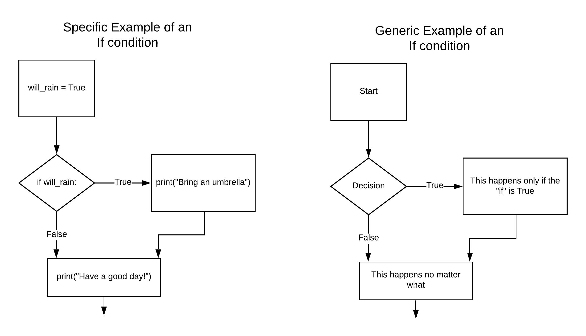
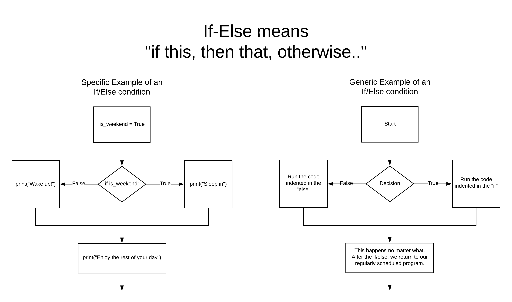

# Control Structures

In this lesson, we'll discuss 2 primary ways of controlling the flow of
execution of our Python scripts:

- conditionals: allow us to execute code conditionally
- loops: allow us to execute code repeatedly

## Conditionals

### If condition is an "if this then that"
The `if` statement is the most basic way to execute code
conditionally. Let's take a look at an if statement:


```python
i_like_coffee = True

if i_like_coffee:
    print('I like coffee!')
    print('Coffee is the best!')
```

    I like coffee!
    Coffee is the best!


!!!tip "Try it out!"
    What would happen if you changed `i_like_coffee` to `False`?

An if statement consist of several parts:

- the keyword `if`
- a *condition* that evaluates to a boolean value followed by a colon (`:`)
- the *body* of the statement indented by 4 spaces

Everything indented with 4 spaces up to the the next line that has a change
in indentation is considered the body of the if statement and all of the
statements in the body will only be run if the condition evaluates to `True`

In the example above, we define a variable named `i_like_coffee` which hold
the boolean value `True`. We then encounter the if statement which will
conditionally execute the body of the if statement depending on the contents
of the `i_like_coffee` variable.

- What do you think will happen if you change `i_like_coffee` to `False`?
- What happens if you store a non-boolean value in `i_like_coffee`?



### If/Else is "if this, then that, otherwise..."
The `if` statement has an (optional) counterpart, `else`:


```python
it_is_raining = False

if it_is_raining:
    print('Better bring an umbrella!')
else:
    print('Looks like a nice, sunny day!')
```

    Looks like a nice, sunny day!


_

### If, else-if, else 
In addition, an `if` statement can check multiple conditions with the `elif` keyword:


```python
coffee_preference = 'medium'

if coffee_preference == 'dark':
    print('I love a good dark roast!')
elif coffee_preference == 'medium':
    print('Middle of the road, huh?')
elif coffee_preference == 'light':
    print('Light roast has the most caffeine!')
else:
    print('How about some tea then?')
```

    Middle of the road, huh?


In the example above, only one of the `print` statements will ever execute, and the first condition that evaluates to true will be the block that executes. For example, if `coffee_preference` was `dark`, only the message about dark roasts would print, and we would not see the others.

If none of the conditions evaluate to true, the final `else` block will execute.

!!!tip "Try it out"
    What would happen if you changed `coffee_preference` to `'light'`? `None`? `42`? an empty string?

## Loops

In addition to executing code conditionally, we can also execute code over and over again, that is, in a loop.

Python has 2 primary looping mechanisms:

- `for` for running a block of code a set number of times
- `while` for running a block of code until a condition is met

### For-Loop

By far, the `for` loop is much more common in python code (this is not necessarily the case in other programming languages), but both are important.

The for loop is commonly used with *iterables*, objects that can be enumerated, for examples, lists or strings.


```python
for number in range(1, 4):
    print(number)
```

    1
    2
    3


```python
for letter in 'abcde':
    print(letter)
```

    a
    b
    c
    d
    e


```python
languages = ['bash', 'python', 'R', 'clojure']

for programming_language in languages:
    print(f'{programming_language} is a nice programming language')
```

    bash is a nice programming language
    python is a nice programming language
    R is a nice programming language
    clojure is a nice programming language


The `for` keyword is used in combination with the `in` keyword and an identifier is created that, inside the body of the loop, will refer to each item in the object being iterated over.

!!!tip "Try it out"
    What happens if you change the variable name `programming_language`?

These control structures can be nested within each other as well:


```python
for programming_language in languages:
    if programming_language == 'python':
        print(f'{programming_language} is my favorite!')
    else:
        print(f'{programming_language} is a nice programming language')
```

    bash is a nice programming language
    python is my favorite!
    R is a nice programming language
    clojure is a nice programming language


There is no practical limit to how much you can nest these control structures, but usually it is a good idea to keep your code as "shallow" as is practical so that it is easier to reason about.


### List Comprehensions

Lists can be created with *list comprehensions*. This is a shorthand way to
specify what elements should be in a list. These share some of the same syntax
as loops, which we will cover in a later lesson.


```python
[n for n in range(10)]
```
    [0, 1, 2, 3, 4, 5, 6, 7, 8, 9]


```python
[n * 2 for n in range(10)]
```
    [0, 2, 4, 6, 8, 10, 12, 14, 16, 18]


```python
[n * 2 for n in range(10) if n % 2 == 0]
```
    [0, 4, 8, 12, 16]


### While

The `while` loop will execute it's body until the condition evaluates to false. Usually this means that the code in the loop condition is being modified somewhere in the loop body.


```python
i = 5
while i <= 10:
    print(i)
    i += 1
```

    5
    6
    7
    8
    9
    10


If the condition in the while loop never evaluates to `False`, you will end up with what is called an *infinite loop*, a loop that never stops executing. Usually this is undesirable, so care should be taken to make sure that your loop condition will eventually evaluate to `False`.

In our opinion, it is best to avoid `while` loops alltogether, but you should be prepared to see them in code that you come accross, or for very specific situations.

### Break and Continue

There are two special keywords in Python that can change how the control flows through a loop:

- `continue` will skip to the next iteration of a loop
- `break` will stop executing the loop entirely

!!!tip "Try It Out!"
    In the example below, what would happen if you switched `break` for `continue`, and `continue` for `break`?


```python
for n in range(100_000):
    print(n)
    if n > 10:
        break
```

    0
    1
    2
    3
    4
    5
    6
    7
    8
    9
    10
    11


```python
for n in range(10):
    if n % 2 == 0:
        continue
    print(f'Here is an odd number: {n}')
```

    Here is an odd number: 1
    Here is an odd number: 3
    Here is an odd number: 5
    Here is an odd number: 7
    Here is an odd number: 9


```python
dataset = [{'name': 'age', 'type': 'int', 'data': [20, 25, 43, 11, 15, 53, 36]},
           {'name': 'is_vegetarian', 'type': 'boolean', 'data': [False, True, False, False, True, False, False]},
           {'name': 'shoe size', 'type': 'int', 'data': [8, 11, 7, 10, 7, 9, 10]},
           {'name': 'ISP', 'type': 'categorical', 'data': ['AT&T', 'Spectrum', 'Spectrum', 'Spectrum', 'AT&T', 'Spectrum', 'AT&T']},
           {'name': 'BMI', 'type': 'float', 'data': [29.9, 20.4, 23.3, 21.7, 22.2, 22.8, 27.0]}]

# print the means for the numeric data
for feature in dataset:
    if feature['type'] == 'categorical' or feature['type'] == 'boolean':
        print(f"{feature['name']} is not numeric, skipping")
        continue
    avg = sum(feature['data']) / len(feature['data'])
    print(f"{feature['name']} average: {avg:.2f}") # the :.2f formats the decimal to 2 places.
```

    age average: 29.00
    is_vegetarian is not numeric, skipping
    shoe size average: 8.86
    ISP is not numeric, skipping
    BMI average: 23.90

## Further Reading

- [List Comprehensions explained visually](https://treyhunner.com/2015/12/python-list-comprehensions-now-in-color/)

## Exercises

Do your work for this exercise in a file named `control_structures_exercises.py` or `control_structures_exercises.ipynb`.

1. Conditional Basics

    1. Prompt the user for a day of the week, print out whether the day is Monday
       or not


    1. Prompt the user for a day of the week, print out whether the day is a
       weekday or a weekend


    1. Calculate a weekly paycheck, accounting for overtime pay. Create variables 
        and make up values for:

        - The number of hours worked in one week
        - The hourly rate

        For calculating pay:
        
        - For working 40 hours or less, each hour is paid at the hourly rate
        - For working more than 40 hours
        
            - the first 40 hours are paid at the hourly rate
            
            - each hour after 40 is paid at time and a half (hourly rate * 1.5) 


1. Loop Basics

    1. While

        1. Create an integer variable `i` with a value of 5. Create a while loop that 
            runs so long as `i` is less than or equal to 15. Each loop iteration, 
            output the current value of `i`, then increment `i` by one.

        Your output should look like this:

            5
            6
            7
            8
            9
            10
            11
            12
            13
            14
            15

        1. Create a while loop that will count by 2's starting with 0 and ending
            at 100. Follow each number with a new line.
        1. Create a while loop that starts at 2, and displays the number
          squared on each line while the number is less than 1,000,000. Output
          should equal:

            ```
             2
             4
             16
             256
             65536
            ```

        1. Write a while loop that uses `print` to create the output shown below.

                100
                95
                90
                85
                80
                75
                70
                65
                60
                55
                50
                45
                40
                35
                30
                25
                20
                15
                10
                5


    1. For Loops

        1. Write some code using a for loop that prompts the user for a number, then shows a
           multiplication table up through 10 for that number.

            For example, if the user enters `7`, your program should output:

                7 x 1 = 7
                7 x 2 = 14
                7 x 3 = 21
                7 x 4 = 28
                7 x 5 = 35
                7 x 6 = 42
                7 x 7 = 49
                7 x 8 = 56
                7 x 9 = 63
                7 x 10 = 70

        1. Create a `for` loop that uses `print` to create the output shown below.

                1
                22
                333
                4444
                55555
                666666
                7777777
                88888888
                999999999

    1. `break` and `continue`

        1. Write a program that prompts the user for a positive integer. Next write
           a loop that prints out the numbers from the number the user entered down
           to 1.

        1. The `input` function can be used to prompt for input and use that input
           in your python code. Prompt the user to enter a positive number and write
           a loop that counts from 0 to that number. (Hints: note that the `input`
           function returns a string, so you'll need to convert this to a numeric
           type.)

        1. Prompt the user for an odd number between 1 and 50. Use a loop and a `break`
           statement to continue prompting the user if they enter invalid input. (Hint:
           use the `isdigit` method on strings to determine this). Use a loop and the
           `continue` statement to output all the odd numbers between 1 and 50, except
           for the number the user entered.

            Your output should look like this:

                Number to skip is: 27

                Here is an odd number: 1
                Here is an odd number: 3
                Here is an odd number: 5
                Here is an odd number: 7
                Here is an odd number: 9
                Here is an odd number: 11
                Here is an odd number: 13
                Here is an odd number: 15
                Here is an odd number: 17
                Here is an odd number: 19
                Here is an odd number: 21
                Here is an odd number: 23
                Here is an odd number: 25
                Yikes! Skipping number: 27
                Here is an odd number: 29
                Here is an odd number: 31
                Here is an odd number: 33
                Here is an odd number: 35
                Here is an odd number: 37
                Here is an odd number: 39
                Here is an odd number: 41
                Here is an odd number: 43
                Here is an odd number: 45
                Here is an odd number: 47
                Here is an odd number: 49

1. Fizzbuzz

    One of the most common interview questions for entry-level programmers is
    the FizzBuzz test. Developed by Imran Ghory, the test is designed to test
    basic looping and conditional logic skills.

    - Write a program that prints the numbers from 1 to 100.
    - For multiples of three print "Fizz" instead of the number
    - For the multiples of five print "Buzz".
    - For numbers which are multiples of both three and five print "FizzBuzz".

1. Display a table of powers.

    - Prompt the user to enter an integer
    - Display a table of squares and cubes from 1 to the value entered
    - Ask if the user wants to continue
    - Assume that the user will enter valid data
    - Only continue if the user agrees to

    Example Output

    ```
    What number would you like to go up to? 5

    Here is your table!

    number | squared | cubed
    ------ | ------- | -----
    1      | 1       | 1
    2      | 4       | 8
    3      | 9       | 27
    4      | 16      | 64
    5      | 25      | 125
    ```


1. Convert given number grades into letter grades.

    - Prompt the user for a numerical grade from 0 to 100
    - Display the corresponding letter grade
    - Prompt the user to continue
    - Assume that the user will enter valid integers for the grades
    - The application should only continue if the user agrees to
    - Grade Ranges:

        - A : 100 - 88
        - B : 87 - 80
        - C : 79 - 67
        - D : 66 - 60
        - F : 59 - 0


1. Create a list of dictionaries where each dictionary represents a book that
   you have read. Each dictionary in the list should have the keys `title`,
   `author`, and `genre`. Loop through the list and print out information about
   each book.

    1. Prompt the user to enter a genre, then loop through your books list and
       print out the titles of all the books in that genre.


#### Bonus Exercises

- For your Power of Tables exercise, research python's format string specifiers to align the table

- For your Number Grade to Letter Grade exercise, edit your grade ranges to include pluses and minuses (ex: 99-100 = A+)

- For practicing with list comprehensions, work through [17 List Comprehension
Exercises][17]

- For even more practice with all your Python tools together, work through [20
Python Data Structure Manipulation Exercises][20] 

[17]: https://gist.github.com/ryanorsinger/f7d7c1dd6a328730c04f3dc5c5c69f3a
[20]: https://gist.github.com/zgulde/2043cba6072fe5b55b272513ae575577

