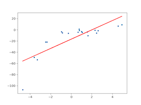
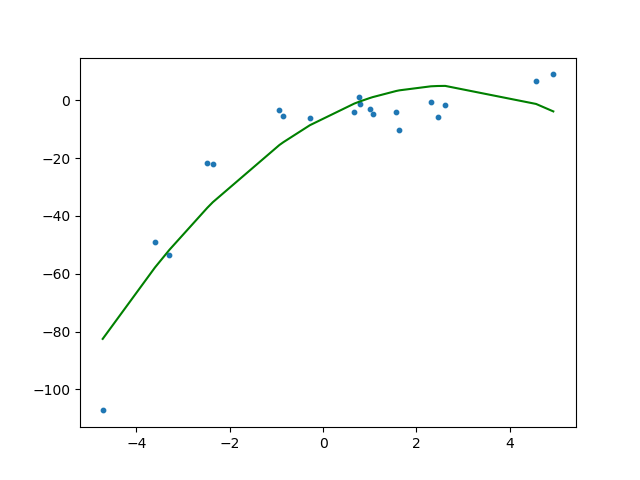

# REGRESSION

## Predicting Continuous Outcomes

In this module, we will analyze, visualize and model various *labeled* datasets that are being stored in *SQL* and have *continuous target variables*. This means we will do supervised machine learning (because the data is labeled) using regression (because the target variable we are analyzing is continuous) on structured data (because the data can be naturally stored in rows and columns). 

- *Labeled* $\rightarrow$ *Supervised Learning*
- *SQL* $\rightarrow$ *Structured Data*
- *continuous target* $\rightarrow$ *Regression*

## Module Goals

### Acquisition

- **Acquire** structured data from SQL to Pandas  

- **Summarize** Summarize the data through aggregates, descriptive stats and distribution plots (histograms, density plots, boxplots, e.g.). (pandas: `.value_counts`, `.head`, `.shape`, `.describe`, `.info`, `matplotlib.pyplot.hist`, `seaborn.boxplot`)  

### Preparation

- **Clean** the data by converting datatypes and handle missing values. (pandas: `.isnull`, `.value_counts`, `.dropna`, `.replace`)  

- **Split** our observations into 3 samples, Train, Validate, and Test. (`sklearn.model_selection.train_test_split`).

### Exploration

- **Hypothesize**: We will discuss the meaning of "drivers", variables vs. features, and the target variable. We will discuss the importance of documenting questions and hypotheses, obtaining answers for those questions, and documenting takeaways and findings at each step of exploration.   

- **Visualize** the interaction of variables, especially independent variables with the dependent variable using charts such as scatterplots, jointplots, pairgrids, and heatmaps to identify drivers. 

- **Test Hypotheses** that involve a continuous variable using t-tests and correlation tests. 

### Preprocess

- **Encode** any string variables to 0 and 1. Utilize one hot encoding or label encoding. 

- **Scale** our numeric data so that all variables are on the same scale, such as between 0 and 1. We will discuss the importance of "scaling", different methods for scaling data, and why to use one type over another.  (`sklearn.preprocessing`: `StandardScaler`, `QuantileTransformer`, `RobustScaler`, `MinMaxScaler`) 

- **Feature Engineering**: We will learn ways to identify, select, and create features through feature importance. We will discuss the "Curse of Dimensionality." (`sklearn.feature_selection.f_regression`).   

### Modeling

- **Establish Baseline**: We will learn about the importance of establishing a "baseline model" or baseline score and ways to complete this task. The baseline for regression is often computed by predicting each observation's value to be the mean or median of the dependent variable. 

- **Build Models**: We will build linear regression models. What does that mean? We will extract the patterns in the data using well established algorithms, so that we don't have to do that manually. An example of a regression algorithm is the glm (generalized linear model). The algorithm will return to us a mathematical model or function (e.g. y = 3x + 2). That function will be used to compute predictions for each observation. We will learn about the differences in the most common regression algorithms. (`sklearn.linear_model`)

- **Model Evaluation**: We will compare regression models by computing evaluation metrics, i.e. metrics that measure how well a model did at predicting the target variable. (`sklearn.metrics`, `math.sqrt`)  

- **Model Selection and Testing**: We will learn how to select a model, and we will test the model on the unseen data sample (the out-of-sample data in the validate and then test datasets). 

### Building a Data Product

We will end with an end-to-end project practicing steps of the data science pipeline from planning through model selection and delivery. 

## About Regression

**Regression** is a **supervised machine learning** technique used to model the relationship of one or more features or independent variables, (one = simple regression, more = multiple regression) to one or more target or dependent variables, (one = univariate regression, more = multivariate regression). The variables are represented by **continuous** data. 

A regression algorithm attempts to find the function that best 'mimics' or 'models' the relationship between independent feature(s) and dependent target variable(s). The algorithm does this by finding the line (for simple regression) or plane (for multiple regression) that minimizes the errors in our predictions when compared to the labeled data. Once we acquire that function, it can be used to make predictions on new observations when they become available; we can simply run these new values of the independent variable(s) through the function for each observation to predict the dependent target variable(s). 

The algorithm attempts to find the “best” choices of values for the parameters, which in a linear regression model are the coefficients, $b_{i}$, in order to make the formula as “accurate” as possible, i.e. minimize the error. There are different ways to define the error, but whichever evaluation metric we select, the algorithm finds the line of best fit by identifying the parameters that minimize that error.  

Once estimated, the parameters (intercept and coefficients) allow the value of the target variable to be obtained from the values of the feature variables. 

### Simple Linear Regression

$y = b_{0} + b_{1}x + \epsilon$

In the simple linear case, our feature is $x$ and our target is $y$. The algorithm finds the parameters that minimize the error between the actual values and the estimated values. The parameters the algorithm estimates are the slope, $b_{1}$, and the y-intercept, $b_{0}$. $\epsilon$ is the error term or the residual value. The residual is the difference of the actual value from the predicted value. 

image source:  https://towardsdatascience.com/polynomial-regression-bbe8b9d97491

### Multiple Linear Regression 

$y = b_{0} + b_{1}x_{1} + b_{2}x_{2} + ... b_{n}x_{n} + \epsilon$

In a multiple linear regression case with n features, our features are $x_{1}$ through $x_{n}$ and our target is $y$. The algorithm finds the parameters that minimize the error between the actual values and the estimated values. The parameters the algorithm estimates are the coefficients of the features, $b_{1}$ through $b_{n}$, and the y-intercept, $b_{0}$. $\epsilon$ is the error term or the residual value.

### Polynomial Regression

$y = b_{0} + b_{1}x + b_{2}x^{2} + ... + b_{n}x^{n} + \epsilon$

In the case we have a polynomial function, we still have a linear model due to the fact that $x^i$ is in fact a feature and the coefficient/weight associated with that feature is still linear. To convert the original features into their higher order terms, we will use the PolynomialFeatures class provided by scikit-learn. Then, we train the model using Linear Regression.

image source:  https://towardsdatascience.com/polynomial-regression-bbe8b9d97491

## Notes

Throughout the regression curriculum you will see a module named `viz` imported in the code examples. This module contains some complex matplotlib plotting code, and [is available for reference here](viz.py). The intent of putting the code in a seperate module is to not distract from the lesson at hand.
