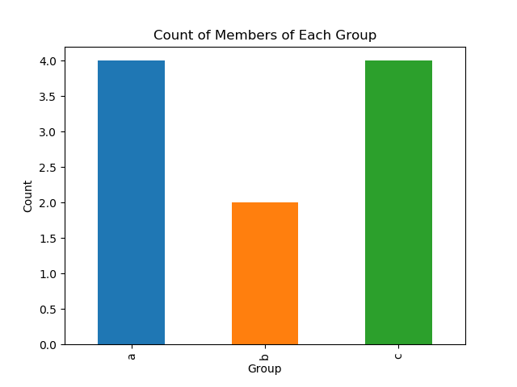
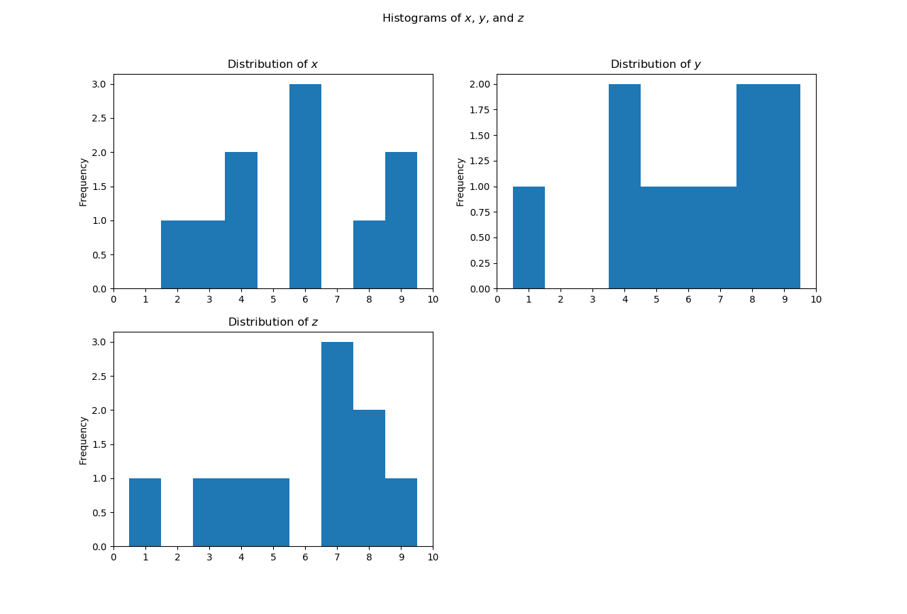
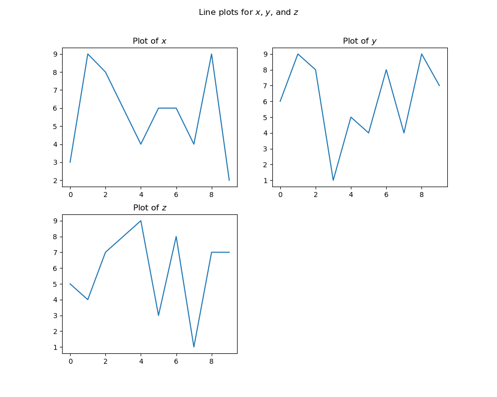
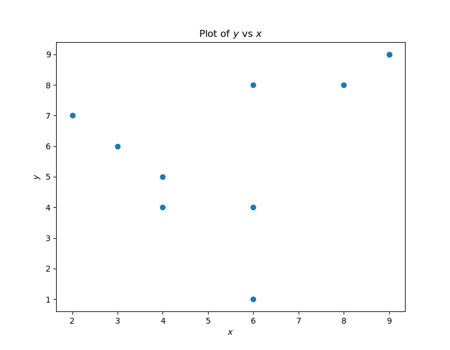
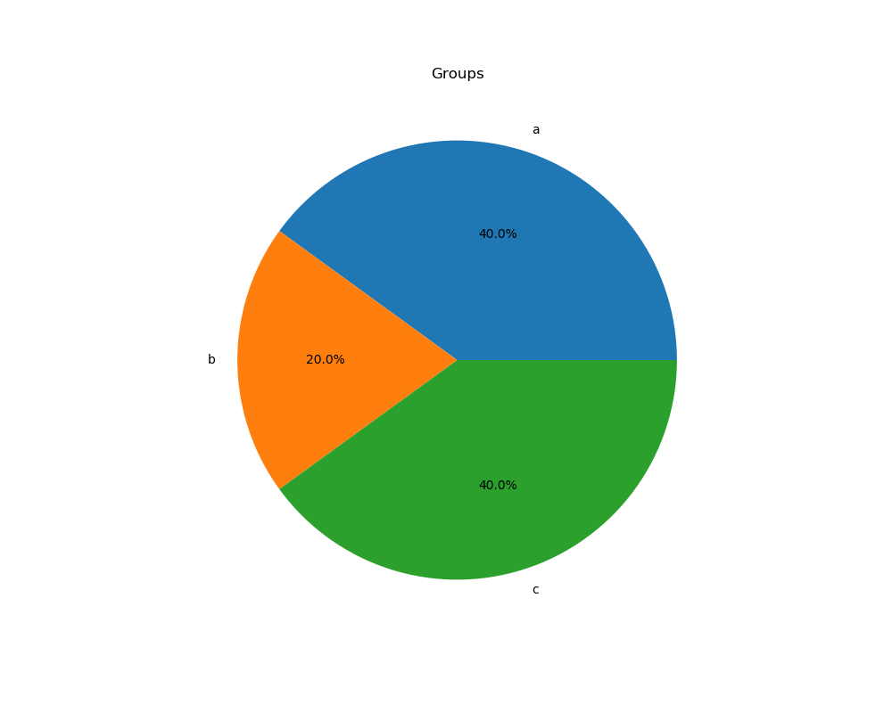

# Visualizing and Aggregating Data in Spreadsheets

## Charts

!!!note "Charts, graphs, & plots, oh my!"
    - A **graph** is a diagram of a mathematical function, but can also be used (loosely) about a diagram of statistical data.
    - A **chart** is a graphic representation of data, where a line chart is one form.
    - A **plot** is the result of plotting statistics as a diagram in different ways, where some of the ways are similar to some chart types.
    - From these definitions, a line chart could be called a graph or a plot, while a pie chart is neither a graph nor a plot. A scatterplot is a chart but not (strictly) a graph, but the purpose of a scatterplot is to determine if there is some relation that can be expressed as a function that then naturally can be drawn as a graph.

The following visualization examples will utilize the data below:

| x | y | z | group |
|---|---|---|-------|
| 3 | 6 | 5 | c |
| 9 | 9 | 4 | c |
| 8 | 8 | 7 | b |
| 6 | 1 | 8 | c |
| 4 | 5 | 9 | a |
| 6 | 4 | 3 | a |
| 6 | 8 | 8 | b |
| 4 | 4 | 1 | a |
| 9 | 9 | 7 | a |
| 2 | 7 | 7 | c |

### Bar or Column Chart (stacked or segmented)

- A chart made from **categorical data** in which the heights of bars represent the frequency (or relative frequency aka percent) of membership in each value of the variable. Unlike a histogram, the width of the bars carries no meaning.
- Vertical bars = column chart (Google Sheets), Horizontal bars = bar chart (Excel)

### Histogram (Relative Frequency Histogram)

- A graph made from **continuous data** in which the range of the data is divided into intervals called bins, and then bars are constructed above each bin such that the heights of the bars represent the frequency or relative frequency of data in the particular bin. Unlike a bar chart, the width of the bars is an important characteristic of the graph. Goal of histograms is to view the distribution of the data.

### Line Chart

- Plotting **continuous data**
- Multi-line and area charts are adaptations of the basic line chart.
- A time series chart is usually a line chart, where the x axis is time.

*Note that this data is not a great fit for a line plot, but we include one here for educational purposes.*

### Scatterplot / Jitterplot

- Used for plotting a large number of points as opposed to an aggregate.
- Scatter plots will plot 2 **continuous variables**
- Jitter or Swarm plots are good for when either a lot of data points fall on the same coordinates or when one of the variables is **categorical**.

### Pie Chart

- Useful for a quick view of how a variable is broken into a limited number of categories (percentage of each category).
- Use sparingly!
- Don't use if context is needed to tell the story, and context is almost always needed.
- Don't use if you have more than a handful of categories.
- Don't use if you need to see minor differences, e.g. if the difference between 45% and 50% is important.
- There are reasons to use this, but not nearly as many as how much use they get! Try another type of chart first!

### Pivot Tables

Pivot tables were covered in pre-work, but here are some reminders and additional tips:

**When to use pivot tables:**

When tabulating, aggregating, summarizing, exploring, and analyzing your data. If you are finding yourself writing lots of formulas to summarize data, such as SUMIF and COUNTIF, then you might want to use PivotTables instead. They also allow you to quickly change how your data is summarized with almost no effort at all.

**How to use pivot tables:**

- Your data should be organized in columns with headings.
- Make sure there are no empty columns or rows in your data. If there exists an empty row or column, the pivot table assumes your data stops at that point. Empty cells within your table are OK, but not a whole row or a whole column of empty cells.

!!!tip "Checking for empty rows/columns"
    Option A: Click a single cell anywhere in the data table, then CTRL+SHIFT+8. This automatically selects the whole table. If any data remains unselected, you need to check for empty columns or rows within the data table.
    Option B: Select the uppermost left cell, then CMD+<down arrow>. If you arrive at the last row of your data, you have no empty rows.  Go back up to your original cell with CMD+<up arrow>. Now, CMD+<right arrow>...if you arrive at the last column of your data, then you have no empty columns.

- If you have a date column, make sure all the values in that column are dates (or blank). If you have a quantity column, make sure all the values are numbers (or blank) and not words.

**Create a blank PivotTable:**

- To create a blank pivot table in Excel, click on either a single cell in the data table or the entire table, and click the PivotTable button from the insert menu. The dialogue box will pop up where you can change defaults if you desire. Generally the defaults are what you want.
- In google sheets, the create pivot table option is under the Data tab.

**Design your Pivot Table:**

- You'll see the Pivot Table Builder (Excel)/Pivot Table Editor (Google Sheets) and the field layout area.
- It should show the column headings from your data table. If not, you may need to check that your whole data table was selected.
- If you click on any cell in your spreadsheet that is outside the pivot table, the pivot table Field List will disappear. You can make it reappear simply by clicking inside the PivotTable report again.
- To create the layout of your pivot table, drag and drop each field to the area you want it to be in the field layout area.
- To change aggregation method and data types: click on the `i` (Excel) or `summarize by` next to the field name in the builder.

**Add your new data to the existing data table:**

- Click inside your pivot table to see the pivot table tools options.
- To refresh or change data source in Excel, click the Refresh button or the Change Data Source button in Pivot Table Tools tab. To do so in Google Sheets, click the "table" icon next to the where the current data range is displayed. Then either change the range or select 'OK' if you just want to refresh the existing range.

## Sparklines

- Sparklines are used to visualize trends over time with full access to the data.
- They give access to quick views into the the trends, the highs and the lows.
- They are often used in financial reports, when the end user also wants acess the the data that is building the charts, and when you need to compare the trend over many different dimensions, like customers or product line.

**Creating sparklines:**

1. Select the cell you in which you want to enter the sparkline
2. Enter `=sparkline(start cell:end cell)`

## Further Reading

- [Excel Pivot Tables](https://fiveminutelessons.com/learn-microsoft-excel/pivot-tables)
- [Creating Sparklines](https://support.office.com/en-us/article/create-sparklines-da9555cd-56f8-41d5-895b-2e40ac58ec50)
- [Types of Graphs](https://visme.co/blog/types-of-graphs/)
- [Catalog of Data Visualizations](https://datavizcatalogue.com/)

## Exercises

Scenario: We want to see how the average monthly price changes from tenure of month 1 to the max tenure for those with phone service, those with internet, and those with both.

1. What are the average monthly charges for each customer age group (full months of tenure) with each service combination (phone, internet, phone & internet)?
    - Hint1: pivot table(s)
    - Hint2: you will need a new calculated column for service_type: phone only, internet only, phone & internet.
    - Create 1 or more line charts visualizing your data.
    - Add a regression line for the line representing internet only, and annotate the function and the r-squared value.
2. Create a transposed copy of the table above, i.e. where rows are the service type and columns are the tenure months.
3. Insert a column at beginning of transposed copy and insert sparklines for each service type.
4. Create a new worksheet named `descriptive_stats` with 3 columns: "attribute_name", "summary_statisic", "value". The following tasks will be done in this new table and will reference your customer details worksheet.
5. Using monthly charges, compute:
    - Sum
    - Count of numeric values
    - Count of all non-empty values
    - Count of all blank cells
    - Average
    - Median
    - Mode
    - Min
    - Max
    - Range
    - Variance
    - Standard deviation
    - 1st quartile
    - 3rd quartile
    - 90th percentile
    - IQR
    - Upper bound cutoff for outliers (using IQR and weight of 1.5)
    - Lower bound cutoff
    - Average for customers with monthly charges > \$100.00
    - Average for customers with monthly charges <= \$100.00
    - Average for customers with tenure <= 12 months
    - Average for customers with tenure >= 48 months
6. Compute the age (in months) of the largest cohort of new customers (i.e. mode of tenure).
7. Compute the percentage of gross revenue (from total charges) that comes from the top 20% of customers.
8. Compute the correlation of tenure and monthly charges.
9. Add a new worksheet that contains 3 different types of charts that give insight into the interactions of tenure and services.
10. Create additional visualizations with the tips dataset.
