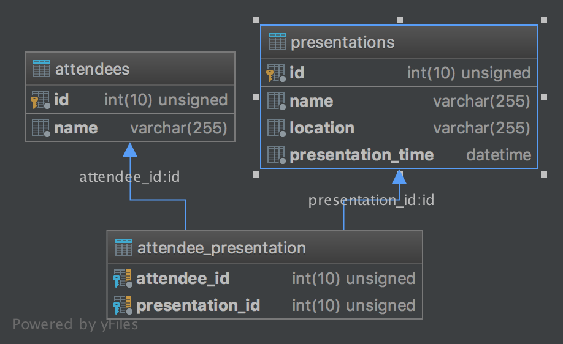

# Database Design

On of the main goals when designing a database should be to avoid duplicated
data, a concept known as *normalization*. We'll take a look at two common cases,
a one to many relationship, and a many to many relationship.

## One to Many

Our `quotes` table from before has some duplication, the author is repeated
quite frequently. Using what we know now about foreign keys, we can split this
database into multiple tables.

Here is the current structure of our `quotes` table:

| id  | first name        | last name        | content                                                                    |
| --- | ----------------- | ---------------- | -------                                                                    |
| 1   | Douglas           | Adams            | I love deadlines. I love the whooshing noise they make as they go by.      |
| 2   | Douglas           | Adams            | Don't Panic.                                                               |
| 3   | Douglas           | Adams            | Time is an illusion. Lunchtime doubly so.                                  |
| 4   | Mark              | Twain            | Clothes make the man. Naked people have little or no influence on society. |
| 5   | Kurt              | Vonnegut         | The universe is a big place, perhaps the biggest.                          |

To remove the duplication of author information, we can define a separate
`authors` table and insert the author data there.

```sql
CREATE TABLE authors (
    id INT UNSIGNED NOT NULL AUTO_INCREMENT,
    first_name VARCHAR(50),
    last_name  VARCHAR(100) NOT NULL,
    PRIMARY KEY (id)
);

INSERT INTO authors(first_name, last_name) VALUES
    ('Douglas', 'Adams'),
    ('Mark', 'Twain'),
    ('Kurt', 'Vonnegut');
```

Now that we have a separate table for our author information, we should consider
the nature of the relationship between authors and quotes. For our data:

- An author can have many quotes
- A quote belongs to an author

Here we would say the nature of the relationship between authors and quotes is
*one to many* (one author has many quotes), and we should define a foreign key
on the `quotes` table that references a row on the `authors` table.

!!!warning ""
    It would not make sense to add a foreign key that references the `quotes`
    table to the `authors` table, as we would need a separate entry for each
    quote, and we do not want to duplicate author data.

!!!info ""
    It is a common convention to name foreign key columns with the name of the
    table you are relating to, followed by `_id`, like in the example below.

```sql
CREATE TABLE quotes (
    id INT UNSIGNED NOT NULL AUTO_INCREMENT,
    content TEXT NOT NULL,
    author_id INT UNSIGNED NOT NULL,
    PRIMARY KEY (id),
    FOREIGN KEY (author_id) REFERENCES authors (id)
);
```

This will give us the following normalized database structure:

**authors**

| id  | first name | last name |
| --- | ---------- | --------- |
| 1   | Douglas    | Adams     |
| 2   | Mark       | Twain     |
| 3   | Kurt       | Vonnegut  |

**quotes**

| id  | author id | content                                                                    |
| --- | --------- | -------                                                                    |
| 1   | 1         | I love deadlines. I love the whooshing noise they make as they go by.      |
| 2   | 1         | Don't Panic.                                                               |
| 3   | 1         | Time is an illusion. Lunchtime doubly so.                                  |
| 4   | 2         | Clothes make the man. Naked people have little or no influence on society. |
| 5   | 3         | The universe is a big place, perhaps the biggest.                          |

## Many to Many

### Quotes and Topics

Let's add some more information to our database. Suppose we want to categorize
our quotes by the topic they relate to. We'll start by creating a `topics` table
and putting some data into it.

```sql
CREATE TABLE topics (
    id INT UNSIGNED NOT NULL AUTO_INCREMENT,
    name VARCHAR(255),
    PRIMARY KEY (id)
);

INSERT INTO topics(name) VALUES
    ('Space and Time'),
    ('Humor'),
    ('Office Life'),
    ('Hitchiker''s Guide to the Galaxy');
```

This will produce the following table:

**topics**

| id  | name                            |
| --- | ----                            |
| 1   | Space and Time                  |
| 2   | Humor                           |
| 3   | Office Life                     |
| 4   | Hitchiker's Guide to the Galaxy |

Now we want to relate our topics to our quotes. Let's consider the nature of the
relationship between quotes and topics:

- A quote can have relate to zero or more topics
- A topic can have many (or none) quotes

We would describe the nature of this relationship as *many to many*. A quote has
many topics, and a topic can have many quotes. In this scenario, we need to
define a separate table, called a *pivot table*, to relate the two together.

!!!warning ""
    In a many to many relationship you should **not** have foreign keys on
    either individual table, rather, you will need a separate table to relate
    the two.

!!!info ""
    It is a common convention to name pivot tables after the singular version of
    the two tables we are relating.

Here's the definition for the table we will use to relate quotes and topics:

```sql
CREATE TABLE quote_topic (
    quote_id INTEGER UNSIGNED NOT NULL,
    topic_id INTEGER UNSIGNED NOT NULL,
    FOREIGN KEY (quote_id) REFERENCES quotes(id),
    FOREIGN KEY (topic_id) REFERENCES topics(id)
);
```

For every individual relationship we have between a topic and a quote, we will
have an entry in this table.

```sql
INSERT INTO quote_topic(quote_id, topic_id)
    VALUES (1, 2), (1, 3), (2, 4), (3, 1),
    (3, 2), (3, 3), (3, 4), (4, 2), (5, 1);
```

Giving us this final structure:

**quotes**

| id  | author id | content                                                                    |
| --- | --------- | -------                                                                    |
| 1   | 1         | I love deadlines. I love the whooshing noise they make as they go by.      |
| 2   | 1         | Don't Panic.                                                               |
| 3   | 1         | Time is an illusion. Lunchtime doubly so.                                  |
| 4   | 2         | Clothes make the man. Naked people have little or no influence on society. |
| 5   | 3         | The universe is a big place, perhaps the biggest.                          |

**topics**

| id  | name                            |
| --- | ----                            |
| 1   | Space and Time                  |
| 2   | Humor                           |
| 3   | Office Life                     |
| 4   | Hitchiker's Guide to the Galaxy |

**quote_topic**

| quote_id | topic_id |
| -------- | -------- |
| 1        | 2        |
| 1        | 3        |
| 2        | 4        |
| 3        | 1        |
| 3        | 2        |
| 3        | 3        |
| 3        | 4        |
| 4        | 2        |
| 5        | 1        |

Here's a diagram of the relationships between the tables:


### Events and Attendees

Let's take a look at another example of a many to many relationship. Imagine we
are creating an application that tracks conference presentations and people
going to those presentations.  Let's define a couple of tables for attendees and
presentations:

**attendees**

| id  | name   |
| --- | -----  |
| 1   | Alan   |
| 2   | Grace  |
| 3   | Ada    |
| 4   | Bjarne |

**presentations**

| id  | name                                                         | location          | presentation_time  |
| --- | ----                                                         | --------          | ----  |
| 1   | Test-Driven Development 101                                  | Conference Room A | 9     |
| 2   | Intro to Management: Proactively Synergizing Paradigm Shifts | Conference Room B | 9     |
| 3   | Java Design Patterns: Factory factories                      | Conference Room A | 10:30 |
| 4   | Development Methodologies: What the SCRUM?                   | Conference Room A | 10:30 |

*For the purposes of demonstration, we are using an overly simplified
representation of time.*

To relate attendees and events we'll say:

- attendees can attend one or more events
- presentations have zero or more attendees

Again we have a *many to many* relationship because an attendee can attend many
different presentations, and an presentation can have many different attendees,
neither is mutually exclusive.

Lets say:

- Alan is going to the TDD talk and the design patterns talk
- Grace is going to the managment and development methodologies talks
- Ada is going to the managment and design patterns talk
- Bjarne is just going to the development methodologies talk

Our pivot table would look like this:

**attendee_presentation**

| attendee_id | presentation_id |
| ---------- | --------------- |
| 1          | 1               |
| 1          | 3               |
| 2          | 2               |
| 2          | 4               |
| 3          | 2               |
| 3          | 3               |
| 4          | 4               |

Here's a diagram of this database design:



## Common Mistakes

Some common database design mistakes are

- Having a column on a table whose contents is a string of comma separated
  values, these should probably be separate rows in a separate table (or an
  enum).
- Column names that have numbers at the end, usually this means you should be
  putting that data on a separate table.

## Further Reading

- [Wikipedia: Database Normalization](https://en.wikipedia.org/wiki/Database_normalization)

## Exercises

For each of these exercises, we'll be designing a database. You should use
scratch paper or take notes for the database design, but you don't need to
actually create these databases in MySQL. Similarly, you should write out the
example queries, but you don't need to actually run them.

### Adlister Application

We'll be building out the entire adlister project in a later module, but for
now, let's design the database! The adlister is a small scale craigslist clone
where users can post ads for items.

**Specifications**

- Users sign up for the site with an email and password
- Users create ads with a title and description and category.
- Each ad is associated with the user that created it.
- An ad can be in one or more categories (for example, "help wanted",
  "giveaway", or "furniture")

**Queries**

Write SQL queries to answer the following questions:

- For a given ad, what is the email address of the user that created it?
- For a given ad, what category, or categories, does it belong to?
- For a given category, show all the ads that are in that category.
- For a given user, show all the ads they have posted.

### Bonus: Quiz Application

Design a database for a quiz taking application.

**Specifications**

- Administrators create questions
- Administrators create answers for each question
    - Each question should have 1 correct answer
- Administrators create quizzes
    - Quizzes have one or more questions associated with them
- Students (users) take quizzes
    - The application should record a student's answers for each question on the
      quiz

**Queries**

- For a given student, calculate their score on a given quiz.
- For a given quiz, find how many students have taken it.

**Bonus**

- Allow questions to have multiple correct answers
