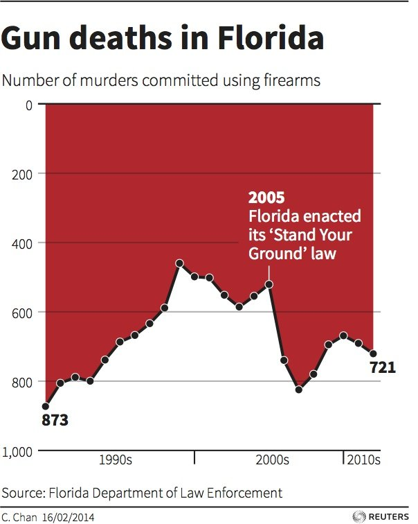

# Bad Charts!

## No Axis

______________________

## Non-Zero Y-Axis

______________________

## Non-Zero AND Non-Matching Y-Axes

______________________

## Inverted Y-Axes

______________________

## "I'm not that good at math"...or..."I hope you aren't that good at math"

## But is 40 *really* half of 80?

## The Dangers of mixing Maps with Heatmaps

