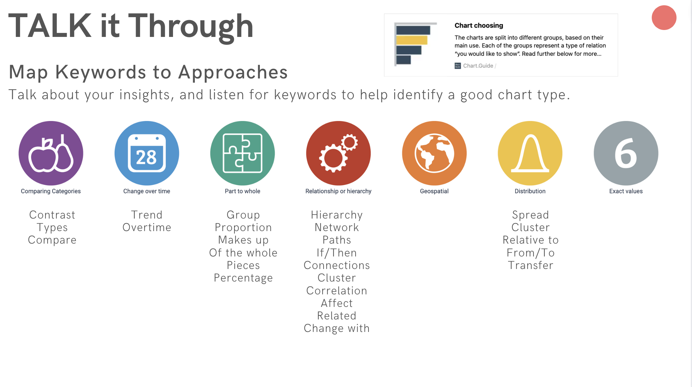

# Create a Data Story

1. DRAW it out
2. TALK it through
3. DIGITIZE drawings
4. REFINE slides
5. PRACTICE presentation

## 1. Draw It Out

!!!note "Your Turn"
    You just got word that your Senior Data Scientist loved your notebook walkthrough so much they are insisting that you present one of your recommendations for reducing churn to the telco Board! You are tasked with creating and delivering a data backed presentation that will persuade the board to act on your recommendation. To do that, you will start out by creating the notecards described above. Be sure to reference your final report from your earlier research. There will be a few notecards not directly related to slides, but after those are created (setting, goal, big idea), then you should have one notecard per slide you intend to have. Take a photo of your notecards, as they will be submitted as part of your project. Estimated Time: 1 hour. 

### Slide Structure

1. Title Slide - should include title, presenter’s name, and date 

2. Agenda - A brief summary of what you will be presenting

3. Executive Summary - Overview of your presentation including projects goal, big Idea, key findings, and recommendations

    *   Goal - What is the overall goal of the project for the stakeholder?
    *   Big Idea - What is the main idea that your presentation is trying to get across?
    *   Key findings - What findings from your report support your big idea?
    *   Recommendations - Given that your big idea is true, what concrete actions should the company take to achieve its goal?

4. Findings - Observations from your analysis that support your big idea

5. Recommendations - Given your big idea, what concrete steps should your stakeholders take to achieve their goal? What are the expected results?

6. Conclusion (1) - give a brief summary of your report and leave the audience with your most important takeaway
 
## 2. Talk It Through

source: https://chart.guide

## 3. Digitize Drawings

Up next: Refining the slides and practicing the presentation. 

____________________________________________

## Create Resource Map

[Explore Create](https://www.canva.com/design/DAEUkKAYm3A/QaLCO9Hz4eIPM_nIr9rGAw/view?utm_content=DAEUkKAYm3A&utm_campaign=designshare&utm_medium=link&utm_source=sharebutton)

