# Creating & Customizing Charts

Before we can create dashboards and stories, we have to create charts. As of now, we should have one tab labeled *data source*, and a blank sheet labeled *sheet 1*. We will now move to *sheet 1*. Every chart we wish to create, we will do so on a new sheet such as this one. Tableau refers to the tabs used for indiviual charts as *worksheets*. In this lesson, we will create a variety of charts on multiple worksheets. One way to create a new tab is to click on the tab that displays a bar chart icon with a '+' in the bottom right corner. The two tabs that follow it are for creating a new dashboard and creating a new story, respectively. Another way you can create a new tab is by duplicating existing tab (right click on tab name) and then editing variables, chart types, titles, etc. So, let's get building.

## Lesson Goals

- Creating charts
- Sorting and filtering data
- Displaying the data underlying a workbook

_____________________

## Data Table

Tableau can create a basic table, like a pivot table you would create in Excel but with more flexibility, that groups and aggregates. You can specify how it aggregates, which fields to aggregate, and the format of the numeric data. If you explore the 'Analysis' tab, you can change the table values to return a 'percentage of' and then specify whether to compute percentage of row, column, or entire table, for example.

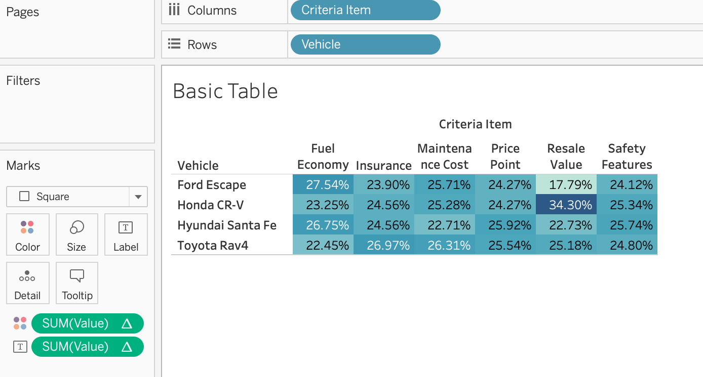

_____________________

## Box Plot

> "A box and whisker plot—also called a box plot—displays the five-number summary of a set of data. The five-number summary is the minimum, first quartile, median, third quartile, and maximum." (Khan Academy, 2020)

A purpose of box plot is to see how the points are distributed across the quartiles, as well as any outliers that exist in the data. For a box plot, you need 0 or more dimensions and 1 or more measures.

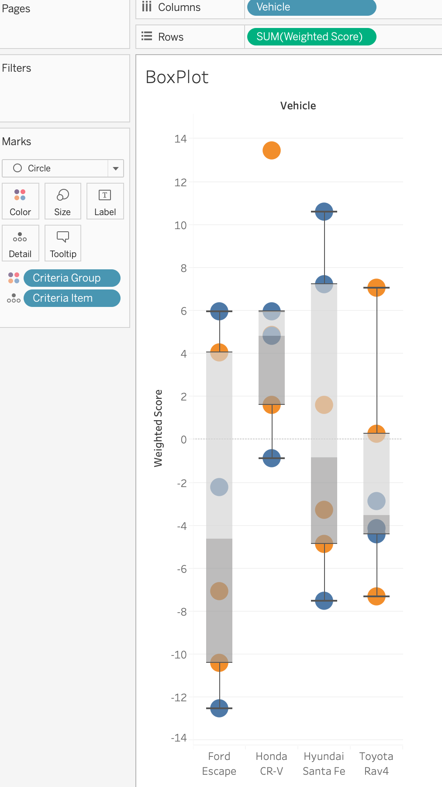{: .w25 .b1 }
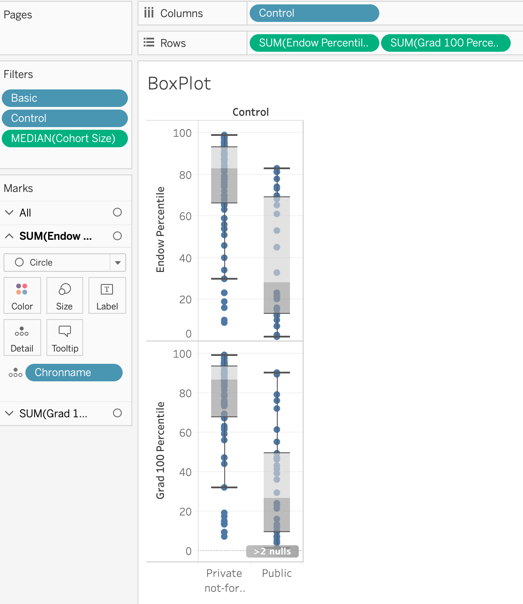{: .w66 .b1 }

_____________________

## Bar Plot

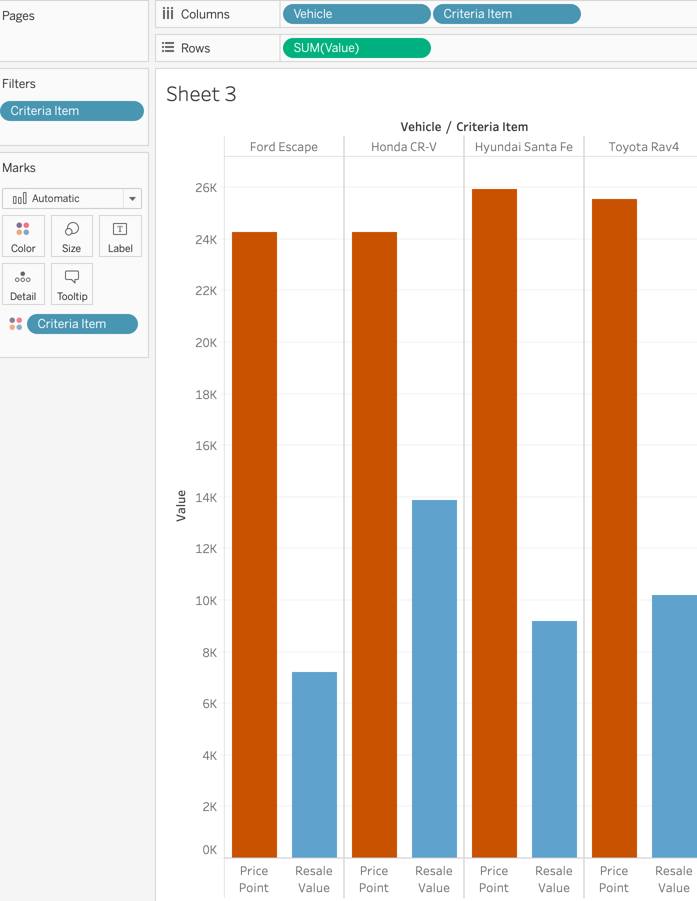{: .w25 .b1 }
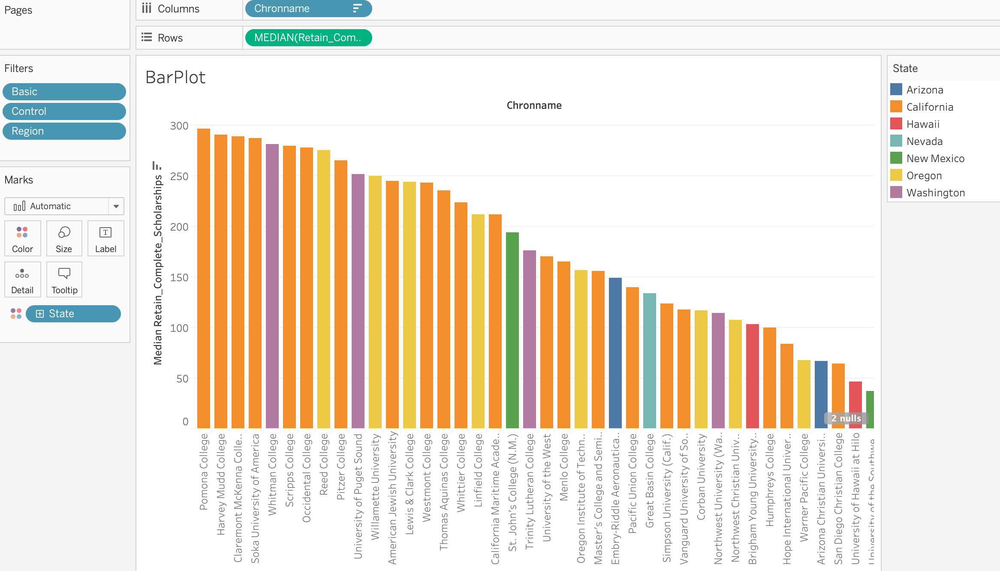{: .w66 .b1 }

_____________________

## Heatmap

To demonstrate the heatmap, we will duplicate our basic table tab, and then we can use the "Show Me" menu on the top right to change the visualization from a table to a heatmap or a highlight table (which I think of as a heatmap, also). In this case the highlight table gives us what we need.

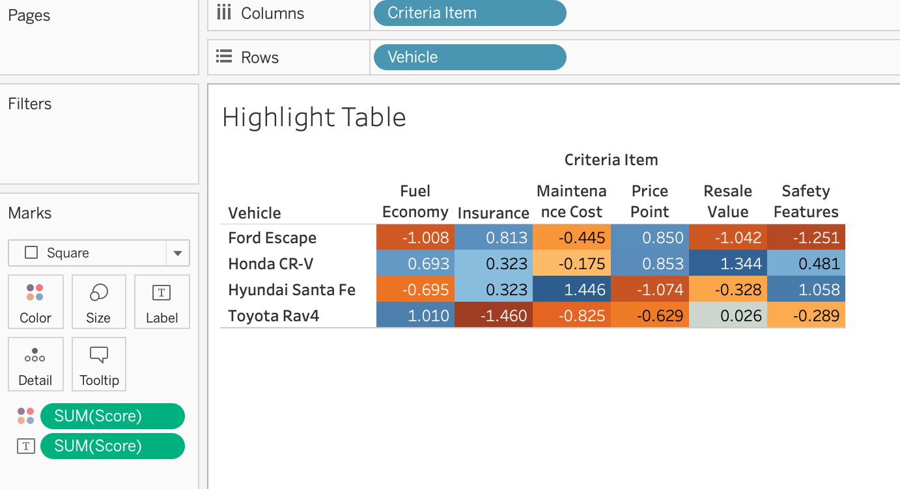

_____________________

## Scatter Plot

A scatter plot needs 2 measures, or numeric variables. By adding dimensions the scatter plot goes from 1 data point to multiple data points, depending on the number of distinct values or combinations in the dimensions.

Dimensions:

For example, let's take retention rate (x) and cohort size (y). We have to select a way to aggregate each of those. Let's aggregate both retention rate and cohort size by median. That value really doesn't mean anything when everything is aggregated together into a single point. So, we need to bring in some dimensions. Think, *group by*. Dimensions can be visualized separately through color, shape, size, or other means, *or* they can just be pulled in so that individual points are not lost and the aggregate measure only goes as far as each value in that dimension. Back to our example, we can add the dimension of *Control* which indicates whether the school is public institution or a private one. That is a good one to indicate by color, as there are a limited number of distinct values. But what if we want to see a data point for each college? We can drag that dimension into our chart. It will add the college name in the info box that displays when hovering over the point and our chart will now have a dot for each college. The measure we are aggregating is now the actual value you would find in the original dataset.

Analysis:

On the top left of the window, there is a tab that exists behind the *Data* tab (where all the columns are listed) called *Analytics*. From here (or from Analysis Menu item at top of page) we can add trend lines, regression formula, among other bits of information.

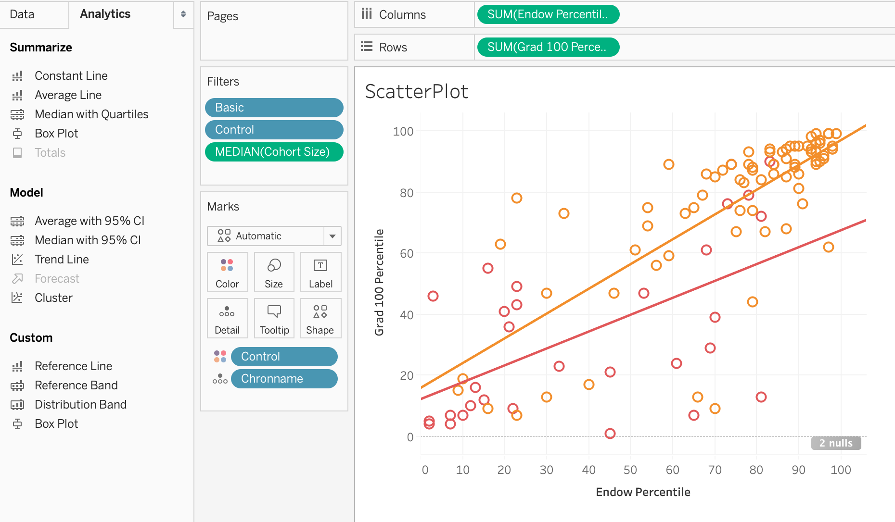

_____________________

## Line Chart

A line chart needs 2 continuous variables. A line chart can be used to analyze the correlation of 2 variables. It can be used in time series analysis and many other use cases as well.

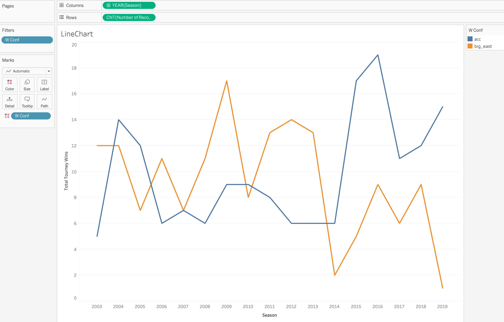

_____________________

## Map

Tableau chart types: **symbol maps**, **maps**

These both require a geographic element. They can take 0 or more dimensions. **Symbol maps** can take 0 to 2 measures, while **maps** take 0 to 1 measures.

Drag longitude to columns and latitude to rows. A default symbol map of a map will populate. Drag *Student Count* to the center of the map and aggregate by median. What's wrong? Why doesn't anything happen? (hint: group by)
Add *City* to group by. Where is Portland, OR? I can't find the dot representing portland. Why could this be?

First we should confirm that the data contains Portland. There are multiple ways to do this. One way is to add *city* as a filter and search to include only Portland. Another way is to filter by State and drill closer into the state. Upon doing that, we see a very little dot of "Portland". That seems counter to what I would expect. Big city should mean bigger dot. This is one way maps can be confusing and/or deceiving. It really shouldn't when we think about how we are aggregating. We are taking the median, and larger cities are going to have more, smaller colleges, thus driving down the median. We could use sum if we want to see total students in the city. We could also count the number of colleges to get different information.

Let's change the **symbol map** to **map**.  We will then colored the state by the number of colleges that exist in that state. What is wrong with this visualization (misleading, deceptive, confusing, ...)?

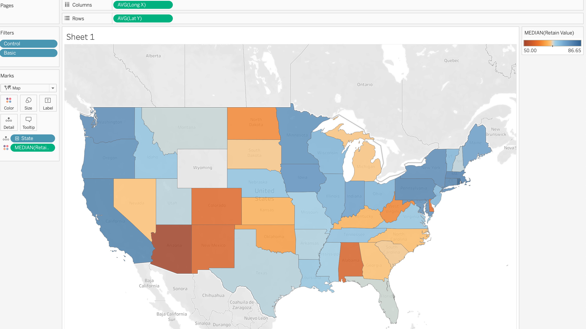

___________________________

## Display Underlying Data

To display or export the underlying data:

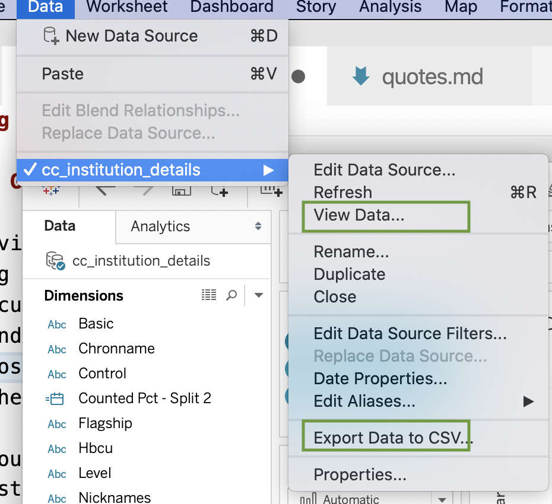{: .w50 .center }

To create a **crosstab** from a chart, right click on tab and select "duplicate as crosstab"

___________________________

## Sorting and filtering data

**Filter**

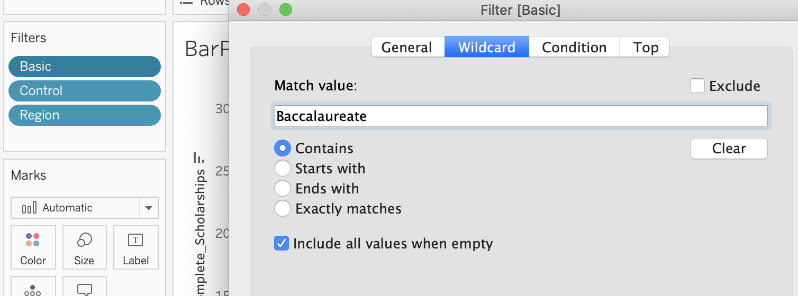{: .w66 }

**Sort**

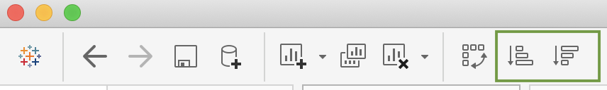{: .b1 .w50 }

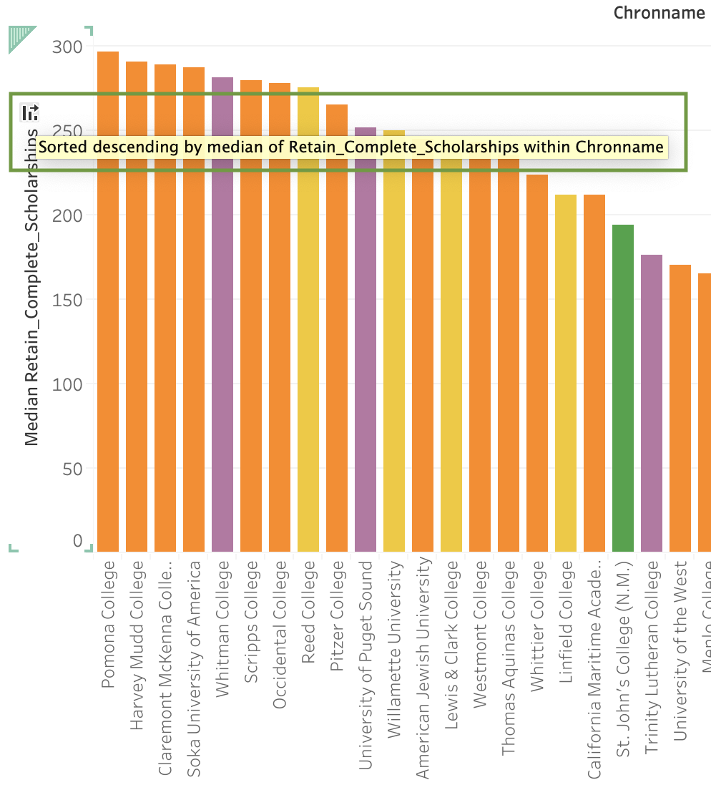{: .b1 .w33 }
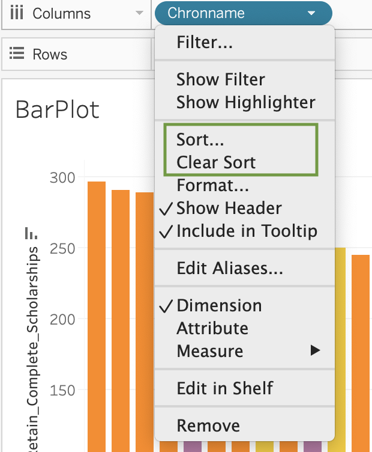{: .b1 .w33 }

## Titles, Labels, Captions, Summary

**Titles**

You might notice that your title matches the name of your tab. Rename your tab, and you will notice that these two strings are connected, by default. Now double click on the title of the page, above the chart. Now you can see how these strings are linked. To customize the chart name, enter the new name in the box provided. If you would like to maintain the synchronization between the tab and the chart title, rename the tab, but keep the chart title as < Sheet Name >

**Captions**

To add a caption, go to *Worksheet* menu header, and select *Show Caption*. Captions are useful for key points, notes about the data, what you want the user to take from your chart, how to read the chart, etc. When you are answering a question through a viz, also answer the question in your caption.

**Axes**

You can customize the x & y axes by selecting one and right clicking.

**Summary**

Right click and select *Summary* to view the summary card. You can also view it by *Worksheet* -> *Show Summary*.
_______________________________________________

## Exercises

### Plot 1: Scatter plot

1. Create the plot: 

    - Create a Scatter Plot with the X axis representing 'Estimated Tenure (months)' and y axis representing 'Monthly Charges'.  
    
    - In order to create a scatter plot of all the customers' tenure x monthly charges, you need to add the customer ids to the chart. Drag the 'Customer ID' field to the "Detail" box in "Marks".  
    
    - Next, add some color to represent whether or not a customer has churned. Do this by dragging 'Customer Status' to the "Color" box in "Marks". 
    
2. Add a caption: 

    - What do you notice from your plot? Add the caption box to your window by right clicking on a gray area in your window until you see the option to select "Caption". Select it so that it has a check mark next to it. 
    
    - Once the caption box appears, double click inside it to bring up the edit box. Keep the default text, but after it, add any takeaways you found in this visualization about how churn seems to relate to tenure and monthly charges. 
    
3. Format the axes: 

    - Format the axis labels: right click in the area of the y-axis and select format. 
    
    - To your left you will see "scale". Format the number labels to be currency (custom). Remove the decimals. 

4. Add a Title: 

    - Double click in the title space, currently titles "Sheet 1", and edit your title. 
    
    - Make your title indicative of what you want the user to take away from this chart. A question is often a useful way to title a chart. For example, “Are Monthly Charges Related to When/Whether a Customer Will Churn?”

### Plot 2: Bar plot

1. Create the plot: 

    - Make a bar plot showing how many customers have churned and how many are active. 
    
    - In a bar plot, you will have 1-2 dimensions and 1 measure, such as count of total records.  In this case, make  the x-axis 'Customer Status' and the y-axis count of the total records. 
    
    - Add a dimension to color, internet service type, so you can view number of customers and their status with respect to type of internet

2. Add a caption with your takaways. 

3. Format the axes: 
    
    - Change the title of 'count of <your_telco_export>.csv' to something meaningful, such as "Number of Customers". Do this by right clicking on the y-axis and selecting "Edit Axis". There you have the option to change the title. 
    
4. Add a title: 

    - What do you want the user to takeaway from your chart? Make your point clear and hard to miss! An example is: "Customers with No Internet Service Do Not Stick Around"

### Plot 3: Duplicate Plot 2

1. Right Click on sheet 2 and select "duplicate"

2. Convert your y-axis into a percentage: 

    - Select Analyze (top menu item) -> percentage of -> columns
    

### Plot 4: Explore Tech Support and Add-Ons

Explore the number of add-ons with and without tech support and how these relate to churn. Control for internet service type. 

1. Add a new chart. 

2. Add to the columns, Internet Service Type and Add-On Count. 

3. Add to rows 'with Tech Support' and your record count values (e.g. mine is titled 'Telco_from_sql.csv (Count)')

4. Select the best type of plot for your data and insights. 

5. Give your chart a title that indicates what you take away from the chart. 

Does having tech support have a relationship with churn? If so, what is it? Is it what you would expect?

### Save your workbook to Tableau Public

___________________________

## References

Khan Academy, (2020), Retrieved from https://www.khanacademy.org/math/statistics-probability/summarizing-quantitative-data/box-whisker-plots/a/box-plot-review
