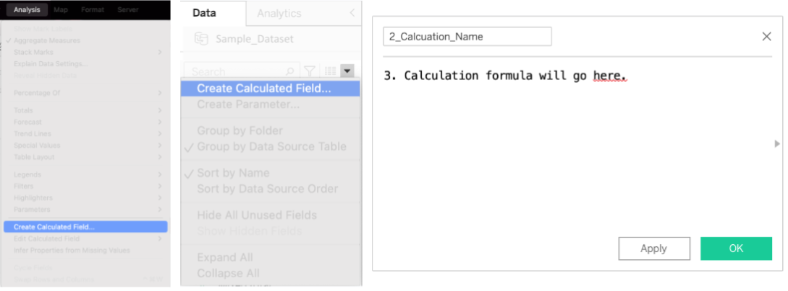

# Creating Custom Calculations & Fields  

Custom-calculated fields are used to segment data, convert data types, aggregate data, filter results, and calculate ratios.  
Example scenarios include:  

- Data is missing, such as net profit, when you have revenue and expenses.    
- Transform values, such as year-over-year growth. (Quick Table Calculation)    
- Quickly categorize data, such as: `IF [net profit] > 0 THEN 'growth' ELSE 'decline' END`.     

## Lesson Goal

- Create basic calculations

__________________________

## Basic Calculations

Basic calculations allow you to transform values or members at the data source level of detail (a row-level calculation) or at the visualization level of detail (an aggregate calculation).   

- Example row-level calculations, or those at the data source level of detail, include: splitting an email address into two columns, username & domain, computing a date difference between start date and end date, or computing the profit of each sale by taking the difference of cost and sales. The calculation in Tableau would look like: `[sales_price] - [cost]`. In pandas, the same type of calculation would look something like: `df['profit'] = df.sales - df.cost`.  

- Example aggregate calculations, or those at the visualization level of detail include: summing the profit or computing the median sales price. How these are grouped when aggregated depends on the dimensions in your visualization. So, the results of the calculation will change with your visualization. The calculation in Tableau would look like: `MEDIAN([sales_price])`.  What this concept could look like in pandas, assuming you want to compute the median sales price for each product category: `df.groupby(['product_category'])['sales_price'].median()`. In the basic calculations, though, the group by is updated every time you alter your visualization by adding or removing a dimension (i.e. a group by field).  
    - *NOTE: This may be addressed in the calculation using a <a href="https://help.tableau.com/current/pro/desktop/en-us/calculations_calculatedfields_lod.htm#fixed">`FIXED` Level of Detail</a> which computes an aggregate using only the specified dimension(s).*

### Simple Calculations

Create a [simple calculated field](https://help.tableau.com/current/pro/desktop/en-us/calculations_calculatedfields_formulas.htm) with the following steps:  

1. Analysis > Create Calculated Field OR in the field names on the left, click on the down arrow of a field you wish to use in the calculation and select 'Create Calculated Field'.  
2. Name the new field
3. Enter a formula.

### Ad Hoc Calculations

[Ad hoc calculations](https://help.tableau.com/current/pro/desktop/en-us/calculations_calculatedfields_adhoc.htm) are calculations that you can create and update as you work with a field on a shelf in the view. Ad-hoc calculations are also known as type-in or in-line calculations. Double-click on a field in your chart (in the rows or columns list, e.g.) and begin. 

### Quick Table Calculations

To create [quick table calculations](https://help.tableau.com/current/pro/desktop/en-us/calculations_tablecalculations_quick.htm), such as year-over-year difference, click on the menu arrow of a field that exists in your chart/table and select 'Quick Table Calculation', then follow the options. 

__________________________

## The Format of Calculations

To understand the format of calculations, we will use this example from the [Tableau help site](https://help.tableau.com/current/pro/desktop/en-us/functions_operators.htm):

> IF [Profit per Day] > 2000 THEN "Highly Profitable"   
> ELSEIF[Profit per Day] <= 0 THEN "Unprofitable"   
> ELSE "Profitable"   
> END  
> // this function labels all profits over 2000 as highly profitable, those <= 0 as unprofitable and all others as profitable.

- **Functions**: [Functions](https://help.tableau.com/current/pro/desktop/en-us/functions.htm) transform the values or members in a field. The functions in the example include IF, THEN, ELSEIF, ELSE, and END.  

- **Fields**: [Fields](https://help.tableau.com/current/pro/desktop/en-us/functions_operators.htm#Fields) are dimensions or measures from your data source, i.e. columns. The fields in the example include Profit per Day.   

- **Operators**: [Operators](https://help.tableau.com/current/pro/desktop/en-us/functions_operators.htm#operator-syntax) are symbols to denote an operation. Operators in our example include > and <=.   

- **Literal Expressions**: [Literal expressions](https://help.tableau.com/current/pro/desktop/en-us/functions_operators.htm#literal-expression-syntax) are constant values that are represented “as is”, such as a string you want to match or return in an if statement. The literal expressions in our example include "Profitable", "Unprofitable", "Highly Profitable", 2000, and 0.  

- **Parameters**: [Parameters](https://help.tableau.com/current/pro/desktop/en-us/functions_operators.htm#add-parameters-to-a-calculation) are placeholder variables that can be inserted into calculations to replace constant values. See more on [creating parameters](https://help.tableau.com/current/pro/desktop/en-us/parameters_create.htm#create-a-parameter).  

- **Comments**: [Comments](https://help.tableau.com/current/pro/desktop/en-us/functions_operators.htm#add-comments-to-a-calculation) You should add comments to any calculations beyond the very basic and simple. Comments are preceded by //. The comment in our example is: "// this function labels all profits over 2000 as highly profitable, those <= 0 as unprofitable and all others as profitable."

- **Data Types**: [Data Types in Calculations](https://help.tableau.com/current/pro/desktop/en-us/functions_operators.htm#understanding-data-types-in-calculations) include string, date/datetime, number, and boolean.    

__________________________

## Exercises

Creating Custom Fields:

1. Create a new calculated field from total charges. Call it "Estimated Tenure (months)". It computes the number of months the customers were around from monthly charges and total charges. Round your tenure value to the nearest whole number. 

2. Create a new calculated field from "Churn Month". Call it "Customer Status". It computes whether or not a customer has churned based on the "Churn Month" field using an IF statement. Your function should look like: IF isnull([field1]) THEN 'churned' ELSE 'active' END. 

3. Create a new calculated field from "Tech Support". Call it "with Tech Support". Using an IF ELSE statement, write the function to return a 1 if the customer has tech support ([Tech Support = 'Yes']) else a 0.

4. Repeat the process in number 3 above for the following fields: 'Streaming TV', 'Streaming Movies', 'Online Backup', 'Online Security'. 

5. Create a new calculated field from "with Tech Support". Call it "Add-On Count". In this field, you will add all the fields you created in numbers 3 and 4 above. It will look like: [with Tech Support] + [with Streaming TV] + [with ...]

6. Convert all of your new fields to dimensions. (Click the down arrow to the right of the field name and select convert to dimension)

__________________________

## Appendix

**Other Types of Calculations**

- Create LOD expression  
- Create table calculation  
- Become familiar with [Tableau functions](https://help.tableau.com/current/pro/desktop/en-us/functions.htm) 
- Become familiar with Tableau documentation on [Calculated Fields](https://help.tableau.com/current/pro/desktop/en-us/calculations_calculatedfields_create.htm)  

### Level of Detail Expressions

[Level of Detail (LOD) expressions](https://help.tableau.com/current/pro/desktop/en-us/calculations_calculatedfields_lod.htm), like basic calculations, allow you to compute values at the data source level and the visualization level. However, LOD calculations give you even more control at the level of granularity you want to compute. They can be performed at a more granular level (`INCLUDE`), a less granular level (`EXCLUDE`), or an entirely independent level (`FIXED`) with respect to the granularity of the visualization. The function in Tableau would look like: `{ FIXED [product_category]:(MEDIAN([sales_price]))}`. In pandas, this would look like: `df.groupby(['product_category'])['sales_price'].median()`. This is just like the example in basic calculations, but this time, in Tableau, the group by field stays static in the visualizations. So if you create a visualization that removes the product_category dimension and adds product_subcategory as a dimension, the value of the median sales_price will remain at the product_category level. So you will see multiple subcategories with the same value. 

### Table Calculations

[Table calculations](https://help.tableau.com/current/pro/desktop/en-us/calculations_tablecalculations.htm) allow you to transform values at the level of detail of the visualization only. For example, if you wanted to add year-over-year growth to your visualization, you could do this in 2 ways. The first way is to add in the Create Calculated Field formula box. It would look like this: `ATTR([sales]) - LOOKUP(ATTR([sales]), -1)`. You could also create this calculation by clicking on the menu arrow of the field sales and selecting 'Quick Table Calculation'. Common use cases for table calculations include ranking, cumulative total, rolling averages, and inter-row calculations such as year-over-year. 
