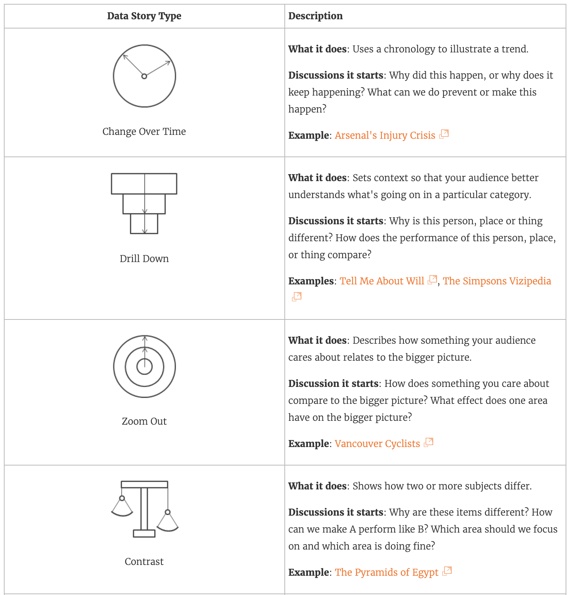
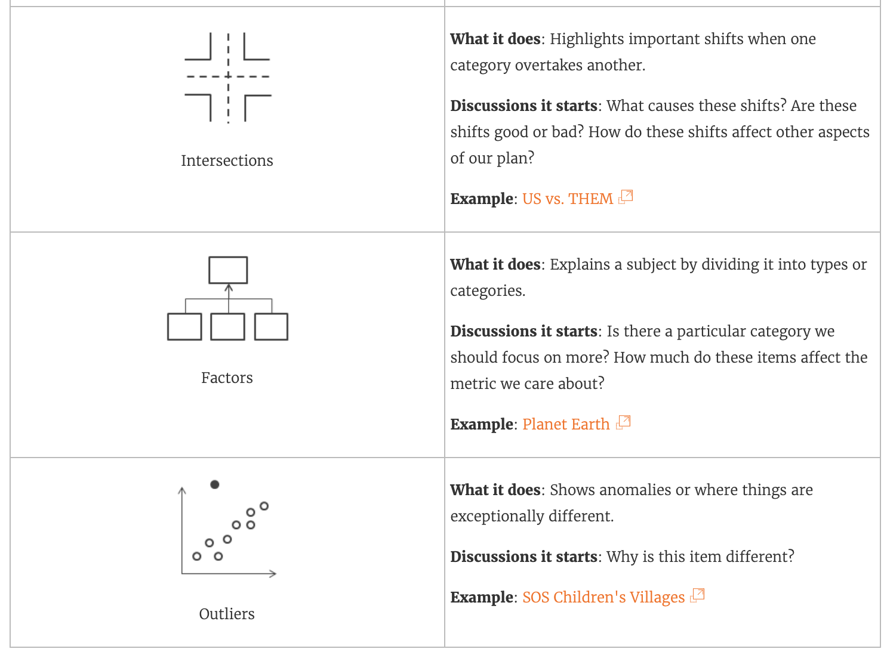

# Creating a Story

> A Tableau Story is a sequence of visualizations that work together to convey information. You can create stories to tell a data narrative, provide context, demonstrate how decisions relate to outcomes, or to simply make a compelling case.    ~ [Stories on help.tableau.com](https://help.tableau.com/current/pro/desktop/en-us/stories.htm)

A story is a separate sheet, just like data, charts, and dashboards. Stories contain multiple pages within them, known as story points. Users can navigate between the points by clicking on the menu at the top of the story.

_____________________________

## Story Elements

- Adding a new story point: Select Blank to add a new blank point, or Duplicate to use a copy of the current point as the beginning of a new one.

- The Story pane: Use this pane to drag dashboards, sheets, and text descriptions to your story sheet. You can also show/hide the title and set the size of the story.

- The Layout pane: Change the style of the navigator object and choose whether to show/hide the navigation arrows.

- The Story menu: Use this menu to format the story font styles, shading, and borders.

- The Story toolbar: Hover your mouse over the navigation bar to make it appear. Use it to delete points, revert changes, update points, or save the point to a new story.

- The navigator: Use the navigator to select different story points. You can also change the order of story points by dragging and dropping them. Your audience will use the navigator to engage with your story.

[Source](https://help.tableau.com/current/pro/desktop/en-us/story_workspace.htm)

_____________________________

## 7 Types of Data Stories

Tableau talks about 7 types of data stories in a table you can see [here](https://help.tableau.com/current/pro/desktop/en-us/story_best_practices.htm#the-seven-types-of-data-stories).

_____________________________

## Build a Story

For details on how to create and format stories, check out the [Tableau documentation](https://help.tableau.com/current/pro/desktop/en-us/story_create.htm).

_________________________  

## Exercises
1. Create a story titled “TelcoCo Key Performance Presentation”.
2. Create an initial point with two text objects, as a preview for your presentation.
3. Make a second point with your most valuable (by personal assessment) visualization.
4. Make a third point containing the desktop variant of your dashboard.

