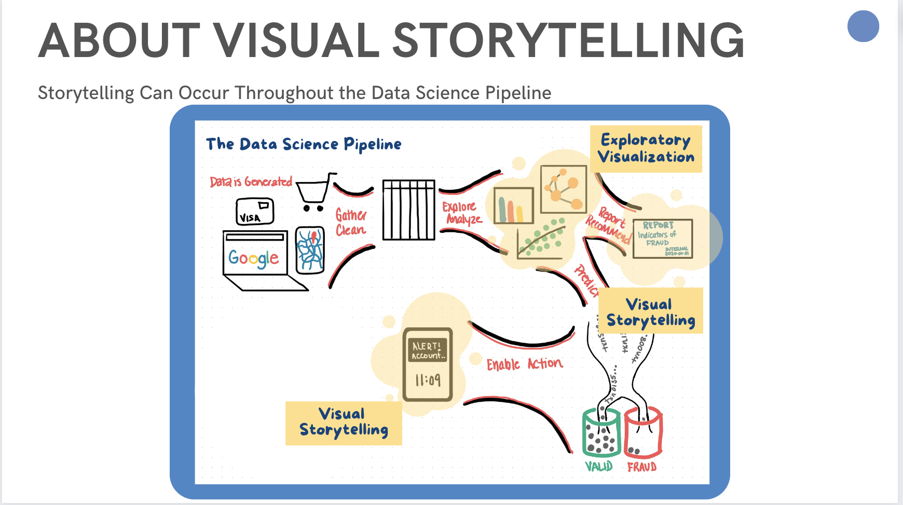
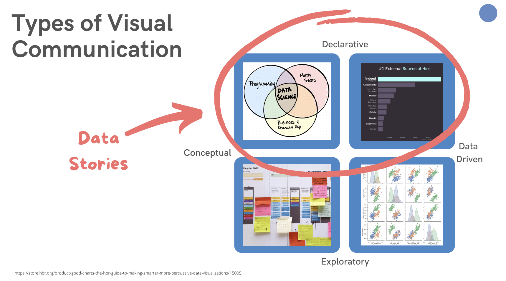
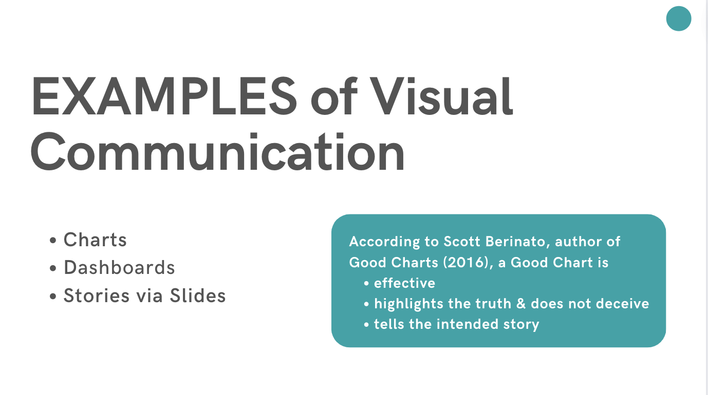
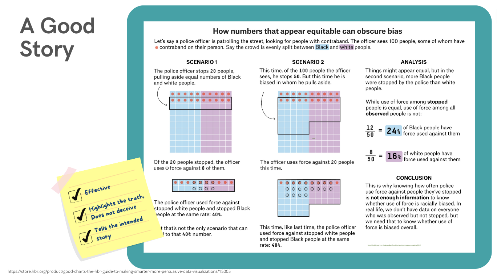
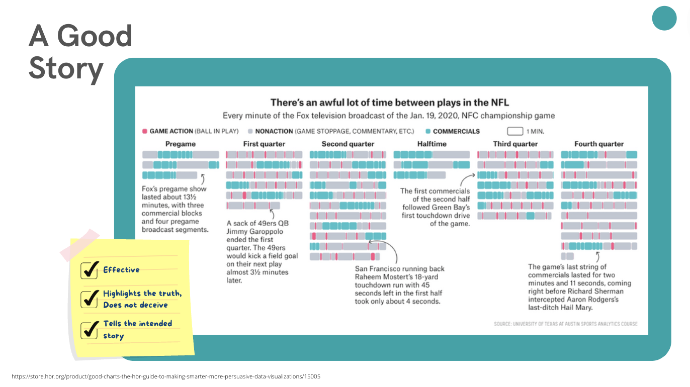
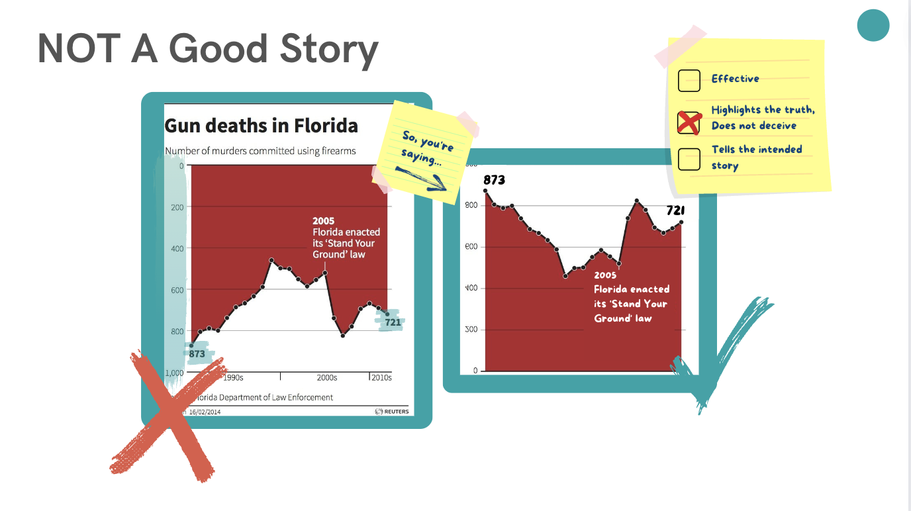
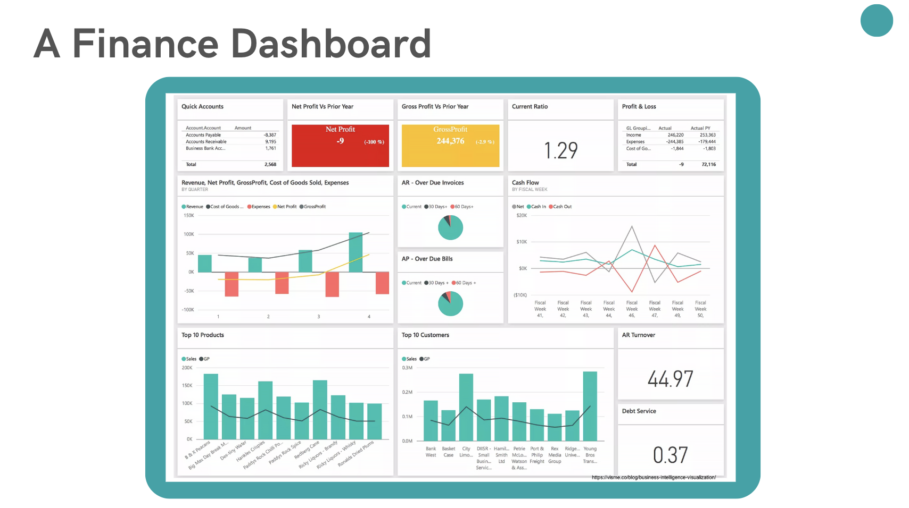
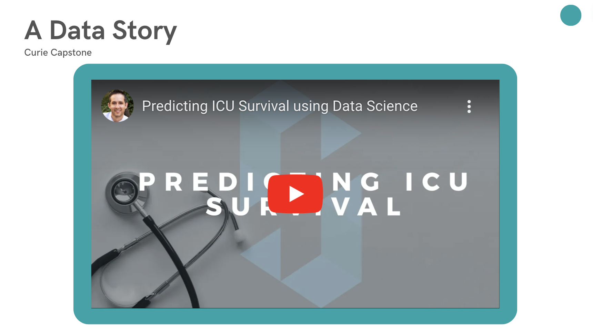

# Storytelling with Data

With a story, what you do will be remembered. 

What you recommend will be considered. 

What you discover will be influential. 

*"We can't make sense of statistics very well without a narrative. Our cognitive capacity shuts down in the absence of a story."* - Robyn Dawes, Psychologist specializing in human judgment

*"More parts of our brain are active when we're engaged with a narrative. Stories increase empathy, understanding and recall. Storytelling is persuasive."* - Scott Berinato, Good Charts (2016)

## Berinato's Quadrants of Visualizations 

## Examples

"Predicting ICU Survival" full presentation [here.](https://youtu.be/Tbu2squWHgU) 

_________________________________________________

## References

Berinato, Scott. (2016). Good Charts: The HBR Guide to Making Smarter, More Persuasive Data Visualizations. Boston: Harvard Business Review Press.  

Chow, Ho Ming, Raymond A. Mar, Yishheng Xu, Siyuan Liu, Suraji Wagage, and Allen R. Braun. (2015) Personal Experience with Narrated Events Modulates Functional Connectivity within Visual and Motor Systems During Story Comprehension.
  
Dawes, Robyn M. (1999). A Message from Pyschologists to Economists. [Journal of Economic Behavior & Organization 39](http://www.sciencedirect.com/science/article/pii/S0167268199000244)
