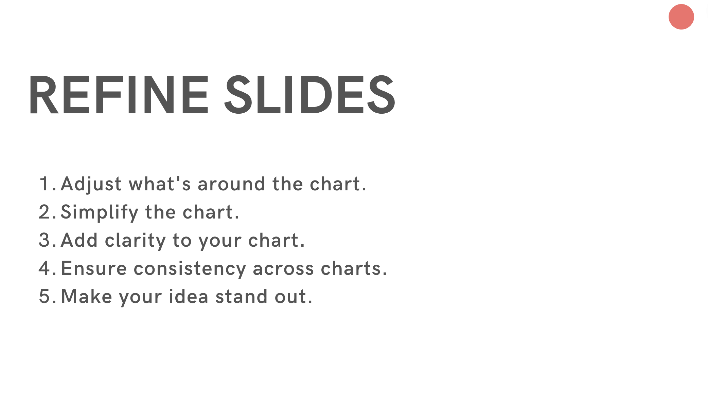
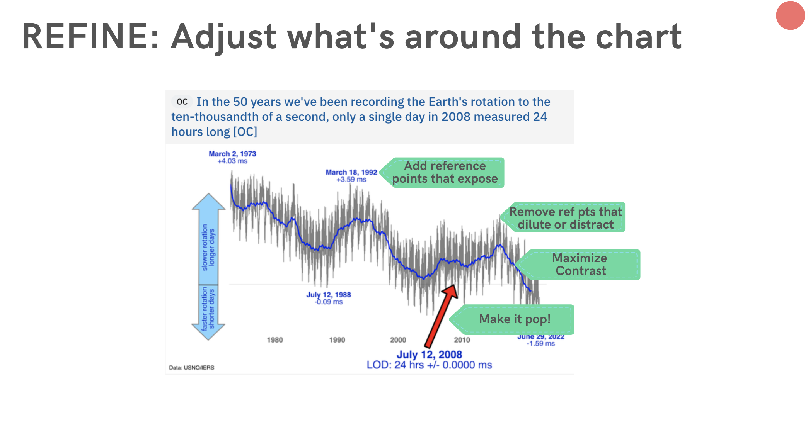
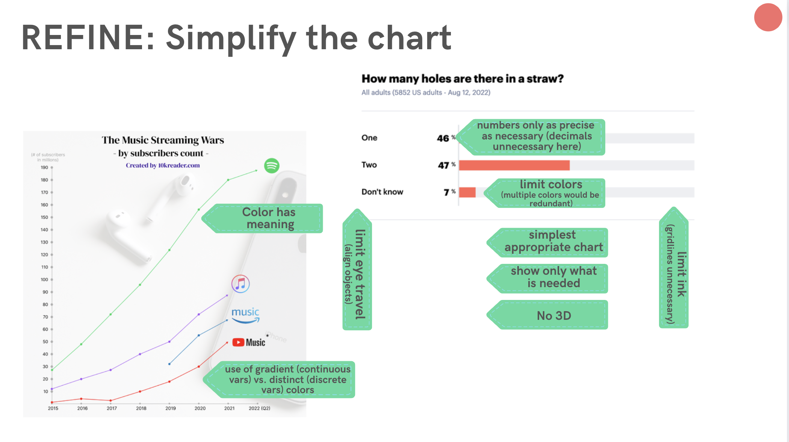
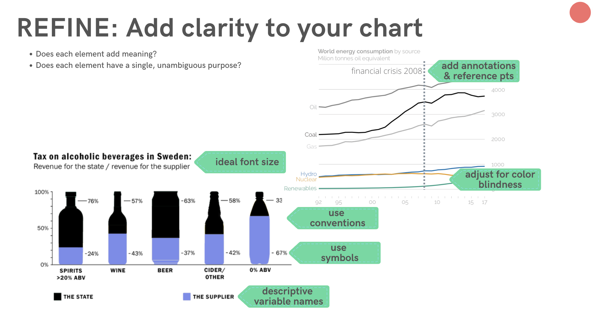
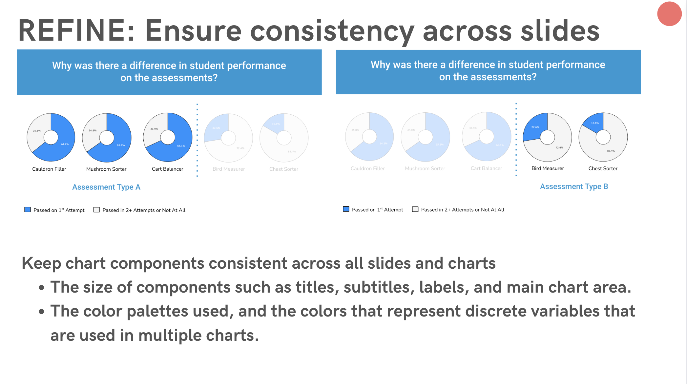
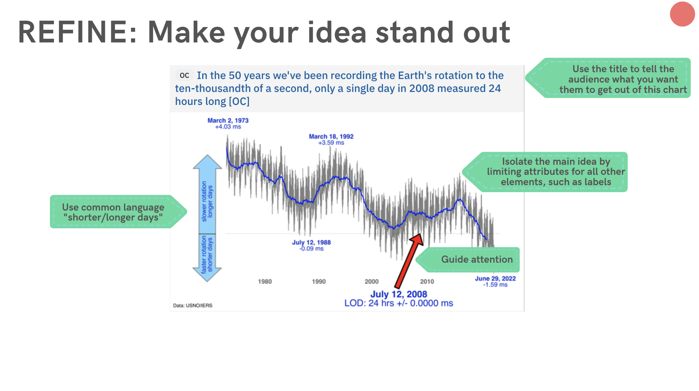
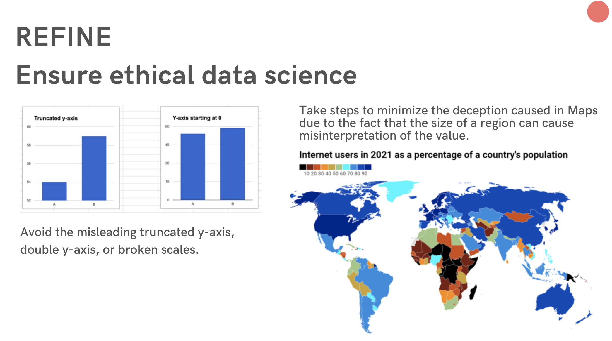

# Refine and Present

## 4. Refine Your Story

!!!note "Your Turn"
    Walk through the 5 steps of refining for each of your charts. Refine your slides using the refine steps as they apply.  Estimated Time: 2 hours. 

### 5. Practice

Speak to *YOUR* audience  

Script it out  

1. Write the script.  
2. Speak the script.  
3. Adjust the script to match the way you speak.  
4. Repeat until it feels natural.  
5. Practice until you no longer need to read.  

Record yourself  

1. Pay attention to the time...If it's too long, don't talk faster, but instead remove content.   
2. Listen for filler words.   

!!!note "Your Turn"
    You are preparing for a 5 minute presentation. Write out your script. Speak the script. Adjust the script. Speak the script. Adjust. Speak and time the script. Cut where needed. Practice with a partner. Record yourself and play back the recording. Make a note on your script where you hit the half-way point (2.5 minutes) and your time at the end of the presentation. If your presentation is longer than 5 minutes, then add a note of where you hit the 5 minute mark. Estimated Time: 3 hours. 
____________________________________________

## Refine and Present Resource Maps

[Explore Refine](https://www.canva.com/design/DAEUkK0f27U/W7AJj62rVSeNQNkNqNnSGg/view?utm_content=DAEUkK0f27U&utm_campaign=designshare&utm_medium=link&utm_source=sharebutton)

[Explore Present](https://www.canva.com/design/DAEUkGI4GrM/ZCKw2adyNVFZjL1FTmy9Tg/view?utm_content=DAEUkGI4GrM&utm_campaign=designshare&utm_medium=link&utm_source=sharebutton)