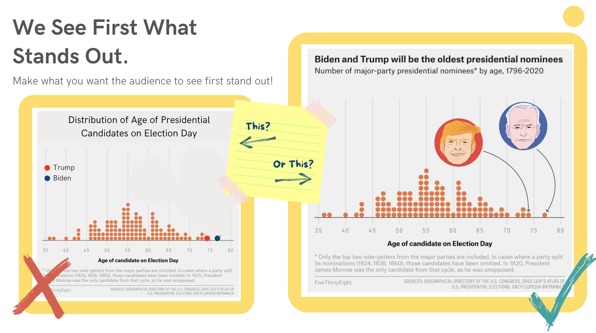

# Understand What Makes a Good Story

1. Understand HOW WE SEE
2. Evaluating stories through CRITIQUE

___________________________________

## Understand How We See

Berinato calls out some key features in how our brains process visual information in his book, Good Charts. 

- We DON'T consume from left to right, top to bottom.  
- We see first what stands out.  
- We only see a few things at once.  
- We seek meaning and make connections. If meaning is unclear, we will make our own.  
- We use experience and expectations to make cognitive shortcuts.  
- We process and remember pictures MUCH better than numbers. Yes, even you!  

> **Other examples of cognitive shortcuts**
> 
> - Red:Green $\Rightarrow$ Negative:Postive
> - Red:Blue $\Rightarrow$ Hot/Active:Cold/Inactive
> - Hierarchies: Top $\Rightarrow$ Bottom
> - Time: Left $\Rightarrow$ Right
> - Y-axes: starts at 0
> - Up:Down $\Rightarrow$ North:South, Good:Bad  
> - Lighter:Darker $\Rightarrow$ Emptier:Fuller, Lower:Higher
> - Like Colors $\Rightarrow$ Like Items
> - Connected data points $\Rightarrow$ relationship from one value to the next, like time, but not categories  
> - Categories arranged from Most Extreme $\Rightarrow$ Least Extreme        
> - Color Gradient/Saturation $\Rightarrow$ Progression of Values
> - Distinct Colors $\Rightarrow$ Distinct Categories 

___________________________________

## Critiquing Stories

Understand what makes a good story by systematically critiquing data stories and visualizations. 
The following 7 steps are recommended by Scott Berinato (Good Charts, 2016) to systematically critique charts. 

Step 1

Step 2

Step 3

Step 4

Step 5

Step 6

Step 7

_______________________________________________

## Exercises

____________________________________________
## Understand Resource Map

[Explore Understand](https://www.canva.com/design/DAEUkPLyRMc/5YaTvBZH72VV2PcAaxy_sQ/view?utm_content=DAEUkPLyRMc&utm_campaign=designshare&utm_medium=link&utm_source=sharebutton)