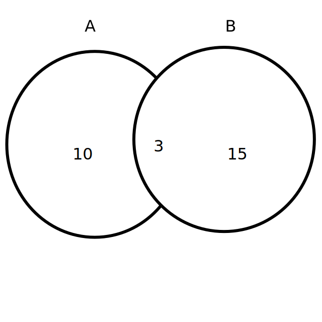
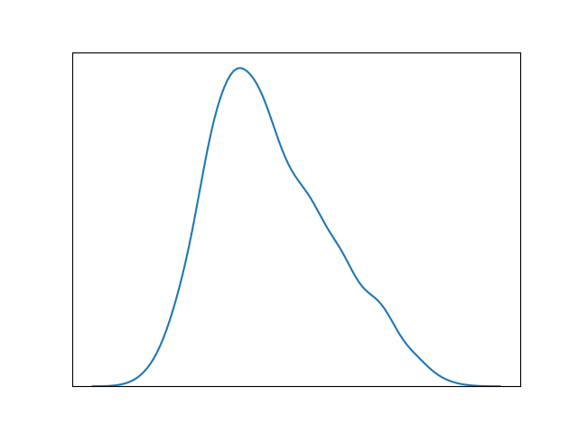

1. How would you know if you have a normal distribution? (Properties of Nornal Distribution:)
    - Unimodal -one mode
    - Symmetrical -left and right halves are mirror images
    - Bell-shaped -maximum height (mode) at the mean
    - Mean, Mode, and Median are all located in the center
    - Asymptotic

1. What can you infer about probabilities knowing you have a normal distribution? 

1. In any 15-minute interval, there is a 20% probability that you will see at least one shooting star. What is the proba­bility that you see at least one shooting star in the period of an hour?
    - Probability of not seeing any shooting star in 15 minutes is
        = 1–P( Seeing one shooting star ) = 1–0.2 = 0.8
    - Probability of not seeing any shooting star in the period of one hour = (0.8)^4 = 0.4096
    - Probability of seeing at least one shooting star in the one hour = 1–P( Not seeing any star ) = 1–0.4096 = 0.5904

1. A jar has 1000 coins, of which 999 are fair and 1 is double headed. Pick a coin at random, and toss it 10 times. Given that you see 10 heads, what is the probability that the next toss of that coin is also a head? 0 <= P <= 1, give answer to 4 decimals. 

1. Explain P-value.
    - A metric that helps assess the statistical significance of an insight whether it is a real insight or just by chance

1. What assumption is made when performing a t-test?

1. Isn't data science another way to say applied statistics? Why or why not?

1. What is the difference between a continuous and discrete variable? Give an
   example of each.

1. Use the image below to calculate the following probabilities:

    

    - $P(A \cap B)$
    - $P(A)$
    - $P(A \cap B^C)$

1. Is the distribution below right skewed or left skewed? How did you determine
   which way it is skewed?

    

1. Give 2 examples of biased samples.

1. What is the difference between dependent and independent events?

1. Zach has 2 different routes he can take to commute to work every morning. The
   first route takes 10 minutes to drive and has 5 traffic lights on the way.
   Each light on the first route has a 10% chance of being red, and if it is red
   it will add 2 minutes to the total travel time. The second route is 7 minutes
   long and has one traffic light that adds 5 minutes if it is red and has a 50%
   chance of being red. Which route will be faster on average? You may assume
   that encountering red lights are independent events.

1. For each of the following distributions, give an example of a real-world
    event or process that could be modeled by the distribution.

    - Poisson
    - Binomial
    - Normal

1. Which distribution best represents choosing a data science student at random
   to give a presentation?

1. Which distribution best represents the number of pots of coffee that will be
   brewed on the 6th floor at Codeup over one day?

1. Which distribution best represents the number of students that will arrive on
   time to the classroom after a break if we know that there is a 90% chance a
   given student will arrive on time?

1. What is the difference between a negative and a positive correlation?

1. What is the difference between a null and alternative hypothesis?

The next several problems reference the following data set:

    [1, 3, 5, 3, 4, 2, 6, 10]

1. Calculate the min and max, count, range, mean, median, and mode for the
   following numbers:

1. Draw (by hand) and label a histogram for the data.

1. Draw (by hand) and label a boxplot for the data.

1. What is an outlier? Describe a way you could identify outliers. Are there any
   outliers in the data?

