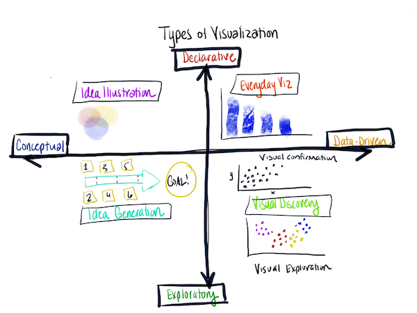

# Happy Wednesday, 2020-03-11

> I would have written a shorter letter but I didn't have the time.
~ Blaise Pascal, Mathematician

## Agenda

1. Effective visualizations  
2. Ineffective, well, bad visualizations
3. Types of visualizations  
4. Classes of visualizations  
5. Use Cases  
6. Tools   

## Effective visualizations  

- [As Climate Changes, Southern States Will Suffer More Than Others](https://www.nytimes.com/interactive/2017/06/29/climate/southern-states-worse-climate-effects.html)  

- [35 Years of American Death](https://projects.fivethirtyeight.com/mortality-rates-united-states/)  

- [The Stories Behind a Line](http://www.storiesbehindaline.com/)  

- [I calculated the average face of a UK Member of Parliament and here’s what I found](https://medium.com/@puntofisso/i-calculated-the-average-face-of-a-uk-member-of-parliament-and-heres-what-i-found-37f31b72b5d9)  

- [Population Growth Explained with Ikea Boxes](https://www.gapminder.org/videos/population-growth-explained-with-ikea-boxes/)

- [Hans Rosling TED Talk: The seemingly impossible is possible](https://www.gapminder.org/videos/ted-talks/hans-rosling-ted-talk-2007-seemingly-impossible-is-possible/)  

## Ineffective, well, bad visualizations  

[Bad Charts](https://ds.codeup.com/2-storytelling/bad-charts/)

## Types of visualizations  

