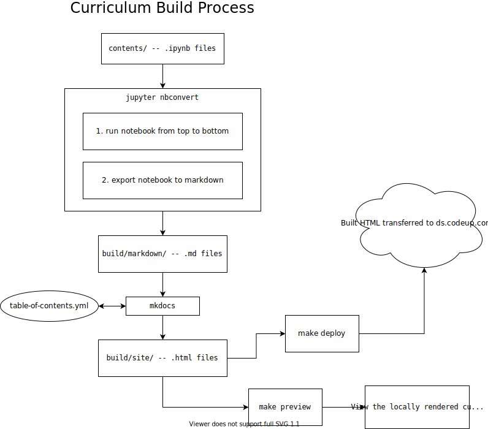

# Data Science Curriculum

Repo for Codeup's data science curriculum

- [Internal Knowledge Share](https://github.com/gocodeup/data-science-curriculum/wiki)
- [Repo Content and Structure](#repo-content-and-structure)
- [How it Works](#how-it-works)
- [Usage](#usage)
- [FAQ](#faq)
- [Curriculum Style Guide](#curriculum-style-guide)
- [Handouts](#handouts)

## Repo Content and Structure

- `table-of-contents.yml`: YAML file that defines the table of contents for the
  curriculum
- `content`: actual curriculum content that is deployed to https://ds.codeup.com
- `grading`: files related to grading; notably, project rubrics, and a script to
  check students' exercise completion live here
- `handouts`: source for various handouts / cheatsheets
- `misc`: miscellaneous files that don't fit into the other directories
- `build`: directory used for building the curriculum, i.e. turning the content
  into the html that is deployed
- `scripts`: utility scripts related to the management of the curriculum

## Setup

1. [Install Brew](https://brew.sh/)

1. Install Anaconda

    We recommend using brew to install anaconda

    ```
    brew cask install anaconda
    ```

    Then add anaconda's `bin` to your PATH:

    ```
    echo 'PATH=/usr/local/anaconda3/bin:$PATH' >> ~/.bash_profile
    source ~/.bash_profile
    ```

    After this, running

    ```
    python --version
    ```

    should output something like `3.x` (i.e. **not** `2.x`)

1. Run `make setup` from the root of the project

1. Fill in values in the `env.py` file

## Usage

In a nutshell, most people will work with this project by editing the notebook
files within the subdirectories of the `content` directory.

- To start up the notebook server

    ```
    make nbserver
    ```

- To run any notebooks modified from since the last commit from top to bottom

    ```
    make run-modified
    ```

**Make sure that any notebooks you commit run from top to bottom without
errors.** This is a requirement of our build process, and the curriculum won't
be able to be deployed without meeting this requirement.

There should **not** be any subdirectories within the individual modules
directories.

### `env.py`

Often times it is the case that we need to keep either environment-specific or
sensitive values out of version control. We will elect to keep those in a file
named `env.py`. Within any subdirectory of `content`, you may import from the
`env` module and will be referencing the `env.py` file at the root of this
project.

### `viz.py`

Some modules will have more complex plotting code that distracts from the lesson
at hand. Our convention is to "hide" this code in a file named `viz.py` that
lives within that modules directory. For example, within `content/5-stats` is a
file named `viz.py` that contains code to make the example visualizations for
the statistics module.

Within the individual lessons, the `viz` module is imported, and various
functions from it that create the visualizations are called.

If you follow this convention, our build script will be sure to copy over the
`.py` file so that the visualization code is accessible to students, but does
not clutter the individual lessons.

### Table of Contents

The filename referenced in the table of contents should be the same as the name
of the notebook, **except** that the file extensions should be `.md` instead of
`.ipynb`.

### Previewing the Curriculum

You can run

```
make preview
```

To see what the built curriculum will look like.

### Writing Markdown

In addition to the standard markdown features, the markdown in the curriculum
has several extensions. This sort of markdown might look funny within a jupyter
notebook, but, rest assured, it will look good in the end, built curriculum
content.

- LaTeX Math

    To display bits of math notation inline with text (e.g. referencing a
    variable within a paragraph), surround the LaTeX expression in `$`s. For
    example:

    ```markdown
    The null hypothesis, $H_0$, is ...
    ```

    To create display math blocks, centered blocks that are separate from any
    surrounding paragraph, use double `$`s. For example:

    ```markdown
    Below is the equation for making predictions with a linear model:

    $$ \hat{y} = \sum{w_i x_i} $$
    ```

- Admonitions

    The markdown in our curriculum supports fancy looking
    [admonitions](https://squidfunk.github.io/mkdocs-material/extensions/admonition/#types).
    You can use these within any markdown, but they will look funny within the
    jupyter notebook, but don't worry, they will render correctly in the output
    html.

    ```
    !!!note "Note Title"
        This is the admonition content.
    ```

- Footnotes

    The curriculum's flavor of markdown supports footnotes as well. The build
    process will autonumber the footnotes and render them at the bottom of the
    page with links to where they appear in the lesson.

    ```
    Here is some information^[this is the footnote content] and some more.

    Here is some more[^1] information[^2] with a couple footnotes.

    [^1]: Footnote content can also go here.

    [^2]:
        Longer footnote content can be split up,

        Into multiple indented paragraphs.
    ```

- Attribute Lists

    You can add custom html element attributes to any element with the following
    syntax:

    ```
    {: class="img-responsive" border=1 }
    ```

### Building The Curriculum

```
make -j 8 build
```

*The `-j 8` tells `make` to run up to 8 processes in parallel. This can
significantly speed up the build process as opposed to omitting it.*

The first time you run this command it will take a bit, as all of the notebooks
will be run from top to bottom and converted to markdown.

Subsequent runnings of `make build` will only run and convert notebooks that
have changed since the last time you ran the command.

## FAQ

- How do I change the name of a lesson?

    Edit the `table-of-contents.yml` file at the root of this project.

- Why isn't the new lesson I wrote showing up in the curriculum?

    In addition to creating the new file, you must update the table of contents.
    Take a look at the `table-of-contents.yml` file, which contains the table of
    contents, and update it as necessary.

- How can I preview what the curriculum looks like before deploying it?

    ```
    make build
    make preview
    ```

## Curriculum Style Guide

- Size of the data permitting, prefer to work with transformed data as the
  result of applying transformations, as opposed to writing intermediate csv
  files, or using `%store` magic.

    For example, if you have a data set that needs to have null values filled
    in, you should write a function that fills in the null values, the reference
    this function and the original dataset in a later notebook, as opposed to
    modifying the dataframe in a previous notebook and `%store`ing it, or
    writing the transformed data to a separate csv file.

- Headings (i.e. lines that start with a `#`) should title sections or
  subdivisions of a lesson, not be used for styling or text emphasis. Use bold
  or italic text for this.

- Only one level 1 heading should be present in each lesson. This is semantic
  HTML and is required for the lesson's autogenerated table of contents to work
  correctly.

- There should be no empty cells in any notebook.

See also the [style guide for the java
curriculum](https://github.com/gocodeup/curriculum-wrapper/blob/master/style-guide.md).

## How it Works

The curriculum content is all markdown and [jupyter notebooks][jn]. The
notebooks are converted into markdown with [jupyter nbconvert][nbconvert], and
all the markdown is then turned into pretty-looking html with [mkdocs][mkdocs]
with it's [material theme][theme] (This markdown -> html setup is the same as we
use for the Java curriculum).



[jn]: https://ipython.org/notebook.html
[nbconvert]: https://nbconvert.readthedocs.io/en/latest/
[mkdocs]: https://www.mkdocs.org/
[theme]: https://squidfunk.github.io/mkdocs-material/

This project contains a `env.py` file and `data` directory that can be
referenced from within any curriculum content notebooks. This works by creating
symlinks in each subdirectory that point to the top level `env.py` file and
`data` directory.

## Handouts

All published handouts live on the [`handouts`
branch](https://github.com/gocodeup/data-science-curriculum/tree/handouts)

### Setup

1. Install [Pandoc](https://pandoc.org/)

    ```
    brew install pandoc
    ```

2. Install [Docker](https://www.docker.com/)

3. Install [R](https://www.r-project.org/) and needed dependencies

    ```
    brew cask install R
    Rscript -e 'install.packages("rmarkdown")'
    Rscript -e 'install.packages("tinytex")'
    Rscript -e 'tinytex::install_tinytex()'
    ```

### Building

```
make handouts
```

### Publishing

```
make handouts-publish
```

## Syllabus Creation

Prerequisites

1. Install [docker](https://docs.docker.com/docker-for-mac/install/)
1. Run `docker pull zgulde/pandoc`

Before a new cohort starts:

1. Edit `misc/syllabus.md` as needed. If nothing else, the list of important
   dates and the cohort name will need to change.
1. (Optional) Edit `misc/syllabus-template.latex` if you want to change the
   syllabus template.
1. Run `make syllabus` from the root of this project. `syllabus.pdf` will be
   created (or overwritten if it already exists).
